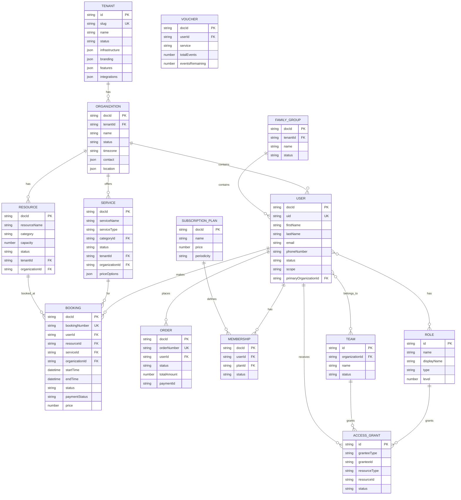

# Modelo de Datos Actual - Serveflow V1

**Estado:** Documento de referencia
**Fecha:** 2025-01-28
**Propósito:** Documentar el modelo de datos actual antes de la migración a V2

---

## Colecciones en Firestore

```
Firebase Project: lazzario-academy-demo

Collections:
├── tenants                    # Configuración de tenants
├── organizations              # Sedes/ubicaciones
├── users                      # Usuarios del sistema
├── bookings                   # Reservas
├── services                   # Tipos de servicio
├── serviceCategories          # Categorías de servicios
├── resources                  # Recursos reservables
├── resourceCategories         # Categorías de recursos
├── roles                      # Roles del sistema
├── teams                      # Equipos/grupos
├── orders                     # Pedidos/pagos
├── subscriptionsPlans         # Planes de suscripción
├── vouchersRule               # Reglas de bonos
├── familyGroups               # Grupos familiares
├── events                     # Eventos (clases, etc.)
├── recurringEvents            # Eventos recurrentes
├── classes2                   # Clases (legacy?)
├── apps                       # Configuración de apps
├── organizationConfigs        # Config por organización
├── booking_statuses           # Estados de booking
├── booking_transitions        # Transiciones de estado
├── booking_expiration_rules   # Reglas de expiración
├── whatsapp-conversations     # Conversaciones WhatsApp
└── whatsapp-messages          # Mensajes WhatsApp
```

---

## Diagrama UML - Modelo Actual



---

## Entidades Detalladas

### 1. Tenant (packages/tenants/src/types/tenant.types.ts)

**Ubicación:** `tenants/{tenantId}`

El modelo de Tenant es **MUY COMPLEJO** con ~450 líneas de tipos. Incluye:

```typescript
interface TenantConfig {
  // Identificación
  id: string;
  slug: string;
  name: string;
  legalName: string;
  taxId: string;

  // Infraestructura (Firebase, Deploy, Domains)
  infrastructure: {
    firebase: FirebaseConfig;      // API keys, project IDs
    deployment: DeploymentConfig;  // environment, region
    domains: DomainConfig;         // subdomain/custom domain
  };

  // Branding (logos, colores, tipografía, tema)
  branding: BrandingConfig;

  // Features & Límites
  features: {
    plan: PlanType;                // starter | professional | enterprise
    modules: {
      bookings: BookingsFeature;
      payments: PaymentsFeature;
      whatsapp: WhatsAppFeature;
      analytics: AnalyticsFeature;
      multiLocation: MultiLocationFeature;
      api: APIFeature;
    };
    limits: ResourceLimits;        // users, storage, bandwidth
    ai: AIConfig;                  // provider, model, temperature
  };

  // Integraciones externas
  integrations: {
    stripe?: StripeIntegration;
    whatsapp?: WhatsAppIntegration;
    google?: GoogleIntegrations;
    email?: EmailIntegration;
    sms?: SMSIntegration;
    webhooks?: WebhookConfig[];
  };

  // Localización
  localization: LocalizationConfig;

  // Info de negocio
  business: BusinessConfig;

  // Metadata del sistema
  metadata: TenantMetadata;
}
```

**Problemas identificados:**
- Demasiado complejo para un MVP
- Mezcla configuración técnica (Firebase) con configuración de negocio
- Mucha información sensible en un solo documento

---

### 2. Organization (apps/tenant-dashboard/src/types/organization.ts)

**Ubicación:** `organizations/{organizationId}`

```typescript
interface IOrganization {
  docId: string;
  tenantId?: string;           // ⚠️ Opcional - inconsistente
  name: string;
  description?: string;
  logoUrl?: string;
  contact: {
    email: string;
    phone?: string;
    address?: string;
    website?: string;
  };
  primaryLocation?: ILocation;
  timezone: string;
  locale: string;
  currency: string;
  status: 'active' | 'inactive' | 'archived';
  createdAt: Date;
  updatedAt?: Date;
}
```

**Problemas identificados:**
- `tenantId` es opcional cuando debería ser obligatorio
- No tiene horario de operación (schedule)
- Faltan campos para multi-ubicación

---

### 3. User (apps/tenant-dashboard/src/types/users.ts)

**Ubicación:** `users/{userId}`

```typescript
interface IUser {
  // Identity
  docId: string;
  uid?: string;                    // Firebase UID
  firstName: string;
  lastName: string;
  email?: string;
  phoneNumber?: string;
  idNumber?: string;               // DNI/Pasaporte
  typeId?: string;
  birthDate?: Date;
  avatarUrl: string;

  // Status
  status: UserStatus;              // active | inactive | suspended | pending | archived
  isVerified: boolean;
  authProvider: 'firebase' | 'google' | 'apple' | 'microsoft' | 'local';
  hasAuthCredentials: boolean;

  // Multi-org
  scope: 'tenant' | 'organization';
  organizations?: string[];
  primaryOrganizationId?: string;

  // RBAC
  roleIds?: string[];              // Role IDs a nivel tenant
  teams?: string[];                // Team IDs

  // Personal
  addresses: ILocation[];
  legal: UserLegalConsent;
  preferences: UserPreferences;
  paymentMethods: UserPaymentMethods;

  // Provider específico
  services?: string[];
  schedule?: WeeklySchedule;
  providerProfile?: ProviderProfile;

  // Family
  familyGroupId?: string;
  userGroups?: string[];           // ⚠️ Legacy

  // Metadata
  contactId?: string;
  lastLoginAt?: Date;
  twoFactorEnabled: boolean;

  createdAt: Date;
  updatedAt?: Date;
}
```

**Problemas identificados:**
- ~430 líneas de tipos - demasiado complejo
- Mezcla datos de User con datos de Provider
- `userGroups` es legacy pero sigue existiendo
- No hay separación clara entre User global y User por tenant

---

### 4. Booking (apps/tenant-dashboard/src/types/booking.ts)

**Ubicación:** `bookings/{bookingId}`

```typescript
interface Booking {
  docId: string;
  bookingNumber: string;
  userId: string;
  resourceId: string;
  providerId?: string;             // Para bookings con provider
  organizationId?: string;         // ⚠️ Opcional pero usado para filtros
  bookingType?: 'standard' | 'blocked';
  serviceId: string;

  // Tiempo
  startTime: Date;
  endTime: Date;
  reservationDate: Date;

  // Precio
  priceOption: IServicePriceOption;
  price: number;

  // Status
  status: BookingStatus;           // draft | pending | confirmed | in_progress | completed | cancelled | expired
  paymentStatus: PaymentStatus;    // unpaid | pending | paid | failed | refunded | partial_refund
  paymentId?: string;

  // Guest
  guestInfo?: {
    firstName: string;
    lastName: string;
    email: string;
    phoneNumber: string;
  };

  // Metadata
  comments?: string;
  metadata?: {
    source: 'web' | 'admin' | 'api' | 'kiosk' | 'mcp';
    ip?: string;
    userAgent?: string;
  };

  createdAt: Date;
  updatedAt?: Date;
}
```

**Problemas identificados:**
- `organizationId` es opcional cuando debería ser obligatorio
- No tiene `tenantId` explícito
- Hay colecciones adicionales para estados (`booking_statuses`, `booking_transitions`)

---

### 5. Service (apps/tenant-dashboard/src/types/services.ts)

**Ubicación:** `services/{serviceId}`

```typescript
interface IService {
  docId: string;
  serviceName: string;
  description?: string;
  serviceType: 'BOOKING' | 'CLASS' | 'EVENT' | string;  // ⚠️ String abierto
  color: string;
  accentColor: string;
  status: ServiceStatus;
  img: string;
  imgUrl: string;
  categoryId?: string;

  // Precios
  priceOptions?: IServicePriceOption[];

  // Suscripciones compatibles
  subscriptionPlans?: string[];

  // Capacidad
  capacity?: IServiceCapacity;     // { minCapacity, maxCapacity }

  // Schedule
  defaultSchedule?: Schedule;

  // Multi-tenancy
  tenantId?: string;               // ⚠️ Opcional
  organizationId?: string;         // ⚠️ Opcional

  createdAt: Date;
  updatedAt?: Date;
}

interface IServicePriceOption {
  id?: string;
  label: string;
  duration: number;
  price: number;
  currency?: string;
  participants?: number | null;
  unlimitedParticipants?: boolean;
  pricePerPerson: boolean;
  hasMemberPrice?: boolean;
  membershipPrices?: Array<{
    subscriptionPlanId: string;
    price: number;
  }>;
}
```

**Problemas identificados:**
- `serviceType` es string abierto - no tipado
- `tenantId` y `organizationId` son opcionales
- `img` e `imgUrl` duplicados

---

### 6. Resource (apps/tenant-dashboard/src/types/resources.ts)

**Ubicación:** `resources/{resourceId}`

```typescript
interface IResource {
  docId: string;
  resourceName: string;
  category?: string;
  description?: string;
  location?: ILocation;
  capacity?: number;
  schedule?: WeeklySchedule;
  active: boolean;
  parentId?: string;              // Jerarquía
  status: ResourceStatus;
  services?: string[];            // Servicios permitidos

  // Multi-tenancy
  tenantId?: string;              // ⚠️ Opcional
  organizationId?: string;        // ⚠️ Opcional

  createdAt: Date;
  updatedAt?: Date;
}
```

**Problemas identificados:**
- `tenantId` y `organizationId` opcionales
- `active` y `status` duplican funcionalidad

---

### 7. RBAC (apps/tenant-dashboard/src/types/auth.ts)

**Sistema muy complejo con AccessGrants:**

```typescript
// Roles
interface Role {
  id: string;
  name: string;
  displayName: string;
  type: 'system' | 'front' | 'custom';
  level?: number;
  parentRole?: string;
  permissions?: string[];          // ⚠️ DEPRECATED
}

// Teams
interface Team {
  id: string;
  organizationId?: string;
  name: string;
  members: TeamMember[];
}

// AccessGrants - El mecanismo central
interface AccessGrant {
  id: string;
  organizationId?: string;

  // Quién recibe acceso
  granteeType: 'user' | 'role' | 'team';
  granteeId: string;

  // Qué acceso recibe
  resourceType: 'app' | 'module' | 'feature' | 'data' | 'organization';
  resourceId: string;
  permissions: Permission[];

  // Restricciones
  constraints?: AccessConstraints;

  status: 'active' | 'inactive' | 'scheduled';
  priority?: number;
  effectiveFrom?: Date;
  expiresAt?: Date;
}

interface Permission {
  resource: string;
  action: string;
  scope: 'none' | 'own' | 'organization' | 'tenant';
}
```

**Problemas identificados:**
- Sistema MUY complejo (~400 líneas)
- AccessGrants añade complejidad innecesaria
- Múltiples formas de asignar permisos (roles, teams, grants)
- `role.permissions` está deprecated pero existe
- Engine de permisos con cache, constraints, scopes...

---

### 8. Order (apps/tenant-dashboard/src/types/order.ts)

**Ubicación:** `orders/{orderId}`

```typescript
interface Order {
  docId: string;
  userId: string;
  orderNumber: string;
  deliveryInfo?: DeliveryInfo;
  items: OrderItem[];             // booking | product | voucher
  status: OrderStatus;
  totalAmount: number;
  guestInfo?: GuestInfo;
  currency: string;
  paymentId?: string;
  paymentMethod?: string;
  paymentDetails?: any;
  notes?: string;
  metadata?: Record<string, any>;
  createdAt: Date;
  updatedAt?: Date;
  completedAt?: Date;
}

interface OrderItem {
  id: string;
  type: 'booking' | 'product' | 'voucher';
  name: string;
  quantity: number;
  price: number;
  coverUrl?: string;
  metadata?: any;
}
```

---

### 9. SubscriptionPlan & Membership

```typescript
interface ISubscriptionPlan {
  docId: string;
  name: string;
  price: number;
  periodicity: 'MONTHLY' | 'ANNUAL' | 'TRIMESTRAL' | 'WEEKLY' | string;
  validityDays?: number;
  description?: string;
}

interface IMembership {
  docId: string;
  userId: string;
  planId: string;
  status: 'active' | 'cancelled' | 'paused';
  startDate: Date;
  endDate?: Date;
}
```

---

### 10. Voucher (apps/tenant-dashboard/src/types/vouchers.ts)

```typescript
interface IVoucher {
  docId: string;
  userId: string;
  service: string;
  status: 'active' | 'inactive';
  voucherRule: string;
  totalEvents: number;
  eventsRemaining: number;
  paymentId?: string;
  recurringEventId?: string;
  totalPrice: number;
  autoRenewal: boolean;
}
```

---

### 11. Identity (packages/identity/src/types.ts)

```typescript
interface IdentityMapping {
  unifiedUserId: string;
  tenantId: string;
  phoneNumbers: string[];
  emails: string[];
  userIds: string[];
  metadata: {
    primaryIdentifierType?: 'phone' | 'email' | 'userId';
    primaryIdentifier?: string;
    lastSeenChannel?: 'whatsapp' | 'copilot' | 'api' | 'test';
    [key: string]: any;
  };
  createdAt: Date;
  updatedAt: Date;
}
```

---

## Resumen de Problemas

### 1. Multi-tenancy Inconsistente

| Entidad | tenantId | organizationId |
|---------|----------|----------------|
| Organization | **Opcional** | N/A |
| User | **No existe** | **Opcional** |
| Booking | **No existe** | **Opcional** |
| Service | **Opcional** | **Opcional** |
| Resource | **Opcional** | **Opcional** |

### 2. Complejidad Excesiva

| Archivo | Líneas | Problema |
|---------|--------|----------|
| tenant.types.ts | ~450 | Demasiadas configuraciones |
| users.ts | ~430 | User mezclado con Provider |
| auth.ts | ~400 | RBAC over-engineered |

### 3. Duplicación de Conceptos

- `img` vs `imgUrl` en Service y Resource
- `active` vs `status` en Resource
- `userGroups` vs `teams` en User
- `role.permissions` (deprecated) vs AccessGrants

### 4. Colecciones Redundantes

- `booking_statuses` - Podría ser enum
- `booking_transitions` - Podría ser historial en booking
- `classes2` - Parece legacy

### 5. Falta de Índices Definidos

No hay documentación de índices de Firestore necesarios para queries eficientes.

---

## Siguientes Pasos

1. **Simplificar Tenant** - Separar config técnica de config de negocio
2. **Obligar tenantId/organizationId** - En todas las entidades
3. **Simplificar RBAC** - Eliminar AccessGrants, usar Roles + Policies
4. **Unificar User** - Separar User de Provider
5. **Eliminar duplicaciones** - Un solo campo por concepto
6. **Documentar índices** - Para queries eficientes
