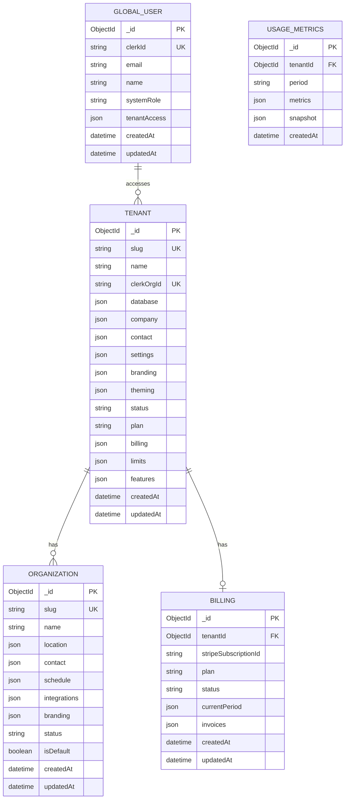

# Bloque 1: Fundación

**Estado:** En progreso
**Última actualización:** 2025-01-28

---

## Contenido

### Parte A: Modelo de Datos
1. [Arquitectura de Bases de Datos](#1-arquitectura-de-bases-de-datos)
2. [Modelo Sistema (db_serveflow_sys)](#2-modelo-sistema-db_serveflow_sys)
3. [Modelo Tenant (db_tenant)](#3-modelo-tenant-db_tenant)
   - 3.3 [Colección: ai_config](#33-colección-ai_config)
4. [Branding vs Theming](#4-branding-vs-theming)

### Parte B: Código e Infraestructura
5. [Estructura NX Monorepo](#5-estructura-nx-monorepo)
   - 5.2 [Apps - Organización por Dominio](#52-apps---organización-por-dominio)
   - 5.3 [Arquitectura de Comunicación](#53-arquitectura-de-comunicación)
   - 5.4.1 [Mapa de URLs Público vs Interno](#541-mapa-de-urls-público-vs-interno)
6. [Arquitectura Multi-Tenant en Código](#6-arquitectura-multi-tenant-en-código)
   - 6.2 [Routing por Subdominios](#62-routing-por-subdominios)
   - 6.3 [Tenant Resolution Layer](#63-la-solución-tenant-resolution-layer)
   - 6.6 [Resolución de Tenant por Servicio](#66-resolución-de-tenant-por-servicio)
7. [Flujo de Request](#7-flujo-de-request)
8. [Provisioning y Deployment](#8-provisioning-y-deployment)
   - 8.5 [Desarrollo Local](#85-desarrollo-local)
9. [Ejemplos Prácticos Multi-Tenant](#9-ejemplos-prácticos-multi-tenant)
   - 9.2 [Mapa de URLs](#92-mapa-de-urls)
   - 9.2.1 [Por qué paths vs subdominios](#921-por-qué-paths-en-vez-de-subdominios-de-subdominios)
   - 9.2.2 [Arquitectura Cloud-Agnostic](#922-arquitectura-cloud-agnostic)
   - 9.5 [Diagrama de Flujo Completo](#95-diagrama-de-flujo-completo)
   - 9.6 [Flujo de Reserva por WhatsApp](#96-ejemplo-flujo-de-reserva-por-whatsapp)

### Parte C: Decisiones
10. [Decisiones y Trade-offs](#10-decisiones-y-trade-offs)

---

## 1. Arquitectura de Bases de Datos

### Dos Modelos Separados

```
┌─────────────────────────────────────────────────────────────────────────────┐
│                         MODELO SISTEMA                                       │
│                      (db_serveflow_sys)                                      │
│                                                                              │
│  Propósito: Gestión de Serveflow como plataforma SaaS                        │
│  - Catálogo de tenants (clientes de Serveflow)                               │
│  - Usuarios globales (admins Serveflow, soporte, cross-tenant)               │
│  - Facturación de Serveflow a sus clientes                                   │
│  - Métricas de uso y analytics por tenant                                    │
│                                                                              │
├─────────────────────────────────────────────────────────────────────────────┤
│                         MODELO TENANT                                        │
│                      (db_tenant_{slug})                                      │
│                                                                              │
│  Propósito: Datos de cada cliente (tenant) aislados                          │
│  - Organizations (sedes del negocio)                                         │
│  - Users (usuarios del tenant)                                               │
│  - Memberships, Services, Resources, Events                                  │
│  - Todo lo específico del negocio del tenant                                 │
└─────────────────────────────────────────────────────────────────────────────┘
```

### Patrón: Database per Tenant

```
MongoDB Atlas Cluster
│
├── db_serveflow_sys              ← MODELO SISTEMA (1 instancia)
│   ├── tenants                   ← Catálogo de todos los tenants
│   ├── global_users              ← Admins Serveflow + usuarios cross-tenant
│   ├── billing                   ← Subscripciones de tenants a Serveflow
│   └── usage_metrics             ← Analytics y métricas de uso
│
├── db_tenant_club_madrid         ← MODELO TENANT (instancia 1)
│   ├── organizations
│   ├── users
│   ├── memberships
│   ├── services
│   ├── resources
│   └── events
│
├── db_tenant_club_barcelona      ← MODELO TENANT (instancia 2)
│   └── (misma estructura)
│
└── db_tenant_fitness_xyz         ← MODELO TENANT (instancia N)
    └── (misma estructura)
```

### ¿Por qué Database per Tenant?

| Beneficio | Descripción |
|-----------|-------------|
| **Escalabilidad** | Cada tenant escala independientemente |
| **Aislamiento total** | Zero data leakage entre tenants |
| **Performance** | Índices pequeños por DB, queries rápidas |
| **No "noisy neighbor"** | Un tenant grande no afecta a otros |
| **GDPR compliant** | Borrar tenant = `drop database` |
| **Migración flexible** | Mover tenant a cluster dedicado si crece |

### Tiers de Cluster

| Tier | Cluster | Tipo de Tenant | % Estimado |
|------|---------|----------------|------------|
| **Standard** | M10 compartido | Pequeños/medianos | 80% |
| **Pro** | M30 compartido | Medianos/grandes | 15% |
| **Enterprise** | Cluster dedicado | Muy grandes/regulados | 5% |

---

## 2. Modelo Sistema (db_serveflow_sys)

### 2.1 Colección: tenants

**Propósito:** Catálogo de todos los tenants (clientes de Serveflow)

#### Fases de Desarrollo

```
┌─────────────────────────────────────────────────────────────────┐
│  FASE 1: CORE (MVP)                    ← Implementar ahora      │
│  ├── Identificación (slug, name)                                │
│  ├── Auth (clerkOrgId)                                          │
│  ├── Infraestructura (database)                                 │
│  ├── Datos de empresa (legalName, taxId, address)               │
│  ├── Contacto (email, phone)                                    │
│  ├── Settings básicos (locale, timezone, currency)              │
│  └── Branding + Theming                                         │
├─────────────────────────────────────────────────────────────────┤
│  FASE 2: NEGOCIO                       ← Cuando haya planes     │
│  ├── Plan y estado (plan, status, trial)                        │
│  ├── Límites (maxUsers, maxOrganizations)                       │
│  └── Billing (stripeCustomerId)                                 │
├─────────────────────────────────────────────────────────────────┤
│  FASE 3: AVANZADO                      ← Cuando haya demanda    │
│  ├── Módulos habilitados (features)                             │
│  ├── Custom domain                                              │
│  └── Configuración avanzada                                     │
└─────────────────────────────────────────────────────────────────┘
```

#### Definición Completa

```typescript
interface Tenant {
  _id: ObjectId;

  // ════════════════════════════════════════════════════════════════
  // FASE 1: CORE (MVP) - Obligatorio desde el inicio
  // ════════════════════════════════════════════════════════════════

  // Identificación
  slug: string;                    // "club-padel-madrid" (único, URL-safe)
  name: string;                    // "Club Padel Madrid"

  // Auth - Vínculo con Clerk
  clerkOrgId: string;              // ID de Organization en Clerk

  // Infraestructura - Esencial para routing
  database: {
    name: string;                  // "db_tenant_club_madrid"
  };

  // Datos de empresa (para facturación de Serveflow al tenant)
  company: {
    legalName: string;             // "Club Padel Madrid S.L."
    taxId: string;                 // "B12345678" (CIF/NIF/VAT)
    address: {
      street: string;              // "Calle Principal 123"
      city: string;                // "Madrid"
      postalCode: string;          // "28001"
      country: string;             // "ES" (ISO 3166-1 alpha-2)
      state?: string;              // "Madrid" (opcional)
    };
  };

  // Contacto del tenant (para comunicación con Serveflow)
  contact: {
    email: string;                 // Email principal/facturación
    phone?: string;                // Teléfono de contacto
    supportEmail?: string;         // Email para soporte (si diferente)
    billingEmail?: string;         // Email para facturas (si diferente)
  };

  // Settings básicos - Necesarios para UI/UX
  settings: {
    locale: string;                // "es-ES"
    timezone: string;              // "Europe/Madrid"
    currency: string;              // "EUR"
  };

  // Branding - Identidad de marca (ver sección 4)
  branding: TenantBranding;

  // Theming - Personalización visual (ver sección 4)
  theming: TenantTheming;

  // Estado mínimo
  status: TenantStatus;            // "active" | "suspended"

  // Timestamps
  createdAt: Date;
  updatedAt: Date;

  // ════════════════════════════════════════════════════════════════
  // FASE 2: NEGOCIO - Cuando implementemos planes/billing
  // ════════════════════════════════════════════════════════════════

  // Plan y billing (para Serveflow cobrar al tenant)
  plan?: TenantPlan;               // "free" | "starter" | "pro" | "enterprise"
  billing?: {
    stripeCustomerId?: string;     // cus_xxx (cliente de Serveflow)
    subscriptionId?: string;       // sub_xxx
    subscriptionStatus?: string;   // "active" | "past_due" | "cancelled"
  };

  // Trial
  trial?: {
    endsAt: Date;
    convertedAt?: Date;
  };

  // Límites (basados en plan de Serveflow)
  limits?: {
    maxOrganizations: number;      // Default: 1
    maxUsers: number;              // Default: 10
    maxEventsPerMonth?: number;    // Default: unlimited
  };

  // ════════════════════════════════════════════════════════════════
  // FASE 3: AVANZADO - Cuando haya demanda
  // ════════════════════════════════════════════════════════════════

  // Módulos habilitados
  features?: {
    bookings: boolean;             // Default: true
    payments: boolean;             // Default: false
    whatsapp: boolean;             // Default: false
    ai: boolean;                   // Default: false
    api: boolean;                  // Default: false
  };

  // Settings avanzados
  advancedSettings?: {
    dateFormat?: string;           // "DD/MM/YYYY"
    timeFormat?: "12h" | "24h";    // "24h"
    weekStartsOn?: 0 | 1;          // 0=Sunday, 1=Monday
    customDomain?: string;         // "app.clubpadelmadrid.com"
  };
}

// Tipos auxiliares
type TenantStatus = "active" | "suspended" | "cancelled";
type TenantPlan = "free" | "starter" | "pro" | "enterprise";
```

#### Versión MVP (Fase 1)

```typescript
interface TenantMVP {
  _id: ObjectId;
  slug: string;
  name: string;
  clerkOrgId: string;
  database: { name: string };
  company: {
    legalName: string;
    taxId: string;
    address: {
      street: string;
      city: string;
      postalCode: string;
      country: string;
      state?: string;
    };
  };
  contact: {
    email: string;
    phone?: string;
    supportEmail?: string;
    billingEmail?: string;
  };
  settings: {
    locale: string;
    timezone: string;
    currency: string;
  };
  branding: TenantBranding;
  theming: TenantTheming;
  status: "active" | "suspended";
  createdAt: Date;
  updatedAt: Date;
}
```

#### Índices

```javascript
// db_serveflow_sys.tenants
{ slug: 1 }                        // unique - búsqueda por URL
{ clerkOrgId: 1 }                  // unique - búsqueda desde Clerk
{ "company.taxId": 1 }             // unique - evitar duplicados por CIF/NIF
{ "contact.email": 1 }             // búsqueda por email
{ status: 1 }                      // filtrar activos
{ "billing.stripeCustomerId": 1 } // Fase 2 - búsqueda desde Stripe webhook
```

---

### 2.2 Colección: global_users

**Propósito:** Usuarios que operan a nivel de sistema o cross-tenant

```typescript
interface GlobalUser {
  _id: ObjectId;

  // Identificación
  clerkId: string;                 // ID de usuario en Clerk
  email: string;
  name: string;

  // Rol a nivel de sistema
  systemRole: "superadmin" | "support" | "billing";

  // Tenants a los que tiene acceso (para soporte)
  tenantAccess?: Array<{
    tenantId: ObjectId;
    role: "viewer" | "support";    // Acceso limitado
    grantedAt: Date;
    grantedBy: ObjectId;
  }>;

  // Timestamps
  createdAt: Date;
  updatedAt: Date;
}
```

**Casos de uso:**
- Admin de Serveflow que gestiona todos los tenants
- Soporte que necesita acceder a tenants específicos
- Usuario que es owner de múltiples tenants (poco común)

---

### 2.3 Colección: billing

**Propósito:** Facturación de Serveflow a sus tenants

```typescript
interface BillingRecord {
  _id: ObjectId;

  tenantId: ObjectId;              // Referencia al tenant

  // Subscripción de Serveflow
  stripeSubscriptionId: string;
  plan: TenantPlan;
  status: "active" | "past_due" | "cancelled" | "trialing";

  // Período actual
  currentPeriod: {
    start: Date;
    end: Date;
  };

  // Historial de facturas
  invoices: Array<{
    stripeInvoiceId: string;
    amount: number;
    currency: string;
    status: "paid" | "open" | "void";
    paidAt?: Date;
  }>;

  createdAt: Date;
  updatedAt: Date;
}
```

---

### 2.4 Colección: usage_metrics

**Propósito:** Métricas de uso para analytics y facturación basada en uso

```typescript
interface UsageMetric {
  _id: ObjectId;

  tenantId: ObjectId;
  period: string;                  // "2025-01" (año-mes)

  // Contadores
  metrics: {
    activeUsers: number;
    eventsCreated: number;
    apiCalls: number;
    storageUsedMB: number;
    whatsappMessages?: number;
  };

  // Snapshot al final del período
  snapshot: {
    totalUsers: number;
    totalOrganizations: number;
    totalResources: number;
  };

  createdAt: Date;
}
```

---

## 3. Modelo Tenant (db_tenant)

### 3.1 Colección: organizations

**Ubicación:** `db_tenant_{slug}.organizations`

#### Fases de Desarrollo

```
┌─────────────────────────────────────────────────────────────────┐
│  FASE 1: CORE (MVP)                    ← Implementar ahora      │
│  ├── Identificación (slug, name)                                │
│  ├── Ubicación básica (address, city, country)                  │
│  ├── Contacto (email, phone)                                    │
│  └── Horario semanal básico                                     │
├─────────────────────────────────────────────────────────────────┤
│  FASE 2: INTEGRACIONES                 ← Cuando se necesiten    │
│  ├── Stripe Connect (accountId) - para cobros del tenant        │
│  └── WhatsApp Business (phoneNumberId)                          │
├─────────────────────────────────────────────────────────────────┤
│  FASE 3: AVANZADO                      ← Cuando haya demanda    │
│  ├── Coordenadas GPS                                            │
│  ├── Festivos y horarios especiales                             │
│  └── Branding por sede (override del tenant)                    │
└─────────────────────────────────────────────────────────────────┘
```

#### Definición Completa

```typescript
interface Organization {
  _id: ObjectId;

  // ════════════════════════════════════════════════════════════════
  // FASE 1: CORE (MVP)
  // ════════════════════════════════════════════════════════════════

  // Identificación
  slug: string;                    // "sede-centro" (único en tenant)
  name: string;                    // "Sede Centro"

  // Ubicación básica
  location: {
    address: string;
    city: string;
    country: string;
    postalCode?: string;
  };

  // Contacto
  contact: {
    email: string;
    phone?: string;
  };

  // Horario de operación
  schedule: {
    timezone: string;              // "Europe/Madrid"
    weekly: WeeklySchedule;
  };

  // Estado
  status: "active" | "inactive";
  isDefault: boolean;              // Sede principal del tenant

  // Timestamps
  createdAt: Date;
  updatedAt: Date;

  // ════════════════════════════════════════════════════════════════
  // FASE 2: INTEGRACIONES
  // Nota: Estas son las integraciones del TENANT con sus clientes,
  // no de Serveflow con el tenant.
  // ════════════════════════════════════════════════════════════════

  integrations?: {
    stripe?: {
      accountId: string;           // acct_xxx (Stripe Connect del tenant)
      enabled: boolean;
      onboardingComplete: boolean;
    };
    whatsapp?: {
      phoneNumberId: string;       // De Meta Business
      enabled: boolean;
    };
  };

  // ════════════════════════════════════════════════════════════════
  // FASE 3: AVANZADO
  // ════════════════════════════════════════════════════════════════

  // Ubicación extendida
  coordinates?: {
    lat: number;
    lng: number;
  };

  // Metadatos adicionales
  description?: string;
  website?: string;

  // Festivos y excepciones
  holidays?: Holiday[];

  // Branding por sede (override del tenant)
  branding?: Partial<TenantBranding>;
}

// ════════════════════════════════════════════════════════════════
// Tipos auxiliares
// ════════════════════════════════════════════════════════════════

interface WeeklySchedule {
  monday?: DaySchedule;
  tuesday?: DaySchedule;
  wednesday?: DaySchedule;
  thursday?: DaySchedule;
  friday?: DaySchedule;
  saturday?: DaySchedule;
  sunday?: DaySchedule;
}

interface DaySchedule {
  isOpen: boolean;
  openTime?: string;               // "09:00" (HH:mm)
  closeTime?: string;              // "22:00" (HH:mm)
  breaks?: Array<{
    start: string;                 // "14:00"
    end: string;                   // "16:00"
  }>;
}

interface Holiday {
  date: string;                    // "2025-12-25" (YYYY-MM-DD)
  name: string;                    // "Navidad"
  isOpen: boolean;
  schedule?: DaySchedule;          // Horario especial si abre
}
```

#### Versión MVP (Fase 1)

```typescript
interface OrganizationMVP {
  _id: ObjectId;
  slug: string;
  name: string;
  location: {
    address: string;
    city: string;
    country: string;
    postalCode?: string;
  };
  contact: {
    email: string;
    phone?: string;
  };
  schedule: {
    timezone: string;
    weekly: WeeklySchedule;
  };
  status: "active" | "inactive";
  isDefault: boolean;
  createdAt: Date;
  updatedAt: Date;
}
```

#### Índices

```javascript
// db_tenant_{slug}.organizations
{ slug: 1 }                        // unique
{ status: 1 }
{ isDefault: 1 }
```

---

### 3.2 Resumen de Colecciones del Tenant

| Colección | Bloque | Estado |
|-----------|--------|--------|
| `organizations` | 1 - Fundación | Definido |
| `ai_config` | 1 - Fundación | Definido |
| `users` | 2 - Identidad | Pendiente |
| `memberships` | 2 - Identidad | Pendiente |
| `services` | 4 - Negocio | Pendiente |
| `resources` | 4 - Negocio | Pendiente |
| `events` | 4 - Negocio | Pendiente |
| `orders` | 5 - Pagos | Pendiente |
| `subscriptions` | 5 - Pagos | Pendiente |
| `vouchers` | 5 - Pagos | Pendiente |

---

### 3.3 Colección: ai_config

**Ubicación:** `db_tenant_{slug}.ai_config`

**Propósito:** Configuración del AI Assistant específica para cada tenant. Permite personalizar el comportamiento, agentes habilitados, prompts y reglas sin necesidad de código custom.

```typescript
interface AIConfig {
  _id: ObjectId;

  // ════════════════════════════════════════════════════════════════
  // IDENTIDAD DEL ASISTENTE
  // ════════════════════════════════════════════════════════════════

  identity: {
    name: string;                    // "PadelBot", "FitAssistant"
    systemPrompt: string;            // Prompt principal del asistente
    personality: string;             // "formal" | "amigable" | "profesional"
    language: string;                // "es" | "en" | "ca"
    welcomeMessage: string;          // Mensaje al iniciar conversación
  };

  // ════════════════════════════════════════════════════════════════
  // AGENTES HABILITADOS
  // ════════════════════════════════════════════════════════════════

  agents: {
    booking: {
      enabled: boolean;
      config?: {
        maxAdvanceDays: number;      // Máximo días de antelación para reservar
        requiresConfirmation: boolean;
      };
    };
    info: {
      enabled: boolean;              // Información general del negocio
    };
    support: {
      enabled: boolean;
      config?: {
        escalateToHuman: boolean;    // Puede escalar a humano
        humanEmail?: string;         // Email para escalación
      };
    };
    tournaments?: {                  // Solo para clubs con torneos
      enabled: boolean;
    };
    classes?: {                      // Solo para gimnasios/fitness
      enabled: boolean;
    };
    nutrition?: {                    // Solo para fitness con nutricionista
      enabled: boolean;
    };
  };

  // ════════════════════════════════════════════════════════════════
  // REGLAS DE NEGOCIO
  // ════════════════════════════════════════════════════════════════

  rules: {
    maxBookingsPerDay: number;       // Límite de reservas por usuario/día
    requiresMembership: boolean;     // Solo socios pueden reservar
    canBookForOthers: boolean;       // Puede reservar para terceros
    cancellationHours: number;       // Horas mínimas para cancelar
  };

  // ════════════════════════════════════════════════════════════════
  // DISPONIBILIDAD DEL ASISTENTE
  // ════════════════════════════════════════════════════════════════

  availability: {
    mode: "24h" | "business_hours" | "custom";
    customHours?: {
      start: string;                 // "08:00"
      end: string;                   // "22:00"
    };
    offlineMessage: string;          // Mensaje fuera de horario
  };

  // ════════════════════════════════════════════════════════════════
  // TOOLS PERSONALIZADOS (opcional)
  // ════════════════════════════════════════════════════════════════

  customTools?: Array<{
    name: string;                    // "check_tournament_status"
    description: string;             // Descripción para el LLM
    endpoint: string;                // "/api/tournaments/status"
    parameters: Record<string, any>; // Schema de parámetros
  }>;

  // ════════════════════════════════════════════════════════════════
  // CONFIGURACIÓN AVANZADA
  // ════════════════════════════════════════════════════════════════

  advanced?: {
    llmProvider?: "anthropic" | "openai";  // Default: anthropic
    model?: string;                  // Default: claude-sonnet
    temperature?: number;            // Default: 0.7
    maxTokens?: number;              // Default: 1000
  };

  // Timestamps
  createdAt: Date;
  updatedAt: Date;
}
```

**Ejemplo para Club de Padel:**

```typescript
const clubPadelConfig: AIConfig = {
  identity: {
    name: "PadelBot",
    systemPrompt: `Eres PadelBot, el asistente virtual del Club Padel Madrid.
Tu objetivo es ayudar a los socios a reservar pistas, consultar disponibilidad
y resolver dudas sobre el club. Sé amable pero eficiente.`,
    personality: "amigable",
    language: "es",
    welcomeMessage: "¡Hola! Soy PadelBot 🎾 ¿En qué puedo ayudarte hoy?",
  },
  agents: {
    booking: { enabled: true, config: { maxAdvanceDays: 7, requiresConfirmation: true } },
    info: { enabled: true },
    support: { enabled: true, config: { escalateToHuman: true } },
    tournaments: { enabled: true },
  },
  rules: {
    maxBookingsPerDay: 2,
    requiresMembership: true,
    canBookForOthers: false,
    cancellationHours: 2,
  },
  availability: {
    mode: "business_hours",
    customHours: { start: "08:00", end: "23:00" },
    offlineMessage: "Estamos fuera de horario. Puedes reservar en nuestra web.",
  },
};
```

**Ejemplo para Gimnasio:**

```typescript
const gymConfig: AIConfig = {
  identity: {
    name: "FitBot",
    systemPrompt: `Eres FitBot, asistente del Gym Valencia.
Ayudas con reservas de clases, información sobre entrenadores,
y consultas sobre membresías. Motiva a los usuarios a entrenar.`,
    personality: "motivador",
    language: "es",
    welcomeMessage: "¡Hey! 💪 Soy FitBot. ¿Listo para entrenar?",
  },
  agents: {
    booking: { enabled: true },
    info: { enabled: true },
    support: { enabled: true },
    classes: { enabled: true },
    nutrition: { enabled: false },  // No tienen nutricionista
  },
  rules: {
    maxBookingsPerDay: 3,
    requiresMembership: true,
    canBookForOthers: false,
    cancellationHours: 1,
  },
  availability: {
    mode: "24h",
    offlineMessage: "",
  },
};
```

---

## 4. Branding vs Theming

### Diferencia Conceptual

```
┌─────────────────────────────────────────────────────────────────────────────┐
│  BRANDING (Identidad de Marca)                                              │
│  ───────────────────────────────                                            │
│  • Estático: cambia raramente                                               │
│  • Quién eres: logo, nombre, favicon                                        │
│  • Identidad: cómo te reconocen                                             │
│                                                                              │
├─────────────────────────────────────────────────────────────────────────────┤
│  THEMING (Personalización Visual)                                           │
│  ─────────────────────────────────                                          │
│  • Dinámico: puede cambiar con preferencias de usuario                      │
│  • Cómo se ve: colores, tipografías, modo oscuro                            │
│  • Experiencia: cómo interactúan con tu app                                 │
└─────────────────────────────────────────────────────────────────────────────┘
```

### 4.1 Branding

```typescript
interface TenantBranding {
  // Logo principal
  logo: {
    url: string;                   // URL del logo para modo claro
    darkUrl?: string;              // URL del logo para modo oscuro (opcional)
  };

  // Favicon
  favicon?: string;                // URL del favicon

  // Nombre de la app (override del tenant name en UI)
  appName?: string;                // "Club Padel Madrid App"
}
```

**Valores por defecto:**

```typescript
const DEFAULT_BRANDING: TenantBranding = {
  logo: {
    url: "/assets/logo-serveflow.svg",
    darkUrl: "/assets/logo-serveflow-white.svg",
  },
  favicon: "/favicon.ico",
  // appName usa tenant.name por defecto
};
```

---

### 4.2 Theming

Basado en el sistema actual de `tenant-dashboard/src/theme`:

```typescript
interface TenantTheming {
  // Modo de color preferido
  mode: "light" | "dark" | "system";

  // Opción 1: Usar un preset predefinido
  preset?: ThemePreset;            // "default" | "preset1" ... "preset5"

  // Opción 2: Colores personalizados (override del preset)
  palette?: {
    primary?: ColorScale;
    secondary?: ColorScale;
  };

  // Tipografía personalizada (opcional)
  typography?: {
    primaryFont?: string;          // "Public Sans Variable"
    secondaryFont?: string;        // "Barlow"
  };

  // Dirección de texto
  direction?: "ltr" | "rtl";       // Default: "ltr"
}

// Escala de colores (misma estructura que theme-config.ts)
interface ColorScale {
  lighter: string;                 // "#faebe9"
  light: string;                   // "#feb39d"
  main: string;                    // "#FF9776" (color principal)
  dark: string;                    // "#f76337"
  darker: string;                  // "#c24825"
  contrastText: string;            // "#FFFFFF"
}

type ThemePreset = "default" | "preset1" | "preset2" | "preset3" | "preset4" | "preset5";
```

**Presets disponibles (de color-presets.ts):**

| Preset | Primary Main | Descripción |
|--------|--------------|-------------|
| `default` | #FF9776 | Coral (Serveflow default) |
| `preset1` | #078DEE | Azul cielo |
| `preset2` | #7635dc | Púrpura |
| `preset3` | #0C68E9 | Azul eléctrico |
| `preset4` | #fda92d | Naranja/Amarillo |
| `preset5` | #FF3030 | Rojo |

**Valores por defecto:**

```typescript
const DEFAULT_THEMING: TenantTheming = {
  mode: "light",
  preset: "default",
  direction: "ltr",
};
```

---

### 4.3 Jerarquía de aplicación

```
┌─────────────────────────────────────────────────────────────────────────────┐
│  1. SERVEFLOW DEFAULTS (defaultThemeSettings)                               │
│     ↓                                                                        │
│  2. TENANT THEMING (mode, direction, preset, palette)                       │
│     ↓                                                                        │
│  3. USER PREFERENCES (solo modo light/dark) [futuro]                        │
└─────────────────────────────────────────────────────────────────────────────┘
```

### 4.4 Uso del ThemeProvider

El ThemeProvider sigue el patrón de Minimal template - simple y basado en `settings`:

```typescript
// apps/tenant/dashboard/src/app/layout.tsx
import { ThemeProvider } from '@serveflow/ui';
import { TenantProvider } from '@serveflow/tenants/react';

export default async function RootLayout({ children }) {
  const { tenant, error } = await getTenantFromHeaders();

  return (
    <TenantProvider tenant={tenant} error={error}>
      <ThemeProvider
        settings={{
          mode: tenant?.theming?.mode || 'light',
          direction: tenant?.theming?.direction || 'ltr',
          preset: tenant?.theming?.preset || 'default',
          tenant: tenant?.theming,  // Para colores custom si los hay
        }}
      >
        {children}
      </ThemeProvider>
    </TenantProvider>
  );
}
```

**Notas:**
- `settings.mode` - Modo claro/oscuro
- `settings.direction` - LTR/RTL para internacionalización
- `settings.preset` - Preset de colores predefinido
- `settings.tenant` - Overrides custom del tenant (primaryColor, etc.)

El `createTheme` interno aplica los settings en este orden:
1. `defaultThemeSettings` (base)
2. `settings` pasados al provider (override)
3. `settings.tenant` si existe (colores custom)

---

# PARTE B: CÓDIGO E INFRAESTRUCTURA

---

## 5. Estructura NX Monorepo

### 5.1 Visión General

```
serveflow/
│
├── apps/
│   │
│   ├── admin/                      # 🔒 SOLO EQUIPO SERVEFLOW
│   │   ├── api/                    # API para gestión de plataforma
│   │   └── dashboard/              # Panel interno de Serveflow
│   │
│   └── tenant/                     # 👥 TODO LO RELACIONADO CON TENANTS
│       ├── api/                    # ⭐ Backend central (incluye WhatsApp webhook)
│       ├── dashboard/              # Dashboard de gestión (Next.js)
│       ├── webapp/                 # Web pública del tenant (booking)
│       ├── mcp-server/             # Model Context Protocol (AI tools)
│       └── ai-assistant/           # LangGraph multi-agent
│
├── packages/                       # Librerías compartidas
│   ├── @serveflow/db/              # MongoDB connection + tenant isolation
│   ├── @serveflow/auth/            # Clerk integration
│   ├── @serveflow/tenants/         # Tenant resolution (hostname → tenant)
│   ├── @serveflow/identity/        # ✅ EXISTE - User identity cross-channel
│   ├── @serveflow/config/          # Environment + feature flags
│   ├── @serveflow/core/            # Types, utils, Zod schemas
│   └── @serveflow/ui/              # MUI components + theming
│
├── docs/                           # Documentación
├── scripts/                        # Scripts de utilidad
└── tools/                          # Herramientas de desarrollo
```

### 5.2 Apps - Organización por Dominio

```
┌─────────────────────────────────────────────────────────────────────────────┐
│  apps/admin/                        🔒 INTERNO SERVEFLOW                     │
│  ───────────                                                                 │
│                                                                              │
│  api/          API para gestionar la plataforma                             │
│                - CRUD de tenants                                            │
│                - Billing de Serveflow                                       │
│                - Métricas globales                                          │
│                - NO multi-tenant (accede a db_serveflow_sys)                │
│                                                                              │
│  dashboard/    Panel interno para equipo Serveflow                          │
│                - Gestión de todos los tenants                               │
│                - Facturación y planes                                       │
│                - Soporte técnico                                            │
├─────────────────────────────────────────────────────────────────────────────┤
│  apps/tenant/                       👥 TODO LO RELACIONADO CON TENANTS       │
│  ────────────                                                                │
│                                                                              │
│  api/          ⭐ BACKEND CENTRAL DEL TENANT                                │
│                - TODAS las operaciones del tenant                           │
│                - Consumido por: dashboard, webapp, MCP, AI, WhatsApp        │
│                - Resuelve tenant por subdomain                              │
│                - Conecta a db_tenant_{slug}                                 │
│                                                                              │
│  dashboard/    Panel de gestión para admins del tenant                      │
│                - Configuración del negocio                                  │
│                - Gestión de reservas, usuarios, recursos                    │
│                - Resuelve tenant por subdomain + Clerk                      │
│                                                                              │
│  webapp/       Web pública para clientes finales del tenant                 │
│                - Booking online                                             │
│                - Perfil de usuario                                          │
│                - Sin auth obligatorio para ver disponibilidad               │
│                                                                              │
│  mcp-server/   Model Context Protocol (Anthropic)                           │
│                - Expone tools para AI: bookings, availability, resources    │
│                - Recibe tenant en headers → llama a tenant/api              │
│                - ✅ EXISTE en repo (parcialmente implementado)              │
│                                                                              │
│  ai-assistant/ Orquestador multi-agente (LangGraph.js/TypeScript)           │
│                - Supervisor + Booking Agent + más agentes                   │
│                - Recibe tenant del caller (WhatsApp, dashboard)             │
│                - Usa MCP para ejecutar acciones                             │
│                - Carga ai_config del tenant para personalización            │
│                - ✅ EXISTE en repo (70% implementado)                       │
│                                                                              │
│  NOTA: WhatsApp webhook se maneja en tenant/api (controller /api/whatsapp)  │
│        No hay servicio separado - el tenant se resuelve por subdomain       │
└─────────────────────────────────────────────────────────────────────────────┘
```

### 5.3 Arquitectura de Comunicación

```
┌─────────────────────────────────────────────────────────────────────────────┐
│                     FLUJO DE COMUNICACIÓN                                    │
└─────────────────────────────────────────────────────────────────────────────┘

                           INTERNET
                              │
      ┌───────────────────────┼───────────────────────┐
      │                       │                       │
      ▼                       ▼                       ▼
┌──────────────┐    ┌─────────────────┐    ┌─────────────────┐
│   tenant/    │    │   WhatsApp      │    │   tenant/       │
│   dashboard  │    │   Business API  │    │   webapp        │
└──────┬───────┘    └────────┬────────┘    └────────┬────────┘
       │                     │ webhook                │
       │                     │                        │
       └─────────────────────┼────────────────────────┘
                             │
                             ▼
┌─────────────────────────────────────────────────────────────────────────────┐
│                                                                              │
│                        ⭐ apps/tenant/api (NestJS)                           │
│                           (Backend Central)                                  │
│                                                                              │
│   - Resuelve tenant por subdomain (club-padel-madrid.serveflow.com/api)     │
│   - Expone: /bookings, /resources, /services, /users, /availability         │
│   - Expone: /whatsapp/webhook (recibe webhooks de Meta)                     │
│   - Conecta a db_tenant_{slug}                                              │
│   - Llama a AI Assistant para procesar mensajes                             │
│                                                                              │
└──────────────────────────────────┬──────────────────────────────────────────┘
                                   │
                      ┌────────────┴────────────┐
                      │                         │
                      ▼                         ▼
               ┌─────────────┐          ┌─────────────┐
               │    AI       │          │    MCP      │
               │  Assistant  │─────────►│   Server    │───┐
               │  (Node.js)  │          │  (Node.js)  │   │
               └─────────────┘          └─────────────┘   │
                                                          │
                      ┌───────────────────────────────────┘
                      │ Ejecuta tools (bookings, availability, etc)
                      ▼
┌─────────────────────────────────────────────────────────────────────────────┐
│                        ⭐ apps/tenant/api (NestJS)                           │
└─────────────────────────────────────────────────────────────────────────────┘
                             │
                             ▼
                    ┌─────────────────┐
                    │  MongoDB Atlas  │
                    │ db_tenant_xxx   │
                    └─────────────────┘
```

### 5.4 Apps - Tabla Resumen

| App | Ubicación | Tecnología | URL | Resuelve Tenant |
|-----|-----------|------------|-----|-----------------|
| `admin/api` | apps/admin/api | NestJS | `admin.serveflow.com/api/*` | No (db_serveflow_sys) |
| `admin/dashboard` | apps/admin/dashboard | Next.js | `admin.serveflow.com/*` | No |
| `tenant/api` | apps/tenant/api | NestJS | `{slug}.serveflow.com/api/*` | Subdomain |
| `tenant/dashboard` | apps/tenant/dashboard | Next.js | `{slug}.serveflow.com/admin/*` | Subdomain + Clerk |
| `tenant/webapp` | apps/tenant/webapp | Next.js | `{slug}.serveflow.com/*` | Subdomain |
| `tenant/mcp-server` | apps/tenant/mcp-server | Node.js (MCP SDK) | `mcp.internal.serveflow.com` | Header `X-Tenant-Slug` |
| `tenant/ai-assistant` | apps/tenant/ai-assistant | Node.js (LangGraph.js) | `ai.internal.serveflow.com` | Body `tenantSlug` |

**Nota:** WhatsApp webhook se maneja en `tenant/api` (controller `/api/whatsapp/webhook`), no requiere servicio separado.

### 5.4.1 Mapa de URLs Público vs Interno

```
┌─────────────────────────────────────────────────────────────────────────────┐
│                         URLS PÚBLICAS (Internet)                             │
└─────────────────────────────────────────────────────────────────────────────┘

  Usuarios finales y webhooks externos acceden a estas URLs:

  TENANT (por subdominio)
  ───────────────────────
  {slug}.serveflow.com/                    → Webapp (reservas públicas)
  {slug}.serveflow.com/admin/*             → Dashboard (gestión, requiere Clerk)
  {slug}.serveflow.com/api/*               → API REST del tenant
  {slug}.serveflow.com/api/whatsapp/webhook→ Webhook de Meta WhatsApp

  ADMIN SERVEFLOW
  ────────────────
  admin.serveflow.com/                     → Panel administración Serveflow
  admin.serveflow.com/api/*                → API administración

┌─────────────────────────────────────────────────────────────────────────────┐
│                       URLS INTERNAS (Service-to-Service)                     │
└─────────────────────────────────────────────────────────────────────────────┘

  Solo accesibles dentro de la red privada (VPC/K8s/Docker network):

  ai.internal.serveflow.com                → AI Assistant (LangGraph.js)
  mcp.internal.serveflow.com               → MCP Server (tools para AI)

  Nota: En desarrollo local, estos servicios corren en localhost con puertos:
  - tenant/api:        localhost:3001
  - AI Assistant:      localhost:3010
  - MCP Server:        localhost:3011

┌─────────────────────────────────────────────────────────────────────────────┐
│                         FLUJO DE COMUNICACIÓN                                │
└─────────────────────────────────────────────────────────────────────────────┘

                              INTERNET
                                 │
     ┌───────────────────────────┼───────────────────────────┐
     │                           │                           │
     ▼                           ▼                           ▼
┌──────────┐              ┌────────────┐              ┌──────────┐
│  Webapp  │              │    API     │              │Dashboard │
│  (Next)  │              │  (NestJS)  │◄─────────────│  (Next)  │
└──────────┘              └─────┬──────┘              └──────────┘
                                │
                   ┌────────────┴────────────┐
                   │                         │
                   │  Incluye:               │
                   │  • REST endpoints       │
                   │  • WhatsApp webhook     │◄──── Meta WhatsApp API
                   │  • Calls AI Assistant   │
                   │                         │
                   └────────────┬────────────┘
                                │
                   ┌────────────┴────────────┐
                   │                         │
                   ▼                         ▼
            ┌───────────┐             ┌───────────┐
            │    AI     │────────────►│   MCP     │
            │ Assistant │             │  Server   │
            │ (Node.js) │             │ (Node.js) │
            └───────────┘             └─────┬─────┘
                                            │
                                            ▼
                                      ┌───────────┐
                                      │   API     │
                                      │ (NestJS)  │
                                      └───────────┘

  tenant/api es el punto de entrada público.
  AI Assistant y MCP Server son servicios internos.
  Llamadas internas incluyen header X-Tenant-Slug o body.tenantSlug.
```

### 5.5 Packages - Detalle

```
┌─────────────────────────────────────────────────────────────────────────────┐
│  @serveflow/db                                                               │
│  ─────────────                                                               │
│  • MongoClient singleton con connection pooling                             │
│  • getTenantDb(slug) → Db                                                   │
│  • getSystemDb() → Db                                                        │
│  • Cache de conexiones por tenant                                           │
├─────────────────────────────────────────────────────────────────────────────┤
│  @serveflow/auth                                                             │
│  ──────────────                                                              │
│  • Clerk middleware (backend)                                                │
│  • ClerkProvider (frontend)                                                  │
│  • getAuth() helper                                                          │
│  • User/Org types desde Clerk                                                │
├─────────────────────────────────────────────────────────────────────────────┤
│  @serveflow/tenants                            ✅ EXISTE                     │
│  ─────────────────                                                           │
│  • Resolución por hostname (subdomain → slug)                               │
│  • Fallback: Edge Config → KV → Firebase                                    │
│  • Cache con TTL 5 minutos                                                  │
│  • TenantContext para React                                                 │
├─────────────────────────────────────────────────────────────────────────────┤
│  @serveflow/identity                           ✅ EXISTE                     │
│  ──────────────────                                                          │
│  • Unified User ID (cross-channel)                                          │
│  • Hash determinístico: SHA-256(userId:tenantId)                            │
│  • Resolución por phone, email, userId                                      │
│  • Mappings en Firestore con cache                                          │
├─────────────────────────────────────────────────────────────────────────────┤
│  @serveflow/config                                                           │
│  ────────────────                                                            │
│  • Environment variables                                                     │
│  • Feature flags por tenant                                                  │
│  • Default values                                                            │
├─────────────────────────────────────────────────────────────────────────────┤
│  @serveflow/core                                                             │
│  ──────────────                                                              │
│  • Shared types (Organization, User, Event, etc.)                           │
│  • Utility functions                                                         │
│  • Constants                                                                 │
│  • Zod schemas para validación                                              │
├─────────────────────────────────────────────────────────────────────────────┤
│  @serveflow/ui                                                               │
│  ─────────────                                                               │
│  • Componentes MUI customizados                                              │
│  • Theme provider con tenant theming                                         │
│  • Design tokens                                                             │
└─────────────────────────────────────────────────────────────────────────────┘
```

### 5.6 Dependencias entre Packages

```mermaid
graph TD
    subgraph "Apps Tenant"
        TD[tenant/dashboard]
        TA[tenant/api]
        TW[tenant/webapp]
        MCP[tenant/mcp-server]
        AI[tenant/ai-assistant]
    end

    subgraph "Packages"
        DB[@serveflow/db]
        AUTH[@serveflow/auth]
        TEN[@serveflow/tenants]
        ID[@serveflow/identity]
        CORE[@serveflow/core]
        CFG[@serveflow/config]
        UI[@serveflow/ui]
    end

    TD --> UI
    TD --> TEN
    TD --> AUTH
    TW --> UI
    TW --> TEN

    TA --> DB
    TA --> TEN
    TA --> AUTH
    TA --> CORE

    AI --> ID
    AI --> CORE
    MCP --> CORE

    TEN --> DB
    TEN --> CFG
    ID --> CFG
    DB --> CFG
```

### 5.7 Path Aliases (tsconfig.base.json)

```json
{
  "paths": {
    "@serveflow/db": ["packages/db/src/index.ts"],
    "@serveflow/auth": ["packages/auth/src/index.ts"],
    "@serveflow/tenants": ["packages/tenants/src/index.ts"],
    "@serveflow/identity": ["packages/identity/src/index.ts"],
    "@serveflow/config": ["packages/config/src/index.ts"],
    "@serveflow/core": ["packages/core/src/index.ts"],
    "@serveflow/ui": ["packages/ui/src/index.ts"]
  }
}
```

---

### 5.5 Arquitectura de Código: Zod-First

#### Principios

```
┌─────────────────────────────────────────────────────────────────────────────┐
│  PROBLEMAS QUE RESOLVEMOS                                                    │
│                                                                              │
│  ❌ Antes: Definiciones duplicadas                                           │
│     • packages/core/types/user.ts        (interfaces TypeScript)            │
│     • packages/core/schemas/user.ts      (Zod schemas)                      │
│     • packages/db/schemas/user.ts        (Mongoose schemas)                 │
│     • apps/api/users/dto/create-user.ts  (class-validator DTOs)             │
│     = 4 lugares donde definir los mismos campos                             │
│     = Inconsistencias, bugs de sincronización                               │
│                                                                              │
│  ✅ Ahora: Single Source of Truth                                            │
│     • packages/core/schemas/user.ts      (Zod = ÚNICA fuente)               │
│     • packages/db/schemas/user.ts        (Mongoose implementa tipo de Zod)  │
│     • apps/api → usa ZodValidationPipe (NO DTOs)                            │
│     = 1 lugar para definir, tipos inferidos automáticamente                 │
│                                                                              │
└─────────────────────────────────────────────────────────────────────────────┘
```

#### Estructura de Packages

```
packages/
├── core/                    # Tipos, schemas, utilidades compartidas
│   └── src/
│       ├── schemas/         # ⭐ ZOD SCHEMAS (ÚNICA FUENTE DE VERDAD)
│       │   ├── tenant.schema.ts
│       │   ├── organization.schema.ts
│       │   ├── user.schema.ts          # (Bloque 2)
│       │   ├── global-user.schema.ts   # (Bloque 2)
│       │   └── index.ts
│       ├── enums/           # Enums compartidos (exportados desde schemas)
│       │   └── index.ts
│       ├── pipes/           # Pipes de validación
│       │   └── zod-validation.pipe.ts
│       ├── utils/           # Utilidades puras
│       │   └── index.ts
│       └── index.ts
│
├── db/                      # Capa de base de datos (Mongoose)
│   └── src/
│       ├── schemas/         # Mongoose schemas (IMPLEMENTAN tipos de @core)
│       │   ├── tenant.schema.ts
│       │   ├── organization.schema.ts
│       │   ├── user.schema.ts          # (Bloque 2)
│       │   └── index.ts
│       ├── connection.service.ts
│       ├── mongoose.module.ts
│       └── index.ts
```

#### Flujo de Validación

```
┌─────────────────────────────────────────────────────────────────────────────┐
│  FLUJO: HTTP Request → Validación → Service → Database                      │
│                                                                              │
│  POST /api/tenants                                                           │
│       │                                                                      │
│       ▼                                                                      │
│  ┌─────────────────────────────────────────────────────────────────────┐    │
│  │  Controller                                                          │    │
│  │  @UsePipes(new ZodValidationPipe(CreateTenantSchema))               │    │
│  │  create(@Body() data: CreateTenantInput) { ... }                    │    │
│  └─────────────────────────────────────────────────────────────────────┘    │
│       │                                                                      │
│       │  ZodValidationPipe valida y transforma                              │
│       │  Si falla → 400 Bad Request con errores detallados                  │
│       │  Si pasa → data es del tipo CreateTenantInput (inferido de Zod)    │
│       ▼                                                                      │
│  ┌─────────────────────────────────────────────────────────────────────┐    │
│  │  Service                                                             │    │
│  │  create(data: CreateTenantInput) {                                   │    │
│  │    return this.tenantModel.create(data);                             │    │
│  │  }                                                                   │    │
│  └─────────────────────────────────────────────────────────────────────┘    │
│       │                                                                      │
│       ▼                                                                      │
│  ┌─────────────────────────────────────────────────────────────────────┐    │
│  │  Mongoose Model                                                      │    │
│  │  class Tenant implements TenantType { ... }                         │    │
│  └─────────────────────────────────────────────────────────────────────┘    │
│                                                                              │
└─────────────────────────────────────────────────────────────────────────────┘
```

#### Ejemplo: Tenant Schema (Zod - Single Source)

```typescript
// packages/core/src/schemas/tenant.schema.ts
import { z } from 'zod';

// ════════════════════════════════════════════════════════════════
// ENUMS
// ════════════════════════════════════════════════════════════════

export const TenantStatusSchema = z.enum(['active', 'suspended', 'cancelled']);
export const TenantPlanSchema = z.enum(['free', 'starter', 'pro', 'enterprise']);

// ════════════════════════════════════════════════════════════════
// SUB-SCHEMAS
// ════════════════════════════════════════════════════════════════

export const AddressSchema = z.object({
  street: z.string().min(1),
  city: z.string().min(1),
  postalCode: z.string().min(1),
  country: z.string().length(2), // ISO 3166-1 alpha-2
  state: z.string().optional(),
});

export const TenantCompanySchema = z.object({
  legalName: z.string().min(1),
  taxId: z.string().min(1),
  address: AddressSchema,
});

export const TenantContactSchema = z.object({
  email: z.string().email(),
  phone: z.string().optional(),
  supportEmail: z.string().email().optional(),
  billingEmail: z.string().email().optional(),
});

export const TenantSettingsSchema = z.object({
  locale: z.string().default('es-ES'),
  timezone: z.string().default('Europe/Madrid'),
  currency: z.string().length(3).default('EUR'),
});

export const TenantBrandingSchema = z.object({
  logo: z.object({
    url: z.string().url(),
    darkUrl: z.string().url().optional(),
  }),
  favicon: z.string().url().optional(),
  appName: z.string().optional(),
});

export const TenantThemingSchema = z.object({
  mode: z.enum(['light', 'dark', 'system']).default('light'),
  preset: z.enum(['default', 'preset1', 'preset2', 'preset3', 'preset4', 'preset5']).optional(),
  direction: z.enum(['ltr', 'rtl']).default('ltr'),
});

// ════════════════════════════════════════════════════════════════
// MAIN SCHEMA
// ════════════════════════════════════════════════════════════════

export const TenantSchema = z.object({
  _id: z.string().optional(),
  slug: z.string().min(3).max(50).regex(/^[a-z0-9-]+$/),
  name: z.string().min(1).max(100),
  clerkOrgId: z.string().min(1),
  database: z.object({
    name: z.string().regex(/^db_tenant_[a-z0-9_]+$/),
  }),
  company: TenantCompanySchema,
  contact: TenantContactSchema,
  settings: TenantSettingsSchema,
  branding: TenantBrandingSchema,
  theming: TenantThemingSchema,
  status: TenantStatusSchema.default('active'),
  createdAt: z.coerce.date().optional(),
  updatedAt: z.coerce.date().optional(),
});

// ════════════════════════════════════════════════════════════════
// INPUT SCHEMAS (para crear/actualizar)
// ════════════════════════════════════════════════════════════════

export const CreateTenantSchema = TenantSchema.omit({
  _id: true,
  createdAt: true,
  updatedAt: true,
});

export const UpdateTenantSchema = CreateTenantSchema.partial().omit({
  slug: true,      // slug no se puede cambiar
  database: true,  // database no se puede cambiar
});

// ════════════════════════════════════════════════════════════════
// TIPOS INFERIDOS (NO interfaces manuales)
// ════════════════════════════════════════════════════════════════

export type Tenant = z.infer<typeof TenantSchema>;
export type CreateTenantInput = z.infer<typeof CreateTenantSchema>;
export type UpdateTenantInput = z.infer<typeof UpdateTenantSchema>;
export type TenantStatus = z.infer<typeof TenantStatusSchema>;
export type TenantPlan = z.infer<typeof TenantPlanSchema>;
export type TenantBranding = z.infer<typeof TenantBrandingSchema>;
export type TenantTheming = z.infer<typeof TenantThemingSchema>;
```

#### Ejemplo: Mongoose Schema (Implementa tipo de Zod)

```typescript
// packages/db/src/schemas/tenant.schema.ts
import { Prop, Schema, SchemaFactory } from '@nestjs/mongoose';
import { HydratedDocument } from 'mongoose';
import type { Tenant as TenantType } from '@serveflow/core';

export type TenantDocument = HydratedDocument<Tenant>;

@Schema({ timestamps: true, collection: 'tenants' })
export class Tenant implements Omit<TenantType, '_id' | 'createdAt' | 'updatedAt'> {

  @Prop({ required: true, unique: true, index: true })
  slug!: string;

  @Prop({ required: true })
  name!: string;

  @Prop({ required: true, unique: true, index: true })
  clerkOrgId!: string;

  @Prop({ type: Object, required: true })
  database!: { name: string };

  @Prop({ type: Object, required: true })
  company!: TenantType['company'];

  @Prop({ type: Object, required: true })
  contact!: TenantType['contact'];

  @Prop({ type: Object, required: true })
  settings!: TenantType['settings'];

  @Prop({ type: Object, required: true })
  branding!: TenantType['branding'];

  @Prop({ type: Object, required: true })
  theming!: TenantType['theming'];

  @Prop({
    required: true,
    enum: ['active', 'suspended', 'cancelled'],
    default: 'active',
    index: true
  })
  status!: string;
}

export const TenantSchemaMongoose = SchemaFactory.createForClass(Tenant);
```

#### ZodValidationPipe

```typescript
// packages/core/src/pipes/zod-validation.pipe.ts
import { PipeTransform, BadRequestException } from '@nestjs/common';
import { ZodSchema, ZodError } from 'zod';

export class ZodValidationPipe<T> implements PipeTransform<unknown, T> {
  constructor(private schema: ZodSchema<T>) {}

  transform(value: unknown): T {
    const result = this.schema.safeParse(value);

    if (!result.success) {
      throw new BadRequestException({
        message: 'Validation failed',
        errors: this.formatErrors(result.error),
      });
    }

    return result.data;
  }

  private formatErrors(error: ZodError) {
    return error.errors.map(err => ({
      field: err.path.join('.'),
      message: err.message,
    }));
  }
}
```

#### Uso en Controller

```typescript
// apps/tenant/api/src/tenants/tenants.controller.ts
import { Controller, Post, Body, UsePipes } from '@nestjs/common';
import { ZodValidationPipe, CreateTenantSchema, CreateTenantInput } from '@serveflow/core';
import { TenantsService } from './tenants.service';

@Controller('tenants')
export class TenantsController {
  constructor(private tenantsService: TenantsService) {}

  @Post()
  @UsePipes(new ZodValidationPipe(CreateTenantSchema))
  async create(@Body() data: CreateTenantInput) {
    // data ya está validado y tipado correctamente
    return this.tenantsService.create(data);
  }
}
```

#### Reglas para Nuevas Entidades

| Paso | Acción | Ubicación |
|------|--------|-----------|
| 1 | Crear Zod schema | `packages/core/src/schemas/{entity}.schema.ts` |
| 2 | Exportar tipos con `z.infer<>` | Mismo archivo |
| 3 | Crear Mongoose schema que implementa el tipo | `packages/db/src/schemas/{entity}.schema.ts` |
| 4 | Usar ZodValidationPipe en controllers | `apps/*/src/{module}/{module}.controller.ts` |
| 5 | **NO crear DTOs separados** | - |
| 6 | **NO crear interfaces manuales** | - |

#### Beneficios

| Aspecto | Antes | Ahora |
|---------|-------|-------|
| **Definiciones** | 4 lugares | 1 lugar (Zod) |
| **Tipos** | Manuales, pueden desincronizarse | Inferidos automáticamente |
| **Validación** | Inconsistente entre capas | Única, en el controller |
| **Mantenimiento** | Cambiar en 4 archivos | Cambiar en 1 archivo |
| **Type Safety** | Parcial | Completa end-to-end |

---

### 5.6 Separación: Packages Universales vs Server-Only

#### El Problema: NestJS en Next.js

```
┌─────────────────────────────────────────────────────────────────────────────┐
│  PROBLEMA: IMPORTS DE NESTJS EN CLIENTE                                      │
│                                                                              │
│  apps/tenant/dashboard (Next.js)                                             │
│       │                                                                      │
│       └── import { User } from '@serveflow/db'   ← ❌ NO HACER               │
│              │                                                               │
│              └── packages/db/src/schemas/user.schema.ts                      │
│                     │                                                        │
│                     └── import { Prop, Schema } from '@nestjs/mongoose'      │
│                            │                                                 │
│                            └── @nestjs/core                                  │
│                                   │                                          │
│                                   └── @nestjs/websockets/socket-module       │
│                                          │                                   │
│                                          └── Module not found ❌             │
│                                                                              │
│  Cuando Next.js compila para el cliente (browser), intenta resolver TODOS   │
│  los imports, incluyendo los de NestJS. Pero NestJS es solo para servidor   │
│  y tiene dependencias opcionales (websockets, microservices) que no están   │
│  instaladas.                                                                 │
│                                                                              │
└─────────────────────────────────────────────────────────────────────────────┘
```

#### Clasificación de Packages

| Package | Tipo | ¿Importar en browser? | Razón |
|---------|------|----------------------|-------|
| `@serveflow/core/schemas` | Universal | ✅ Sí | Solo Zod + TypeScript |
| `@serveflow/core` (pipes) | Server-only | ❌ No | Usa `@nestjs/common` |
| `@serveflow/db` | Server-only | ❌ No | Usa `@nestjs/mongoose` |
| `@serveflow/db/client` | **Universal** | ✅ Sí | Solo MongoDB driver (no NestJS) |
| `@serveflow/tenants/resolve` | **Universal** | ✅ Sí | Solo resolver functions |
| `@serveflow/tenants` | Server-only | ❌ No | Incluye NestJS middleware |
| `@serveflow/tenants/react` | Universal | ✅ Sí | React context/hooks |
| `@serveflow/auth` | Server-only | ❌ No | Usa `@nestjs/common` |
| `@serveflow/webhooks` | Server-only | ❌ No | Usa Svix + backend |
| `@serveflow/ui` | Universal | ✅ Sí | React components |
| `@serveflow/auth-ui` | Universal | ✅ Sí | React + Clerk hooks |

#### Solución: Exports Condicionales

```
┌─────────────────────────────────────────────────────────────────────────────┐
│  ESTRUCTURA DE @serveflow/core                                               │
│                                                                              │
│  packages/core/                                                              │
│  ├── src/                                                                    │
│  │   ├── schemas/           ← UNIVERSAL (browser + server)                  │
│  │   │   ├── user.schema.ts                                                 │
│  │   │   ├── tenant.schema.ts                                               │
│  │   │   └── index.ts       ← Solo exports Zod schemas + tipos              │
│  │   │                                                                       │
│  │   ├── pipes/             ← SERVER-ONLY                                   │
│  │   │   ├── zod-validation.pipe.ts  ← Importa @nestjs/common               │
│  │   │   └── index.ts                                                       │
│  │   │                                                                       │
│  │   └── index.ts           ← Re-exporta todo (CUIDADO en cliente)          │
│  │                                                                           │
│  └── package.json           ← Configurar exports condicionales              │
│                                                                              │
└─────────────────────────────────────────────────────────────────────────────┘
```

#### Configuración de package.json

```json
// packages/core/package.json
{
  "name": "@serveflow/core",
  "exports": {
    ".": "./src/index.ts",
    "./schemas": "./src/schemas/index.ts",
    "./pipes": "./src/pipes/index.ts"
  }
}
```

#### Uso Correcto en Next.js

```typescript
// ════════════════════════════════════════════════════════════════
// EN COMPONENTES CLIENTE (browser)
// ════════════════════════════════════════════════════════════════

// ✅ CORRECTO - Solo importa Zod schemas (universal)
import { User, CreateUserInput, UserSchema } from '@serveflow/core/schemas';

// ❌ INCORRECTO - Trae NestJS
import { User } from '@serveflow/core';  // Incluye pipes → NestJS
import { User } from '@serveflow/db';     // Mongoose → NestJS

// ════════════════════════════════════════════════════════════════
// EN NEXT.JS SERVER COMPONENTS / SERVER ACTIONS
// ════════════════════════════════════════════════════════════════

// ✅ CORRECTO - Usa entry points universales
import { resolveTenantFromHost } from '@serveflow/tenants/resolve';
import { getSystemDb, getTenantDbBySlug } from '@serveflow/db/client';

// ❌ INCORRECTO - Trae NestJS middleware
import { resolveTenantFromHost } from '@serveflow/tenants';

// ════════════════════════════════════════════════════════════════
// EN REACT COMPONENTS (client-side)
// ════════════════════════════════════════════════════════════════

// ✅ CORRECTO - Usa entry point React
import { TenantProvider, useTenant } from '@serveflow/tenants/react';

// ════════════════════════════════════════════════════════════════
// EN APPS NESTJS (tenant-api, admin-api)
// ════════════════════════════════════════════════════════════════

// ✅ CORRECTO - NestJS puede importar todo
import {
  User,
  CreateUserInput,
  ZodValidationPipe,
  CreateUserSchema
} from '@serveflow/core';
import { User as UserModel, UserSchema } from '@serveflow/db';
import { TenantMiddleware } from '@serveflow/tenants';
```

#### Configuración de Next.js (Alternativa)

Si necesitas importar `@serveflow/core` completo en Next.js, configura webpack para excluir NestJS del bundle cliente:

```javascript
// apps/tenant/dashboard/next.config.js
/** @type {import('next').NextConfig} */
const nextConfig = {
  webpack: (config, { isServer }) => {
    if (!isServer) {
      // Excluir packages server-only del bundle cliente
      config.resolve.alias = {
        ...config.resolve.alias,
        '@nestjs/common': false,
        '@nestjs/core': false,
        '@nestjs/mongoose': false,
        '@nestjs/websockets': false,
        '@nestjs/microservices': false,
      };
    }
    return config;
  },
  // Marcar packages como externos en el servidor
  serverExternalPackages: ['@serveflow/db', 'mongoose'],
};

module.exports = nextConfig;
```

#### Reglas para Nuevos Packages

| Si el package... | Entonces... |
|------------------|-------------|
| Solo usa Zod, TypeScript, React | Es **Universal** - puede importarse en browser |
| Importa `@nestjs/*` | Es **Server-only** - nunca importar en cliente |
| Importa `mongoose`, `mongodb` | Es **Server-only** - nunca importar en cliente |
| Usa `'use server'` | Puede tener partes server-only |

#### Diagrama de Dependencias

```
┌─────────────────────────────────────────────────────────────────────────────┐
│  DEPENDENCIAS ENTRE PACKAGES                                                 │
│                                                                              │
│  UNIVERSAL (browser-safe)          SERVER-ONLY (NestJS/Node)                │
│  ───────────────────────           ─────────────────────────                │
│                                                                              │
│  ┌─────────────────┐               ┌─────────────────┐                      │
│  │ @serveflow/core │               │ @serveflow/core │                      │
│  │    /schemas     │◄──────────────│    /pipes       │                      │
│  └────────┬────────┘               └────────┬────────┘                      │
│           │                                  │                               │
│  ┌─────────────────┐               ┌─────────────────┐                      │
│  │ @serveflow/db   │               │  @serveflow/db  │                      │
│  │    /client      │◄──────────────│     (main)      │                      │
│  │  (MongoDB only) │               │   (+ NestJS)    │                      │
│  └────────┬────────┘               └────────┬────────┘                      │
│           │                                  │                               │
│  ┌─────────────────┐               ┌─────────────────┐                      │
│  │@serveflow/tenants│              │@serveflow/tenants│                     │
│  │    /resolve      │◄─────────────│    (main)       │                      │
│  │ (resolver only)  │              │ (+ middleware)  │                      │
│  └─────────────────┘               └─────────────────┘                      │
│                                                                              │
│  ┌─────────────────┐               ┌─────────────────┐                      │
│  │@serveflow/tenants│              │ @serveflow/auth │                      │
│  │    /react       │               └─────────────────┘                      │
│  └─────────────────┘                                                        │
│                                    ┌─────────────────┐                      │
│  ┌─────────────────┐               │@serveflow/webhooks│                    │
│  │  @serveflow/ui  │               └─────────────────┘                      │
│  └─────────────────┘                                                        │
│                                                                              │
└─────────────────────────────────────────────────────────────────────────────┘
```

---

## 6. Arquitectura Multi-Tenant en Código

### 6.1 El Problema

```
┌─────────────────────────────────────────────────────────────────────────────┐
│  REQUEST ENTRANTE                                                            │
│  ────────────────                                                            │
│                                                                              │
│  ¿Cómo sabemos a qué tenant pertenece?                                      │
│  ¿Cómo conectamos a la base de datos correcta?                              │
│  ¿Cómo propagamos el contexto del tenant por toda la app?                   │
└─────────────────────────────────────────────────────────────────────────────┘
```

### 6.2 Routing por Subdominios

Cada tenant tiene su propio subdominio:

```
┌─────────────────────────────────────────────────────────────────────────────┐
│  SUBDOMINIOS POR TENANT                                                      │
│  ───────────────────────                                                     │
│                                                                              │
│  club-padel-madrid.serveflow.com    → tenant "club-padel-madrid"            │
│  fitness-barcelona.serveflow.com    → tenant "fitness-barcelona"            │
│  gym-valencia.serveflow.com         → tenant "gym-valencia"                 │
│                                                                              │
│  app.clubpadelmadrid.com            → custom domain (Fase 3)                │
└─────────────────────────────────────────────────────────────────────────────┘
```

**Flujo de resolución:**

```
                  club-padel-madrid.serveflow.com
                              │
                              ▼
                    ┌─────────────────┐
                    │   NEXT.JS       │
                    │   MIDDLEWARE    │
                    │                 │
                    │  1. Extraer     │
                    │     subdomain   │
                    │     del host    │
                    └────────┬────────┘
                             │
                             ▼
                    ┌─────────────────┐
                    │  db_serveflow   │
                    │  _sys.tenants   │
                    │                 │
                    │  2. Query por   │
                    │     slug        │
                    └────────┬────────┘
                             │
                             ▼
                    ┌─────────────────┐
                    │  TENANT         │
                    │  CONTEXT        │
                    │                 │
                    │  3. Inyectar    │
                    │     en request  │
                    └─────────────────┘
```

### 6.3 La Solución: Tenant Resolution Layer

```typescript
// packages/tenants/src/middleware/tenant.middleware.ts

import { getSystemDb, getTenantDb } from "@serveflow/db";
import type { Tenant } from "@serveflow/core";

export interface TenantContext {
  tenant: Tenant;
  db: Db;                          // Database del tenant
  organizationId?: ObjectId;       // Sede actual (si aplica)
}

// ════════════════════════════════════════════════════════════════
// Extraer subdomain del host
// ════════════════════════════════════════════════════════════════

function extractTenantSlug(host: string): string | null {
  // Producción: club-padel-madrid.serveflow.com
  // Local: club-padel-madrid.localhost:3000

  const baseDomains = [
    ".serveflow.com",
    ".localhost",
  ];

  for (const baseDomain of baseDomains) {
    if (host.includes(baseDomain)) {
      const subdomain = host.split(baseDomain)[0];
      // Quitar puerto si existe
      return subdomain.split(":")[0] || null;
    }
  }

  // Custom domain: buscar en DB por advancedSettings.customDomain
  return null;
}

// ════════════════════════════════════════════════════════════════
// Middleware principal
// ════════════════════════════════════════════════════════════════

export async function tenantMiddleware(
  req: Request,
  res: Response,
  next: NextFunction
) {
  const sysDb = getSystemDb();
  let tenant: Tenant | null = null;

  // ════════════════════════════════════════════════════════════════
  // PASO 1: Resolver tenant por SUBDOMAIN (método primario)
  // ════════════════════════════════════════════════════════════════

  const host = req.headers.host || "";
  const tenantSlug = extractTenantSlug(host);

  if (tenantSlug) {
    tenant = await sysDb.collection<Tenant>("tenants").findOne({
      slug: tenantSlug,
      status: { $in: ["active", "trial"] }
    });
  }

  // ════════════════════════════════════════════════════════════════
  // PASO 1B: Fallback a custom domain si no hay subdomain
  // ════════════════════════════════════════════════════════════════

  if (!tenant) {
    tenant = await sysDb.collection<Tenant>("tenants").findOne({
      "advancedSettings.customDomain": host.split(":")[0],
      status: { $in: ["active", "trial"] }
    });
  }

  if (!tenant) {
    return res.status(404).json({
      error: "TENANT_NOT_FOUND",
      message: `No tenant found for host: ${host}`
    });
  }

  // ════════════════════════════════════════════════════════════════
  // PASO 2: Validar que el usuario de Clerk pertenece a este tenant
  // ════════════════════════════════════════════════════════════════

  const { orgId } = req.auth || {};

  // Si hay sesión de Clerk, validar que el orgId coincide
  if (orgId && tenant.clerkOrgId !== orgId) {
    return res.status(403).json({
      error: "TENANT_MISMATCH",
      message: "Your Clerk organization doesn't match this tenant"
    });
  }

  // ════════════════════════════════════════════════════════════════
  // PASO 3: Conectar a database del tenant
  // ════════════════════════════════════════════════════════════════

  const tenantDb = getTenantDb(tenant.database.name);

  // ════════════════════════════════════════════════════════════════
  // PASO 4: Inyectar contexto en request
  // ════════════════════════════════════════════════════════════════

  req.tenantContext = {
    tenant,
    db: tenantDb,
  };

  next();
}
```

### 6.4 Package: @serveflow/db

```typescript
// packages/db/src/client.ts

import { MongoClient, Db } from "mongodb";
import { config } from "@serveflow/config";

// ════════════════════════════════════════════════════════════════
// Singleton MongoClient con connection pooling
// ════════════════════════════════════════════════════════════════

let client: MongoClient | null = null;

export async function getMongoClient(): Promise<MongoClient> {
  if (!client) {
    client = new MongoClient(config.MONGODB_URI, {
      maxPoolSize: 100,           // Conexiones máximas en el pool
      minPoolSize: 10,            // Conexiones mínimas siempre abiertas
      maxIdleTimeMS: 30000,       // Cerrar conexiones idle después de 30s
    });
    await client.connect();
  }
  return client;
}

// ════════════════════════════════════════════════════════════════
// Helpers para acceder a bases de datos
// ════════════════════════════════════════════════════════════════

export function getSystemDb(): Db {
  if (!client) throw new Error("MongoDB client not initialized");
  return client.db("db_serveflow_sys");
}

export function getTenantDb(dbName: string): Db {
  if (!client) throw new Error("MongoDB client not initialized");

  // Validar que el nombre sigue el patrón esperado
  if (!dbName.startsWith("db_tenant_")) {
    throw new Error(`Invalid tenant database name: ${dbName}`);
  }

  return client.db(dbName);
}

// ════════════════════════════════════════════════════════════════
// Cache de conexiones por tenant (opcional, para optimización)
// ════════════════════════════════════════════════════════════════

const dbCache = new Map<string, Db>();

export function getCachedTenantDb(dbName: string): Db {
  if (!dbCache.has(dbName)) {
    dbCache.set(dbName, getTenantDb(dbName));
  }
  return dbCache.get(dbName)!;
}
```

### 6.5 Package: @serveflow/tenants (Frontend)

La arquitectura de tenant en el frontend sigue el patrón **Server-First Resolution**:

```
┌─────────────────────────────────────────────────────────────────────────────┐
│  PATRÓN SERVER-FIRST RESOLUTION                                              │
│  ─────────────────────────────────                                           │
│                                                                              │
│  1. layout.tsx (Server Component)                                           │
│     └─> Resuelve tenant desde Host header                                   │
│         └─> Pasa tenant a TenantProvider                                    │
│                                                                              │
│  2. TenantProvider (Client Component)                                       │
│     └─> Recibe tenant como prop (ya resuelto)                               │
│         └─> NO hace fetch adicional                                         │
│                                                                              │
│  3. Componentes hijos                                                       │
│     └─> Usan useTenant() para acceder al contexto                          │
│         └─> CERO llamadas a DB duplicadas                                   │
└─────────────────────────────────────────────────────────────────────────────┘
```

#### Layout.tsx - Resolución única en Server Component

```typescript
// apps/tenant/dashboard/src/app/layout.tsx

import { headers } from 'next/headers';
import { resolveTenantFromHost } from '@serveflow/tenants/resolve';
import { TenantProvider } from '@serveflow/tenants/react';

export default async function RootLayout({ children }: { children: React.ReactNode }) {
  // ════════════════════════════════════════════════════════════════
  // RESOLUCIÓN ÚNICA - Solo aquí se consulta la DB
  // ════════════════════════════════════════════════════════════════
  const headersList = await headers();
  const host = headersList.get('host') || '';
  const { tenant, error } = await resolveTenantFromHost(host);

  return (
    <html lang={tenant?.settings.locale?.split('-')[0] || 'en'}>
      <body>
        {/* Tenant ya resuelto - se pasa como prop */}
        <TenantProvider tenant={tenant} error={error}>
          {children}
        </TenantProvider>
      </body>
    </html>
  );
}
```

#### TenantProvider - Contexto sin fetch

```typescript
// packages/tenants/src/react/TenantContext.tsx
'use client';

import { createContext, useContext, type ReactNode } from 'react';
import type { TenantMVP } from '@serveflow/core';

interface TenantContextValue {
  tenant: TenantMVP | null;
  isLoading: boolean;
  error: string | null;
}

const TenantContext = createContext<TenantContextValue | null>(null);

interface TenantProviderProps {
  children: ReactNode;
  tenant: TenantMVP | null;  // ← Ya resuelto desde Server Component
  error?: string | null;
}

export function TenantProvider({ children, tenant, error }: TenantProviderProps) {
  // NO hay SWR, NO hay fetch - el tenant ya viene resuelto
  return (
    <TenantContext.Provider value={{ tenant, isLoading: false, error: error || null }}>
      {children}
    </TenantContext.Provider>
  );
}

export function useTenant() {
  const context = useContext(TenantContext);
  if (!context) {
    throw new Error('useTenant must be used within TenantProvider');
  }
  return context;
}
```

#### Componentes Cliente - Sin llamadas a DB

```typescript
// apps/tenant/dashboard/src/components/TenantInfo.tsx
'use client';

import { useTenant } from '@serveflow/tenants/react';

export function TenantInfo() {
  // ════════════════════════════════════════════════════════════════
  // ACCESO AL CONTEXTO - Sin fetch, sin DB call
  // ════════════════════════════════════════════════════════════════
  const { tenant, isLoading, error } = useTenant();

  if (isLoading) return <div>Cargando...</div>;
  if (error || !tenant) return <div>Tenant no encontrado: {error}</div>;

  return (
    <div>
      <h2>{tenant.name}</h2>
      <p>Slug: {tenant.slug}</p>
      <p>Status: {tenant.status}</p>
    </div>
  );
}
```

#### Page.tsx - Sin resolución de tenant

```typescript
// apps/tenant/dashboard/src/app/page.tsx

import { TenantInfo } from '../components/TenantInfo';

// ════════════════════════════════════════════════════════════════
// NO resolves tenant aquí - ya está en contexto desde layout
// ════════════════════════════════════════════════════════════════
export default function Home() {
  return (
    <div>
      <h1>Dashboard</h1>
      <TenantInfo />  {/* Usa contexto, no hace fetch */}
    </div>
  );
}
```

#### Hook para theming basado en tenant

```typescript
// packages/tenants/src/react/useTenantTheme.ts

export function useTenantTheme() {
  const { tenant } = useTenant();

  return useMemo(() => {
    if (!tenant) return DEFAULT_THEME;

    return {
      branding: {
        ...DEFAULT_BRANDING,
        ...tenant.branding,
      },
      theming: {
        ...DEFAULT_THEMING,
        ...tenant.theming,
      },
    };
  }, [tenant]);
}
```

#### Beneficios del Patrón

| Aspecto | Antes (SWR) | Ahora (Server-First) |
|---------|-------------|----------------------|
| Llamadas a DB | N por página | 1 en layout |
| Latencia | Waterfall de fetches | Single query |
| Complejidad | useSWR + fetcher + API route | Props drilling simple |
| SSR | Doble render (server + client) | Render único |
| Error handling | En cada componente | Centralizado en layout |

### 6.6 Resolución de Tenant por Servicio

Cada servicio resuelve el tenant de forma diferente según su contexto de entrada:

```
┌─────────────────────────────────────────────────────────────────────────────┐
│                    RESOLUCIÓN DE TENANT POR SERVICIO                         │
└─────────────────────────────────────────────────────────────────────────────┘

  ┌─────────────────────────────────────────────────────────────────────────┐
  │  tenant/api (Backend Central)                                           │
  │  ─────────────────────────────                                          │
  │                                                                         │
  │  Método 1: SUBDOMAIN (requests externos)                               │
  │  ────────────────────────────────────────                              │
  │  club-padel-madrid.serveflow.com/api/bookings                          │
  │                 ↓                                                       │
  │  Extraer "club-padel-madrid" del host                                  │
  │                 ↓                                                       │
  │  Query db_serveflow_sys.tenants por slug                               │
  │                                                                         │
  │  Método 2: HEADER (requests de servicios internos)                     │
  │  ─────────────────────────────────────────────────                     │
  │  POST api.serveflow.com/bookings                                       │
  │  Headers: { "X-Tenant-Slug": "club-padel-madrid" }                     │
  │                 ↓                                                       │
  │  Validar que el caller es un servicio interno (IP/token)               │
  │                 ↓                                                       │
  │  Query db_serveflow_sys.tenants por slug                               │
  └─────────────────────────────────────────────────────────────────────────┘

  ┌─────────────────────────────────────────────────────────────────────────┐
  │  tenant/dashboard y tenant/webapp                                       │
  │  ───────────────────────────────────                                    │
  │                                                                         │
  │  SUBDOMAIN + CLERK                                                     │
  │  ─────────────────                                                      │
  │  club-padel-madrid.serveflow.com                                       │
  │                 ↓                                                       │
  │  1. Extraer slug del subdomain                                         │
  │  2. Validar Clerk JWT (si autenticado)                                 │
  │  3. Verificar clerkOrgId == tenant.clerkOrgId                         │
  │                 ↓                                                       │
  │  Inyectar TenantContext en la app                                      │
  └─────────────────────────────────────────────────────────────────────────┘

  ┌─────────────────────────────────────────────────────────────────────────┐
  │  tenant/mcp-server                                                      │
  │  ─────────────────                                                      │
  │                                                                         │
  │  HEADER del caller (AI Assistant)                                      │
  │  ───────────────────────────────                                        │
  │  El MCP Server NO resuelve tenant por sí mismo.                        │
  │  Recibe el tenant del caller y lo propaga a tenant/api.                │
  │                                                                         │
  │  AI Assistant → MCP Server → tenant/api                                │
  │       │              │              │                                   │
  │       │   X-Tenant-Slug: xxx       │                                   │
  │       └──────────────┘              │                                   │
  │                      │   X-Tenant-Slug: xxx                            │
  │                      └──────────────┘                                   │
  │                                                                         │
  │  Código MCP:                                                           │
  │  ```typescript                                                         │
  │  // Al llamar a tenant/api                                             │
  │  const response = await fetch(`${TENANT_API_URL}/bookings`, {          │
  │    headers: {                                                          │
  │      "X-Tenant-Slug": context.tenantSlug, // Del caller                │
  │      "Authorization": `Bearer ${INTERNAL_SERVICE_TOKEN}`,              │
  │    }                                                                   │
  │  });                                                                   │
  │  ```                                                                   │
  └─────────────────────────────────────────────────────────────────────────┘

  ┌─────────────────────────────────────────────────────────────────────────┐
  │  tenant/ai-assistant                                                    │
  │  ───────────────────                                                    │
  │                                                                         │
  │  CONTEXT del caller (WhatsApp, Dashboard, API)                         │
  │  ─────────────────────────────────────────────                          │
  │  El AI Assistant recibe el tenant en el input del request.             │
  │  Lo almacena en el state de LangGraph y lo propaga a MCP.              │
  │                                                                         │
  │  WhatsApp Gateway:                                                     │
  │  ```json                                                               │
  │  POST /ai/chat                                                         │
  │  {                                                                     │
  │    "message": "Quiero reservar una pista",                             │
  │    "channel": "whatsapp",                                              │
  │    "userId": "+34612345678",                                           │
  │    "tenantSlug": "club-padel-madrid"  ← Resuelto por WA Gateway       │
  │  }                                                                     │
  │  ```                                                                   │
  │                                                                         │
  │  Dashboard (via API):                                                  │
  │  ```json                                                               │
  │  POST /ai/chat                                                         │
  │  Headers: { "X-Tenant-Slug": "club-padel-madrid" }  ← Del subdomain   │
  │  {                                                                     │
  │    "message": "¿Cuántas reservas hay mañana?",                        │
  │    "channel": "dashboard",                                             │
  │    "userId": "user_clerk_xxx"                                          │
  │  }                                                                     │
  │  ```                                                                   │
  │                                                                         │
  │  State de LangGraph:                                                   │
  │  ```typescript                                                         │
  │  interface ConversationState {                                         │
  │    messages: Message[];                                                │
  │    tenant: {                                                           │
  │      tenantId: string;                                                 │
  │      tenantSlug: string;     // ← Se propaga a MCP                    │
  │      tenantName: string;                                               │
  │    };                                                                  │
  │    user: { ... };                                                      │
  │  }                                                                     │
  │  ```                                                                   │
  └─────────────────────────────────────────────────────────────────────────┘

  ┌─────────────────────────────────────────────────────────────────────────┐
  │  WhatsApp - WEBHOOK POR TENANT (en tenant/api)                         │
  │  ─────────────────────────────────────────────                          │
  │                                                                         │
  │  SUBDOMAIN → TENANT (sin lookup!)                                      │
  │  ───────────────────────────────                                        │
  │  Cada tenant configura su propio webhook URL en Meta Business Suite.   │
  │  El tenant se resuelve directamente del subdomain, sin tabla de routing.│
  │                                                                         │
  │  Configuración en Meta Business:                                       │
  │  ┌──────────────────────────────────────────────────────────────────┐  │
  │  │  Webhook URL: https://club-padel-madrid.serveflow.com            │  │
  │  │               /api/whatsapp/webhook                              │  │
  │  │                     ▲                                             │  │
  │  │                     │                                             │  │
  │  │              tenant slug ya está en la URL!                      │  │
  │  └──────────────────────────────────────────────────────────────────┘  │
  │                                                                         │
  │  Flujo:                                                                │
  │  ```                                                                   │
  │  1. Usuario envía mensaje a +34 612 345 678 (número del club)         │
  │                                                                         │
  │  2. Meta envía webhook a:                                              │
  │     POST club-padel-madrid.serveflow.com/api/whatsapp/webhook         │
  │                                                                         │
  │  3. TenantMiddleware extrae "club-padel-madrid" del subdomain         │
  │                                                                         │
  │  4. WhatsAppController ya tiene el tenantContext! Sin lookup.         │
  │  ```                                                                   │
  │                                                                         │
  │  Implementación:                                                       │
  │  ```typescript                                                         │
  │  // apps/tenant/api/src/whatsapp/whatsapp.controller.ts               │
  │                                                                         │
  │  @Controller("whatsapp")                                               │
  │  export class WhatsAppController {                                     │
  │                                                                         │
  │    @Post("webhook")                                                    │
  │    async handleMessage(                                                │
  │      @Body() payload: WhatsAppWebhook,                                │
  │      @TenantContext() ctx: TenantContextType,  // ← Ya resuelto!     │
  │    ) {                                                                 │
  │      // No hay lookup! El tenant viene del subdomain                  │
  │      const message = payload.entry[0].changes[0].value.messages[0];   │
  │                                                                         │
  │      await this.aiService.chat({                                      │
  │        tenantSlug: ctx.tenant.slug,                                   │
  │        channel: "whatsapp",                                           │
  │        userId: message.from,                                          │
  │        message: message.text.body,                                    │
  │      });                                                               │
  │    }                                                                   │
  │  }                                                                     │
  │  ```                                                                   │
  │                                                                         │
  │  Beneficios:                                                           │
  │  ✅ Sin colección whatsapp_routing                                    │
  │  ✅ Sin query extra por mensaje                                       │
  │  ✅ Cada tenant gestiona su propio WhatsApp Business                  │
  │  ✅ Mejor aislamiento                                                  │
  │  ✅ Más simple de debuggear                                           │
  └─────────────────────────────────────────────────────────────────────────┘
```

### 6.7 Tabla Resumen de Resolución

| Servicio | Input | Método de Resolución | Output |
|----------|-------|----------------------|--------|
| `tenant/api` | HTTP Request | Subdomain o Header `X-Tenant-Slug` | `req.tenantContext` |
| `tenant/dashboard` | Browser | Subdomain + Clerk validation | `TenantContext` (React) |
| `tenant/webapp` | Browser | Subdomain | `TenantContext` (React) |
| `mcp-server` | AI Assistant | Header `X-Tenant-Slug` del caller | Propaga a tenant/api |
| `ai-assistant` | WhatsApp/Dashboard | `tenantSlug` en body/header | `state.tenant` (LangGraph) |
| `whatsapp (en api)` | Meta Webhook | **Subdomain** (directo, sin lookup) | Envía a ai-assistant |

---

## 7. Flujo de Request

### 7.1 Request Flow Completo

```
┌─────────────────────────────────────────────────────────────────────────────┐
│                              REQUEST FLOW                                    │
│               club-padel-madrid.serveflow.com/api/resources                 │
└─────────────────────────────────────────────────────────────────────────────┘

  CLIENTE                    SERVIDOR                         MONGODB
     │                          │                                │
     │  1. Request a            │                                │
     │  club-padel-madrid       │                                │
     │  .serveflow.com          │                                │
     │ ─────────────────────────>                                │
     │                          │                                │
     │                    ┌─────┴─────┐                          │
     │                    │  TENANT   │  2. Query tenant         │
     │                    │ MIDDLEWARE│     por SLUG             │
     │                    │           │ ──────────────────────────>
     │                    │ Extraer   │                          │
     │                    │ subdomain │<───────────────────────── │
     │                    │ "club-    │  3. Return tenant config │
     │                    │ padel-    │                          │
     │                    │ madrid"   │                          │
     │                    └─────┬─────┘                          │
     │                          │                                │
     │                    ┌─────┴─────┐                          │
     │                    │  CLERK    │                          │
     │                    │ MIDDLEWARE│                          │
     │                    │           │                          │
     │                    │ Valida JWT│                          │
     │                    │ Extrae:   │                          │
     │                    │  - userId │                          │
     │                    │  - orgId  │                          │
     │                    │           │                          │
     │                    │ Validar   │                          │
     │                    │ orgId ==  │                          │
     │                    │ tenant    │                          │
     │                    └─────┬─────┘                          │
     │                          │                                │
     │                    ┌─────┴─────┐                          │
     │                    │  ROUTE    │  4. Query tenant data    │
     │                    │  HANDLER  │ ──────────────────────────>
     │                    │           │    db_tenant_club_madrid │
     │                    │ req.db.   │<───────────────────────── │
     │                    │ collection│  5. Return data          │
     │                    └─────┬─────┘                          │
     │                          │                                │
     │<───────────────────────── │                                │
     │  6. Response              │                                │
     │                          │                                │

```

**Importante:** El tenant se resuelve por SUBDOMAIN primero, no por Clerk orgId.
El Clerk orgId solo se usa para validar que el usuario autenticado tiene acceso a ese tenant.

### 7.2 Middleware Chain (NestJS)

```typescript
// apps/tenant/api/src/common/middleware/tenant.middleware.ts

import { Injectable, NestMiddleware } from "@nestjs/common";
import { Request, Response, NextFunction } from "express";
import { TenantService } from "@serveflow/tenants";

@Injectable()
export class TenantMiddleware implements NestMiddleware {
  constructor(private readonly tenantService: TenantService) {}

  async use(req: Request, res: Response, next: NextFunction) {
    // 1. Extraer slug del subdomain
    const host = req.headers.host || "";
    const tenantSlug = this.extractTenantSlug(host);

    if (!tenantSlug) {
      return res.status(404).json({ error: "TENANT_NOT_FOUND" });
    }

    // 2. Resolver tenant y conectar DB
    const tenantContext = await this.tenantService.resolve(tenantSlug);
    req["tenantContext"] = tenantContext;

    next();
  }

  private extractTenantSlug(host: string): string | null {
    // club-padel-madrid.serveflow.com → "club-padel-madrid"
    const match = host.match(/^([^.]+)\.serveflow\.com/);
    return match ? match[1] : null;
  }
}
```

```typescript
// apps/tenant/api/src/app.module.ts

import { Module, NestModule, MiddlewareConsumer } from "@nestjs/common";
import { TenantMiddleware } from "./common/middleware/tenant.middleware";
import { ClerkAuthGuard } from "@serveflow/auth";

@Module({
  imports: [/* ... */],
  providers: [/* ... */],
})
export class AppModule implements NestModule {
  configure(consumer: MiddlewareConsumer) {
    // Orden de middlewares (importante!)
    // 1. TenantMiddleware: Extrae subdomain → Resuelve tenant → Conecta DB
    // 2. ClerkAuthGuard: Se aplica por decorador en controllers que lo necesiten
    consumer
      .apply(TenantMiddleware)
      .forRoutes("*");
  }
}
```

```typescript
// apps/tenant/api/src/organizations/organizations.controller.ts

import { Controller, Get, UseGuards } from "@nestjs/common";
import { ClerkAuthGuard } from "@serveflow/auth";
import { TenantContext } from "../common/decorators/tenant.decorator";

@Controller("organizations")
export class OrganizationsController {
  @Get()
  @UseGuards(ClerkAuthGuard)  // Solo rutas que requieren auth
  async findAll(@TenantContext() ctx: TenantContextType) {
    const orgs = await ctx.db.collection("organizations").find().toArray();
    return orgs;
  }
}
```

### 7.3 Request sin Tenant (Rutas Públicas)

```typescript
// Decorator para marcar rutas que no requieren tenant
import { SetMetadata } from "@nestjs/common";

export const SKIP_TENANT_KEY = "skipTenant";
export const SkipTenant = () => SetMetadata(SKIP_TENANT_KEY, true);

// Uso en controller
@Controller()
export class HealthController {
  @Get("health")
  @SkipTenant()
  healthCheck() {
    return { status: "ok" };
  }
}

// Webhook de Stripe (identifica tenant por metadata)
@Controller("webhooks")
export class WebhooksController {
  @Post("stripe")
  @SkipTenant()
  async stripeWebhook(@Body() event: StripeEvent) {
    const tenantId = event.metadata.tenantId;
    // Resolver tenant manualmente
  }
}
```

---

## 8. Provisioning y Deployment

### 8.1 Flujo de Provisioning

```
┌─────────────────────────────────────────────────────────────────────────────┐
│                         PROVISIONING FLOW                                    │
└─────────────────────────────────────────────────────────────────────────────┘

  ADMIN                      CLERK                     SERVEFLOW API
    │                          │                            │
    │  1. Crear Organization   │                            │
    │ ─────────────────────────>                            │
    │                          │                            │
    │                          │  2. Webhook: org.created   │
    │                          │ ──────────────────────────>│
    │                          │                            │
    │                          │                     ┌──────┴──────┐
    │                          │                     │ PROVISION   │
    │                          │                     │ TENANT      │
    │                          │                     │             │
    │                          │                     │ 3. Crear en │
    │                          │                     │    sys DB   │
    │                          │                     │             │
    │                          │                     │ 4. Crear    │
    │                          │                     │    tenant DB│
    │                          │                     │             │
    │                          │                     │ 5. Crear    │
    │                          │                     │    índices  │
    │                          │                     │             │
    │                          │                     │ 6. Crear    │
    │                          │                     │    org def. │
    │                          │                     └──────┬──────┘
    │                          │                            │
    │<──────────────────────────────────────────────────────│
    │  7. Tenant ready                                      │
```

### 8.2 Provisioning Script

```typescript
// packages/tenants/src/provisioning/provision-tenant.ts

interface CreateTenantInput {
  slug: string;
  name: string;
  clerkOrgId: string;
  ownerEmail: string;
  company: {
    legalName: string;
    taxId: string;
    address: {
      street: string;
      city: string;
      postalCode: string;
      country: string;
      state?: string;
    };
  };
  contact: {
    email: string;
    phone?: string;
  };
  settings?: Partial<TenantSettings>;
  branding?: Partial<TenantBranding>;
  theming?: Partial<TenantTheming>;
}

export async function provisionTenant(input: CreateTenantInput): Promise<TenantMVP> {
  const sysDb = getSystemDb();
  const dbName = `db_tenant_${input.slug}`;

  // 1. Validar slug único
  const existing = await sysDb.collection("tenants").findOne({ slug: input.slug });
  if (existing) {
    throw new Error(`Tenant with slug "${input.slug}" already exists`);
  }

  // 2. Crear registro en sistema
  const tenant: TenantMVP = {
    _id: new ObjectId(),
    slug: input.slug,
    name: input.name,
    clerkOrgId: input.clerkOrgId,
    database: { name: dbName },
    company: input.company,
    contact: input.contact,
    settings: { ...DEFAULT_TENANT_SETTINGS, ...input.settings },
    branding: { ...DEFAULT_BRANDING, ...input.branding },
    theming: { ...DEFAULT_THEMING, ...input.theming },
    status: "active",
    createdAt: new Date(),
    updatedAt: new Date(),
  };

  await sysDb.collection("tenants").insertOne(tenant);

  // 3. Crear database del tenant
  const tenantDb = getTenantDb(dbName);

  // 4. Crear colecciones con schema validation
  await createTenantCollections(tenantDb);

  // 5. Crear índices
  await createTenantIndexes(tenantDb);

  // 6. Crear organización por defecto
  await createDefaultOrganization(tenantDb, tenant, input.ownerEmail);

  return tenant;
}
```

### 8.3 Deployment Strategy

```
┌─────────────────────────────────────────────────────────────────────────────┐
│                      SINGLE DEPLOYMENT - MULTI TENANT                        │
│                      (Wildcard subdomain *.serveflow.com)                   │
│                      (Path-based routing: /, /admin, /api)                  │
└─────────────────────────────────────────────────────────────────────────────┘

                              VERCEL / CLOUD / AWS
                    ┌──────────────────────────────────────────┐
                    │                                          │
  club-padel-madrid │         REVERSE PROXY / ROUTING          │
  .serveflow.com ───┼─┐                                        │
                    │ │       ┌────────────────────────────┐   │
  fitness-barcelona │ │       │  /*        → webapp        │   │
  .serveflow.com ───┼─┼──────►│  /admin/*  → dashboard     │   │
                    │ │       │  /api/*    → api (NestJS)  │   │
  gym-valencia      │ │       └────────────────────────────┘   │
  .serveflow.com ───┼─┘                                        │
                    │                │         │         │     │
  app.gymvalencia   │                ▼         ▼         ▼     │
  .com ─────────────┼───────►  ┌────────┐ ┌────────┐ ┌──────┐ │
                    │          │ webapp │ │ admin  │ │ api  │ │
                    │          │Next.js │ │Next.js │ │NestJS│ │
                    │          └────────┘ └────────┘ └──────┘ │
                    │                                          │
                    └──────────────────────────────────────────┘
                                    │
                                    │ Tenant Resolution
                                    │ (subdomain → slug → DB)
                                    ▼
                    ┌──────────────────────────────────┐
                    │         MONGODB ATLAS            │
                    │                                  │
                    │  ┌─────────────────────────┐    │
                    │  │   db_serveflow_sys      │    │
                    │  │   └─ tenants            │    │
                    │  │      (slug → database)  │    │
                    │  └─────────────────────────┘    │
                    │                                  │
                    │  ┌─────────────────────────┐    │
                    │  │  db_tenant_club_madrid  │    │
                    │  └─────────────────────────┘    │
                    │                                  │
                    │  ┌─────────────────────────┐    │
                    │  │  db_tenant_fitness_bcn  │    │
                    │  └─────────────────────────┘    │
                    │                                  │
                    │  ┌─────────────────────────┐    │
                    │  │  db_tenant_gym_valencia │    │
                    │  └─────────────────────────┘    │
                    │                                  │
                    └──────────────────────────────────┘
```

### 8.4 Configuración DNS y Vercel

```
┌─────────────────────────────────────────────────────────────────────────────┐
│  DNS RECORDS (Cloudflare/Route53/etc)                                        │
│  ────────────────────────────────────                                        │
│                                                                              │
│  *.serveflow.com    CNAME    cname.vercel-dns.com                           │
│  serveflow.com      A        76.76.21.21                                    │
│                                                                              │
├─────────────────────────────────────────────────────────────────────────────┤
│  VERCEL PROJECT SETTINGS                                                     │
│  ───────────────────────                                                     │
│                                                                              │
│  Domains:                                                                    │
│    - *.serveflow.com (wildcard)                                             │
│    - serveflow.com (landing page)                                           │
│                                                                              │
│  Custom domains (añadidos dinámicamente vía API):                           │
│    - app.clubpadelmadrid.com → tenant "club-padel-madrid"                   │
└─────────────────────────────────────────────────────────────────────────────┘
```

### 8.5 Desarrollo Local

Para desarrollo local usamos subdominios en localhost:

```
┌─────────────────────────────────────────────────────────────────────────────┐
│  LOCAL DEVELOPMENT                                                           │
│  ─────────────────                                                           │
│                                                                              │
│  Opción 1: Subdominio en localhost (recomendado)                            │
│  ───────────────────────────────────────────────                            │
│                                                                              │
│  1. Editar /etc/hosts (Linux/Mac) o C:\Windows\System32\drivers\etc\hosts   │
│                                                                              │
│     127.0.0.1   club-padel-madrid.localhost                                 │
│     127.0.0.1   fitness-barcelona.localhost                                 │
│     127.0.0.1   demo.localhost                                              │
│                                                                              │
│  2. Acceder a:                                                               │
│                                                                              │
│     http://club-padel-madrid.localhost:3000                                 │
│     http://demo.localhost:3000                                              │
│                                                                              │
├─────────────────────────────────────────────────────────────────────────────┤
│  Opción 2: Query param (fallback para debugging)                            │
│  ───────────────────────────────────────────────                            │
│                                                                              │
│  localhost:3000?tenant=club-padel-madrid                                    │
│                                                                              │
│  (Solo en desarrollo, middleware detecta NODE_ENV=development)              │
└─────────────────────────────────────────────────────────────────────────────┘
```

**Middleware actualizado para desarrollo:**

```typescript
function extractTenantSlug(req: Request): string | null {
  const host = req.headers.host || "";

  // ════════════════════════════════════════════════════════════════
  // LOCAL DEV: Query param override (solo development)
  // ════════════════════════════════════════════════════════════════
  if (process.env.NODE_ENV === "development") {
    const url = new URL(req.url, `http://${host}`);
    const tenantParam = url.searchParams.get("tenant");
    if (tenantParam) return tenantParam;
  }

  // ════════════════════════════════════════════════════════════════
  // Producción y local: Extraer de subdomain
  // ════════════════════════════════════════════════════════════════
  const baseDomains = [
    ".serveflow.com",   // Producción
    ".localhost",       // Local development
  ];

  for (const baseDomain of baseDomains) {
    if (host.includes(baseDomain)) {
      const subdomain = host.split(baseDomain)[0];
      return subdomain.split(":")[0] || null;
    }
  }

  return null;
}
```

### 8.6 Environment Variables

```bash
# .env (común para todos los tenants)

# MongoDB
MONGODB_URI=mongodb+srv://...@cluster.mongodb.net

# Clerk
CLERK_SECRET_KEY=sk_...
NEXT_PUBLIC_CLERK_PUBLISHABLE_KEY=pk_...

# Base domain (para construir URLs de tenants)
NEXT_PUBLIC_BASE_DOMAIN=serveflow.com
# En local: localhost:3000

# No hay config por tenant en env!
# Todo viene de db_serveflow_sys.tenants
```

### 8.7 Valores por Defecto (Constants)

```typescript
// packages/config/src/defaults.ts

export const DEFAULT_TENANT_SETTINGS = {
  locale: "es-ES",
  timezone: "Europe/Madrid",
  currency: "EUR",
};

export const DEFAULT_WEEKLY_SCHEDULE: WeeklySchedule = {
  monday:    { isOpen: true, openTime: "09:00", closeTime: "21:00" },
  tuesday:   { isOpen: true, openTime: "09:00", closeTime: "21:00" },
  wednesday: { isOpen: true, openTime: "09:00", closeTime: "21:00" },
  thursday:  { isOpen: true, openTime: "09:00", closeTime: "21:00" },
  friday:    { isOpen: true, openTime: "09:00", closeTime: "21:00" },
  saturday:  { isOpen: true, openTime: "09:00", closeTime: "14:00" },
  sunday:    { isOpen: false },
};

export const DEFAULT_BRANDING: TenantBranding = {
  logo: {
    url: "/assets/logo-serveflow.svg",
    darkUrl: "/assets/logo-serveflow-white.svg",
  },
  favicon: "/favicon.ico",
};

export const DEFAULT_THEMING: TenantTheming = {
  mode: "light",
  preset: "default",
  direction: "ltr",
};

export const DEFAULT_TENANT_LIMITS = {
  maxOrganizations: 1,
  maxUsers: 10,
  maxEventsPerMonth: null,
};
```

### 8.8 Índices de Base de Datos

```typescript
// packages/db/src/indexes.ts

export async function createTenantIndexes(db: Db): Promise<void> {
  await Promise.all([
    // Organizations
    db.collection("organizations").createIndex({ slug: 1 }, { unique: true }),
    db.collection("organizations").createIndex({ status: 1 }),

    // Users
    db.collection("users").createIndex({ clerkId: 1 }, { unique: true }),
    db.collection("users").createIndex({ email: 1 }),

    // Memberships
    db.collection("memberships").createIndex({ userId: 1 }),
    db.collection("memberships").createIndex({ organizationId: 1 }),
    db.collection("memberships").createIndex(
      { userId: 1, organizationId: 1 },
      { unique: true }
    ),

    // Services
    db.collection("services").createIndex({ slug: 1 }, { unique: true }),
    db.collection("services").createIndex({ organizationId: 1, status: 1 }),

    // Resources
    db.collection("resources").createIndex({ organizationId: 1, slug: 1 }, { unique: true }),
    db.collection("resources").createIndex({ organizationId: 1, status: 1 }),

    // Events
    db.collection("events").createIndex({ organizationId: 1, startTime: 1 }),
    db.collection("events").createIndex({ resourceId: 1, startTime: 1, endTime: 1 }),
    db.collection("events").createIndex({ "participants.userId": 1, startTime: 1 }),
  ]);
}

export async function createSystemIndexes(db: Db): Promise<void> {
  await Promise.all([
    // Tenants
    db.collection("tenants").createIndex({ slug: 1 }, { unique: true }),
    db.collection("tenants").createIndex({ clerkOrgId: 1 }, { unique: true }),
    db.collection("tenants").createIndex({ "company.taxId": 1 }, { unique: true }),
    db.collection("tenants").createIndex({ "contact.email": 1 }),
    db.collection("tenants").createIndex({ status: 1 }),

    // Global Users
    db.collection("global_users").createIndex({ clerkId: 1 }, { unique: true }),
    db.collection("global_users").createIndex({ email: 1 }, { unique: true }),

    // Billing
    db.collection("billing").createIndex({ tenantId: 1 }, { unique: true }),
    db.collection("billing").createIndex({ stripeSubscriptionId: 1 }),
  ]);
}
```

---

## 9. Ejemplos Prácticos Multi-Tenant

### 9.1 Escenario: 3 Tenants en Producción

```
┌─────────────────────────────────────────────────────────────────────────────┐
│                        TENANTS EN PRODUCCIÓN                                 │
└─────────────────────────────────────────────────────────────────────────────┘

  TENANT 1: Club Padel Madrid
  ───────────────────────────
  • Slug: club-padel-madrid
  • Plan: Pro
  • 2 sedes (Centro, Norte)
  • WhatsApp activo
  • 150 usuarios

  TENANT 2: Fitness Barcelona
  ───────────────────────────
  • Slug: fitness-barcelona
  • Plan: Starter
  • 1 sede
  • Sin WhatsApp
  • 45 usuarios

  TENANT 3: Gym Valencia
  ──────────────────────
  • Slug: gym-valencia
  • Plan: Enterprise
  • 5 sedes
  • WhatsApp activo
  • Custom domain: app.gymvalencia.com
  • 500 usuarios
```

### 9.2 Mapa de URLs

```
┌─────────────────────────────────────────────────────────────────────────────┐
│                    ESTRUCTURA DE URLs POR TENANT                             │
└─────────────────────────────────────────────────────────────────────────────┘

  Un subdominio por tenant, paths para diferenciar apps:

  ┌─────────────────────────────────────────────────────────────────────────┐
  │  {tenant-slug}.serveflow.com                                            │
  │                                                                         │
  │  /              → Webapp (reservas, info) - SIN auth obligatorio       │
  │  /admin/*       → Dashboard de gestión - REQUIERE auth (Clerk)         │
  │  /api/*         → API del tenant (NestJS)                              │
  └─────────────────────────────────────────────────────────────────────────┘

  EJEMPLOS CONCRETOS
  ──────────────────

  Club Padel Madrid:
  ├── club-padel-madrid.serveflow.com/              → Webapp (reservas)
  ├── club-padel-madrid.serveflow.com/admin         → Dashboard (gestión)
  └── club-padel-madrid.serveflow.com/api/*         → API

  Fitness Barcelona:
  ├── fitness-barcelona.serveflow.com/              → Webapp
  ├── fitness-barcelona.serveflow.com/admin         → Dashboard
  └── fitness-barcelona.serveflow.com/api/*         → API

  Gym Valencia (con custom domain):
  ├── app.gymvalencia.com/                          → Webapp
  ├── app.gymvalencia.com/admin                     → Dashboard
  └── app.gymvalencia.com/api/*                     → API

  ADMIN SERVEFLOW (interno)
  ─────────────────────────
  admin.serveflow.com/                              → Panel interno
  admin.serveflow.com/api/*                         → API administración
```

### 9.2.1 ¿Por qué paths en vez de subdominios de subdominios?

```
┌─────────────────────────────────────────────────────────────────────────────┐
│  COMPARACIÓN DE ARQUITECTURAS                                                │
└─────────────────────────────────────────────────────────────────────────────┘

  ❌ SUBDOMINIOS DE SUBDOMINIOS (más complejo):

     club-padel-madrid.serveflow.com       → dashboard
     club-padel-madrid.book.serveflow.com  → webapp
     club-padel-madrid.serveflow.com/api   → api

     Problemas:
     - Múltiples wildcards DNS (*.serveflow.com, *.book.serveflow.com, etc)
     - Múltiples certificados SSL
     - CORS entre subdominios (diferentes orígenes)
     - Más difícil compartir sesión/cookies
     - Más complejo configurar custom domains

  ✅ PATHS BAJO UN SUBDOMINIO (elegido):

     club-padel-madrid.serveflow.com/       → webapp
     club-padel-madrid.serveflow.com/admin  → dashboard
     club-padel-madrid.serveflow.com/api    → api

     Beneficios:
     - Un solo wildcard DNS (*.serveflow.com)
     - Un solo certificado SSL wildcard
     - Sin CORS (mismo origen)
     - Cookies compartidas automáticamente
     - Cloud-agnostic (funciona igual en Vercel, AWS, GCP)
     - Fácil configurar custom domains (1 dominio = todo)
```

### 9.2.2 Arquitectura Cloud-Agnostic

```
┌─────────────────────────────────────────────────────────────────────────────┐
│  MISMA ARQUITECTURA, DIFERENTE CLOUD                                         │
└─────────────────────────────────────────────────────────────────────────────┘

                    ┌─────────────────────────────┐
                    │     REVERSE PROXY / CDN     │
                    │                             │
                    │  Vercel: rewrites           │
                    │  AWS: CloudFront + ALB      │
                    │  GCP: Cloud Load Balancer   │
                    │  K8s: nginx Ingress         │
                    └─────────────┬───────────────┘
                                  │
            ┌─────────────────────┼─────────────────────┐
            │                     │                     │
            ▼                     ▼                     ▼
       /admin/*              /api/*                  /*
       Dashboard              API                  Webapp
       (Next.js)            (NestJS)             (Next.js)

  La configuración de routing cambia, pero la arquitectura es la misma.
  Migrar de Vercel a AWS = cambiar config, no código.
```

### 9.3 Endpoints por Tenant

```
┌─────────────────────────────────────────────────────────────────────────────┐
│  EJEMPLOS DE REQUESTS                                                        │
└─────────────────────────────────────────────────────────────────────────────┘

  ═══════════════════════════════════════════════════════════════════════════
  CLUB PADEL MADRID
  ═══════════════════════════════════════════════════════════════════════════

  GET club-padel-madrid.serveflow.com/api/organizations
  Response:
  [
    { "slug": "sede-centro", "name": "Sede Centro", "isDefault": true },
    { "slug": "sede-norte", "name": "Sede Norte", "isDefault": false }
  ]

  GET club-padel-madrid.serveflow.com/api/resources?orgSlug=sede-centro
  Response:
  [
    { "slug": "pista-1", "name": "Pista 1", "type": "padel_court" },
    { "slug": "pista-2", "name": "Pista 2", "type": "padel_court" },
    { "slug": "pista-3", "name": "Pista 3", "type": "padel_court" }
  ]

  POST club-padel-madrid.serveflow.com/api/bookings
  Body: { "resourceSlug": "pista-1", "date": "2025-02-01", "time": "10:00" }

  ═══════════════════════════════════════════════════════════════════════════
  FITNESS BARCELONA
  ═══════════════════════════════════════════════════════════════════════════

  GET fitness-barcelona.serveflow.com/api/services
  Response:
  [
    { "slug": "clase-spinning", "name": "Clase de Spinning", "duration": 45 },
    { "slug": "clase-yoga", "name": "Yoga", "duration": 60 },
    { "slug": "entrenamiento-personal", "name": "Personal Training", "duration": 60 }
  ]

  ═══════════════════════════════════════════════════════════════════════════
  GYM VALENCIA (con custom domain)
  ═══════════════════════════════════════════════════════════════════════════

  GET app.gymvalencia.com/api/organizations
  (Resuelve: custom domain → slug "gym-valencia" → db_tenant_gym_valencia)
  Response:
  [
    { "slug": "centro", "name": "GYM Valencia Centro" },
    { "slug": "playa", "name": "GYM Valencia Playa" },
    { "slug": "campanar", "name": "GYM Valencia Campanar" },
    { "slug": "paterna", "name": "GYM Valencia Paterna" },
    { "slug": "torrent", "name": "GYM Valencia Torrent" }
  ]
```

### 9.4 Estructura de Bases de Datos

```
┌─────────────────────────────────────────────────────────────────────────────┐
│                     MONGODB ATLAS CLUSTER                                    │
└─────────────────────────────────────────────────────────────────────────────┘

  db_serveflow_sys                          ← SISTEMA (1 única)
  │
  ├── tenants
  │   ├── { slug: "club-padel-madrid", database: { name: "db_tenant_club_padel_madrid" }, ... }
  │   ├── { slug: "fitness-barcelona", database: { name: "db_tenant_fitness_barcelona" }, ... }
  │   └── { slug: "gym-valencia", database: { name: "db_tenant_gym_valencia" }, advancedSettings: { customDomain: "app.gymvalencia.com" }, ... }
  │
  ├── global_users
  │   └── { email: "admin@serveflow.com", systemRole: "superadmin", ... }
  │
  └── billing
      ├── { tenantId: ObjectId("..."), plan: "pro", status: "active" }
      ├── { tenantId: ObjectId("..."), plan: "starter", status: "active" }
      └── { tenantId: ObjectId("..."), plan: "enterprise", status: "active" }

  ─────────────────────────────────────────────────────────────────────────────

  db_tenant_club_padel_madrid               ← TENANT 1
  │
  ├── organizations
  │   ├── { slug: "sede-centro", name: "Sede Centro", isDefault: true }
  │   └── { slug: "sede-norte", name: "Sede Norte" }
  │
  ├── ai_config
  │   └── { identity: { name: "PadelBot", ... }, agents: { booking: true, ... } }
  │
  ├── users (150 documentos)
  ├── resources (6 pistas)
  ├── services (3 tipos de reserva)
  └── events (reservas)

  ─────────────────────────────────────────────────────────────────────────────

  db_tenant_fitness_barcelona               ← TENANT 2
  │
  ├── organizations
  │   └── { slug: "principal", name: "Fitness Barcelona", isDefault: true }
  │
  ├── users (45 documentos)
  ├── resources (salas, máquinas)
  ├── services (clases)
  └── events (reservas de clases)

  ─────────────────────────────────────────────────────────────────────────────

  db_tenant_gym_valencia                    ← TENANT 3
  │
  ├── organizations
  │   ├── { slug: "centro", name: "GYM Valencia Centro", isDefault: true }
  │   ├── { slug: "playa", name: "GYM Valencia Playa" }
  │   ├── { slug: "campanar", name: "GYM Valencia Campanar" }
  │   ├── { slug: "paterna", name: "GYM Valencia Paterna" }
  │   └── { slug: "torrent", name: "GYM Valencia Torrent" }
  │
  ├── users (500 documentos)
  ├── resources (50+ recursos entre todas las sedes)
  ├── services
  └── events
```

### 9.5 Diagrama de Flujo Completo

```
┌─────────────────────────────────────────────────────────────────────────────┐
│                    ARQUITECTURA COMPLETA EN PRODUCCIÓN                       │
└─────────────────────────────────────────────────────────────────────────────┘

                                    INTERNET
                                       │
           ┌───────────────────────────┼───────────────────────────┐
           │                           │                           │
           ▼                           ▼                           ▼
  ┌─────────────────┐        ┌─────────────────┐        ┌─────────────────┐
  │ club-padel-     │        │ fitness-        │        │ app.gymvalencia │
  │ madrid.serveflow│        │ barcelona.      │        │ .com            │
  │ .com            │        │ serveflow.com   │        │ (custom domain) │
  └────────┬────────┘        └────────┬────────┘        └────────┬────────┘
           │                          │                          │
           └──────────────────────────┼──────────────────────────┘
                                      │
                                      ▼
                    ┌─────────────────────────────────────┐
                    │           VERCEL / CLOUD            │
                    │                                     │
                    │  ┌─────────────────────────────┐   │
                    │  │     tenant/dashboard        │   │
                    │  │     (1 deployment)          │   │
                    │  │                             │   │
                    │  │  Wildcard: *.serveflow.com  │   │
                    │  │  Custom: app.gymvalencia.com│   │
                    │  └─────────────────────────────┘   │
                    │                                     │
                    │  ┌─────────────────────────────┐   │
                    │  │       tenant/api            │   │
                    │  │       (1 deployment)        │   │
                    │  │                             │   │
                    │  │  *.serveflow.com/api/*      │   │
                    │  │  app.gymvalencia.com/api/*  │   │
                    │  │                             │   │
                    │  │  Incluye:                   │   │
                    │  │  • REST endpoints           │   │
                    │  │  • /api/whatsapp/webhook    │◄──┼─── Meta WhatsApp API
                    │  │                             │   │
                    │  └──────────────┬──────────────┘   │
                    │                 │                   │
                    │       ┌─────────┴─────────┐        │
                    │       │                   │        │
                    │       ▼                   ▼        │
                    │    ┌────┐            ┌────┐       │
                    │    │ AI │            │MCP │       │
                    │    │Asst│───────────►│Srv │       │
                    │    └────┘            └────┘       │
                    │                                    │
                    └────────────────────────────────────┘

                    ┌───────────────────────────────────────────────────────┐
                    │  📱 Cada tenant configura su webhook en Meta:         │
                    │                                                       │
                    │  club-padel-madrid.serveflow.com/api/whatsapp/webhook│
                    │  gym-valencia.serveflow.com/api/whatsapp/webhook     │
                    │  app.gymvalencia.com/api/whatsapp/webhook            │
                    └───────────────────────────────────────────────────────┘

                                      │
                                      ▼
                    ┌─────────────────────────────────────┐
                    │          MONGODB ATLAS              │
                    │                                     │
                    │   ┌─────────────────────────────┐  │
                    │   │     db_serveflow_sys        │  │
                    │   │     (tenant registry)       │  │
                    │   └─────────────────────────────┘  │
                    │                                     │
                    │   ┌───────┐ ┌───────┐ ┌───────┐   │
                    │   │db_    │ │db_    │ │db_    │   │
                    │   │tenant_│ │tenant_│ │tenant_│   │
                    │   │club.. │ │fitnes.│ │gym_va.│   │
                    │   └───────┘ └───────┘ └───────┘   │
                    │                                     │
                    └─────────────────────────────────────┘
```

### 9.6 Ejemplo: Flujo de Reserva por WhatsApp

```
┌─────────────────────────────────────────────────────────────────────────────┐
│  FLUJO: Usuario reserva pista por WhatsApp en Club Padel Madrid             │
└─────────────────────────────────────────────────────────────────────────────┘

  1. USUARIO ENVÍA MENSAJE
  ────────────────────────
  📱 Usuario escribe a +34 612 345 678: "Quiero reservar una pista mañana"

  2. META ENVÍA WEBHOOK AL SUBDOMINIO DEL TENANT
  ──────────────────────────────────────────────
  POST club-padel-madrid.serveflow.com/api/whatsapp/webhook
       ─────────────────
       ↑ Tenant ya está en la URL!
  {
    "entry": [{
      "changes": [{
        "value": {
          "metadata": { "phone_number_id": "111111" },
          "messages": [{
            "from": "34666777888",                        ← Teléfono usuario
            "text": { "body": "Quiero reservar una pista mañana" }
          }]
        }
      }]
    }]
  }

  3. TENANT API RESUELVE TENANT POR SUBDOMAIN (sin lookup!)
  ─────────────────────────────────────────────────────────
  TenantMiddleware extrae "club-padel-madrid" del host
  → Conecta a db_tenant_club_padel_madrid
  → WhatsAppController ya tiene tenantContext

  4. WHATSAPP CONTROLLER ENVÍA A AI ASSISTANT
  ───────────────────────────────────────────
  await aiService.chat({
    tenantSlug: "club-padel-madrid",    ← Ya resuelto!
    channel: "whatsapp",
    userId: "+34666777888",
    message: "Quiero reservar una pista mañana"
  });

  5. AI ASSISTANT CARGA CONFIG DEL TENANT Y USA MCP
  ─────────────────────────────────────────────────
  // Carga ai_config del tenant
  const config = await db.collection("ai_config").findOne({});
  // → { identity: { name: "PadelBot" }, agents: { booking: true }, ... }

  MCP Tool Call: check_availability
  {
    "date": "2025-02-01",
    "resourceType": "padel_court"
  }

  MCP → tenant/api:
  GET club-padel-madrid.serveflow.com/api/availability
  Headers: { "X-Tenant-Slug": "club-padel-madrid" }

  6. TENANT API RESPONDE
  ──────────────────────
  {
    "date": "2025-02-01",
    "slots": [
      { "time": "10:00", "resource": "pista-1", "available": true },
      { "time": "10:00", "resource": "pista-2", "available": false },
      { "time": "11:00", "resource": "pista-1", "available": true },
      ...
    ]
  }

  7. AI ASSISTANT RESPONDE AL USUARIO
  ───────────────────────────────────
  "¡Hola! Mañana tienes disponibles:
   - Pista 1 a las 10:00
   - Pista 1 a las 11:00
   - Pista 3 a las 10:00
   ¿Cuál prefieres?"

  8. USUARIO CONFIRMA Y AI CREA RESERVA
  ─────────────────────────────────────
  MCP Tool Call: create_booking
  {
    "resourceSlug": "pista-1",
    "date": "2025-02-01",
    "time": "10:00",
    "userId": "+34666777888"
  }

  POST club-padel-madrid.serveflow.com/api/bookings
  → Crea evento en db_tenant_club_padel_madrid.events

  9. CONFIRMACIÓN
  ───────────────
  "¡Reservado! Tienes la Pista 1 mañana a las 10:00.
   Te llegará un recordatorio 1 hora antes. 🎾"
```

### 9.7 Resumen Visual de Aislamiento

```
┌─────────────────────────────────────────────────────────────────────────────┐
│                    AISLAMIENTO TOTAL ENTRE TENANTS                           │
└─────────────────────────────────────────────────────────────────────────────┘

  Club Padel Madrid                    Fitness Barcelona
  ═══════════════════                  ═══════════════════

  🌐 Subdominio propio                 🌐 Subdominio propio
     club-padel-madrid.                   fitness-barcelona.
     serveflow.com                        serveflow.com

  🗄️ Base de datos propia              🗄️ Base de datos propia
     db_tenant_club_padel_madrid          db_tenant_fitness_barcelona

  👥 Usuarios propios                  👥 Usuarios propios
     150 usuarios                         45 usuarios
     (no ven usuarios de otros)           (no ven usuarios de otros)

  🎨 Branding propio                   🎨 Branding propio
     Logo, colores, nombre                Logo, colores, nombre

  📱 WhatsApp propio                   📱 Sin WhatsApp
     +34 612 345 678                      (no contratado)
     +34 612 345 679

  💳 Stripe Connect propio             💳 Stripe Connect propio
     acct_padel_madrid                    acct_fitness_bcn


  ┌───────────────────────────────────────────────────────────────────────┐
  │                                                                        │
  │   ❌ Club Padel Madrid NO PUEDE ver datos de Fitness Barcelona        │
  │   ❌ Fitness Barcelona NO PUEDE ver datos de Club Padel Madrid        │
  │   ❌ Un webhook de WhatsApp de un tenant NO afecta a otro             │
  │   ❌ Un fallo en un tenant NO afecta a otros                          │
  │                                                                        │
  │   ✅ Cada tenant es como si tuviera su propia aplicación              │
  │   ✅ Serveflow (admin) puede ver y gestionar todos                    │
  │                                                                        │
  └───────────────────────────────────────────────────────────────────────┘
```

---

# PARTE C: DECISIONES

---

## 10. Decisiones y Trade-offs

### Decisión 1: Database per Tenant vs Shared Database

| Opción | Pros | Contras |
|--------|------|---------|
| **Database per Tenant** | Aislamiento total, escalabilidad, GDPR fácil | Más conexiones, provisioning más complejo |
| Shared + tenant_id | Simpler, menos conexiones | Data leakage risk, queries lentas a escala |

**Elegido:** Database per Tenant porque escalabilidad > simplicidad

### Decisión 2: Integraciones en Tenant vs Organization

| Opción | Pros | Contras |
|--------|------|---------|
| En Tenant | Una sola configuración | No permite multi-sede con diferentes cuentas |
| **En Organization** | Flexibilidad multi-sede | Más configuración |

**Elegido:** En Organization porque un tenant puede tener sedes con diferentes cuentas de Stripe/WhatsApp

### Decisión 3: Branding vs Theming separados

| Opción | Pros | Contras |
|--------|------|---------|
| Todo junto en "branding" | Más simple | Confuso conceptualmente |
| **Separados** | Clara distinción identidad/visual | Dos objetos a mantener |

**Elegido:** Separados porque tienen ciclos de vida diferentes y semántica distinta

### Decisión 4: Theming con presets

| Opción | Pros | Contras |
|--------|------|---------|
| Solo colores custom | Máxima flexibilidad | Más complejo para usuarios |
| **Presets + override** | Simple por defecto, flexible si quieren | Mantener presets |

**Elegido:** Presets con override opcional porque 90% de tenants usarán un preset

### Decisión 5: Tenant Resolution por Subdomain

| Opción | Pros | Contras |
|--------|------|---------|
| Header/Cookie | Simple, no necesita DNS | Menos profesional, fácil de olvidar |
| Path (`/tenant-slug/...`) | Fácil de implementar | URLs feas, confuso para SEO |
| **Subdomain** (`slug.serveflow.com`) | Profesional, aislamiento claro, SEO amigable | Requiere wildcard DNS, CORS |

**Elegido:** Subdominio porque:
- Cada tenant tiene su "propia app": `club-padel-madrid.serveflow.com`
- Aislamiento claro para el usuario final
- Permite custom domains en el futuro fácilmente
- Cookies aisladas por subdomain (seguridad)

### Decisión 6: Estructura NX con subcarpetas

| Opción | Pros | Contras |
|--------|------|---------|
| Flat (`apps/admin-api`, `apps/tenant-dashboard`) | Simple, tradicional | Difícil ver qué pertenece a qué dominio |
| **Subcarpetas** (`apps/admin/api`, `apps/tenant/dashboard`) | Clara separación por dominio | Rutas más largas |

**Elegido:** Subcarpetas porque:
- Clara separación: `admin/` (Serveflow interno), `tenant/` (todo lo de clientes)
- Facilita entender qué apps pertenecen a qué dominio
- Mejor organización a medida que crece el proyecto

### Decisión 7: API separada para tenant vs Next.js API Routes

| Opción | Pros | Contras |
|--------|------|---------|
| Next.js API Routes | Simple, todo junto | Acoplado al frontend, difícil escalar |
| **API separada (tenant/api)** | Desacoplado, reutilizable, escala independiente | Más deployments |

**Elegido:** API separada porque:
- La API es consumida por múltiples clientes: dashboard, webapp, MCP, AI, WhatsApp
- Escala independientemente del frontend
- Más fácil de testear y mantener
- Patrón estándar para arquitecturas de microservicios

### Decisión 8: WhatsApp webhook routing

| Opción | Pros | Contras |
|--------|------|---------|
| Webhook centralizado + lookup | Un solo endpoint | Query por mensaje, tabla extra |
| **Webhook por tenant (subdomain)** | Sin lookup, tenant en URL | Cada tenant configura su webhook |

**Elegido:** Webhook por tenant porque:
- Sin colección `whatsapp_routing` (eliminada)
- Sin query extra por cada mensaje recibido
- Cada tenant configura su URL: `{slug}.serveflow.com/api/whatsapp/webhook`
- Mejor aislamiento y más fácil de debuggear
- Cada tenant gestiona su propio WhatsApp Business de todas formas

### Decisión 9: Paths vs Subdominios para apps dentro del tenant

| Opción | Pros | Contras |
|--------|------|---------|
| Subdominios (`*.book.serveflow.com`) | Aislamiento total | Múltiples DNS, SSL, CORS |
| **Paths bajo subdomain** (`{slug}.serveflow.com/admin`) | Simple, cloud-agnostic, sin CORS | Menos aislamiento |

**Elegido:** Paths porque:
- Un solo wildcard DNS y certificado SSL
- Sin problemas de CORS (mismo origen)
- Cookies compartidas automáticamente
- Funciona igual en Vercel, AWS, GCP, K8s
- Patrón usado por Shopify, Zendesk (SaaS empresariales)

### Decisión 10: NestJS vs Fastify para API del tenant

| Opción | Pros | Contras |
|--------|------|---------|
| Fastify | Más rápido, ligero | Menos estructura, DI manual |
| **NestJS** | DI built-in, modular, decorators, mejor para equipos | Más overhead, curva de aprendizaje |

**Elegido:** NestJS porque:
- Dependency Injection nativo (mejor testabilidad)
- Arquitectura modular (separación clara de concerns)
- Decorators para auth, validación, tenant context
- Mejor para proyectos grandes y equipos
- Ecosistema rico (guards, interceptors, pipes)
- Más fácil de mantener a largo plazo

### Decisión 11: AI Assistant - Instancia compartida vs dedicada por tenant

| Opción | Pros | Contras |
|--------|------|---------|
| Instancia dedicada por tenant | Aislamiento total, código custom | N deployments, costes altos, cold starts |
| **Instancia compartida + config rica** | 1 deployment, bajo coste, siempre caliente | Personalización limitada a config |

**Elegido:** Instancia compartida con configuración rica por tenant (`ai_config`) porque:
- Un solo deployment que sirve a todos los tenants
- Personalización vía config: prompts, agentes habilitados, reglas, tools
- Menor coste de infraestructura
- Sin cold starts (siempre caliente)
- Actualizaciones benefician a todos los tenants
- Si un tenant necesita código custom (Enterprise), se puede migrar a instancia dedicada

---

## Diagrama ER del Bloque



---

## Preguntas Resueltas

- [x] ¿Separar modelo sistema vs modelo tenant? → Sí, clara separación
- [x] ¿Branding vs Theming? → Separados por semántica diferente
- [x] ¿Colores como presets o custom? → Presets con override opcional
- [x] ¿Cómo resolver tenant? → Por subdomain (`slug.serveflow.com`)
- [x] ¿Desarrollo local? → Subdominios en localhost + query param fallback
- [x] ¿Subcarpetas en NX apps/? → Sí: `admin/`, `tenant/` (incluye MCP, AI, WhatsApp)
- [x] ¿API separada para tenant? → Sí, `tenant/api` como backend central (NestJS)
- [x] ¿Cómo resuelve tenant el MCP? → Header `X-Tenant-Slug` del caller
- [x] ¿Cómo resuelve tenant WhatsApp? → **Subdomain directo** (webhook por tenant, sin lookup)
- [x] ¿Cómo resuelve tenant AI Assistant? → Context del caller (WhatsApp/Dashboard)
- [x] ¿Subdominios de subdominios o paths? → Paths (`/admin`, `/api`) bajo un subdominio
- [x] ¿Framework para API del tenant? → NestJS (DI, modular, mejor para equipos)
- [x] ¿Cloud-agnostic? → Sí, arquitectura funciona en Vercel, AWS, GCP, K8s
- [x] ¿AI Assistant compartido o dedicado por tenant? → Compartido + config rica (`ai_config`)
- [x] ¿Cada tenant puede personalizar su AI? → Sí, vía colección `ai_config` (prompts, agentes, reglas)

## Preguntas Abiertas

- [ ] ¿Cómo manejamos el límite de conexiones con muchos tenants?
- [ ] ¿Backup automático por tenant o general?
- [ ] ¿Cómo sincronizamos cambios de branding con el frontend (cache)?

---

## Siguiente Bloque

→ [02-IDENTIDAD.md](./02-IDENTIDAD.md): Auth (Clerk) + User + Membership
