# Bloque 2: Identidad (Autenticación)

**Estado:** ✅ Completado
**Dependencias:** Bloque 1 (Fundación) - Completado
**Última actualización:** 2025-12-15

---

## Índice

1. [Visión General](#1-visión-general)
2. [FusionAuth: Conceptos Clave](#2-fusionauth-conceptos-clave)
3. [Arquitectura Multi-Tenant](#3-arquitectura-multi-tenant)
4. [Modelo de Datos](#4-modelo-de-datos)
5. [Flujos de Autenticación](#5-flujos-de-autenticación)
6. [Implementación por App](#6-implementación-por-app)
   - 6.1 [Tenant Dashboard](#61-tenant-dashboard-nextjs)
   - 6.2 [Tenant Webapp](#62-tenant-webapp-nextjs)
   - 6.3 [Admin Dashboard](#63-admin-dashboard-nextjs)
   - 6.4 [Tenant Server](#64-tenant-server-nestjs)
   - 6.5 [AI Assistant (LangGraph)](#65-ai-assistant-langgraph)
   - 6.6 [MCP Server](#66-mcp-server)
7. [Package @serveflow/auth](#7-package-serveflowauth)
8. [Integración con Cerbos](#8-integración-con-cerbos)
9. [Configuración y Variables de Entorno](#9-configuración-y-variables-de-entorno)
10. [Decisiones Tomadas](#10-decisiones-tomadas)
11. [Social Login (Google OAuth Multi-Tenant)](#11-social-login-google-oauth-multi-tenant)

---

## 1. Visión General

### El Problema

Serveflow es una plataforma multi-tenant donde cada tenant (club deportivo) necesita:
- Usuarios completamente aislados entre tenants
- El mismo email puede existir en diferentes tenants
- UI de login personalizable (white-label)
- Diferentes tipos de usuarios (admin, client, provider)

### La Solución

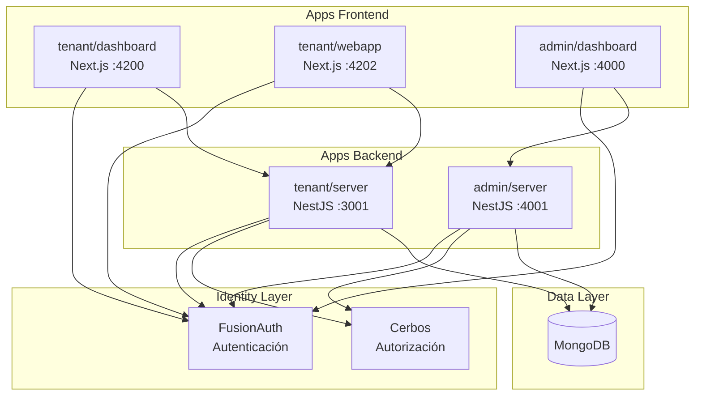

### Separación de Responsabilidades

| Componente | Responsabilidad | Qué almacena |
|------------|-----------------|--------------|
| **FusionAuth** | Autenticación (¿Quién eres?) | Credenciales, JWT, MFA, OAuth |
| **Cerbos** | Autorización (¿Qué puedes hacer?) | Policies (en archivos YAML) |
| **MongoDB** | Datos de negocio del usuario | Perfil, preferencias, organizaciones |

---

## 2. FusionAuth: Conceptos Clave

### ¿Qué es FusionAuth?

FusionAuth es un proveedor de identidad (IdP) que maneja:
- Login/Registro de usuarios
- Tokens JWT con firma RS256
- Multi-Factor Authentication (MFA)
- Social Login (Google, etc.)
- Passwordless (Magic Links)

### Conceptos Fundamentales

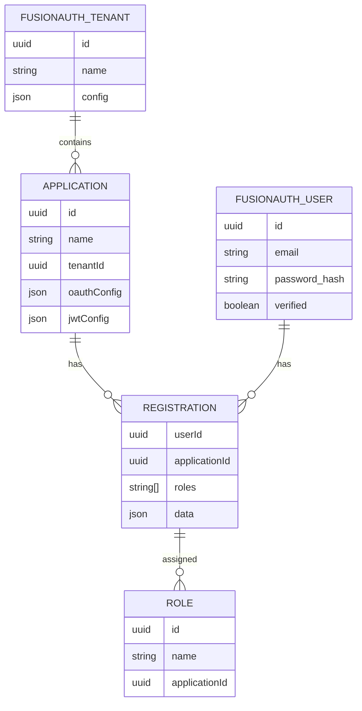

#### Tenant (en FusionAuth)
- Contenedor de aislamiento de usuarios
- Cada Serveflow Tenant = 1 FusionAuth Tenant
- El mismo email puede existir en diferentes FusionAuth Tenants

#### Application
- Define una "app" dentro de un Tenant
- Tiene su propia configuración OAuth/JWT
- 1 Application por Serveflow Tenant (dashboard + webapp comparten)

#### Registration
- Relación Usuario ↔ Application
- Contiene los **roles** del usuario en esa app
- Un usuario puede tener registrations en múltiples applications

#### Role
- Pertenece a una Application
- Se asigna via Registration
- Roles: `admin`, `client`, `provider`
  - `admin`: Acceso completo al tenant (superRole)
  - `client`: Usuarios finales (socios, clientes) - rol por defecto
  - `provider`: Proveedores de servicios (monitores, entrenadores, staff)

### JWT de FusionAuth

```typescript
// Estructura del JWT que genera FusionAuth
interface FusionAuthJWT {
  // Claims estándar
  sub: string;           // User ID (UUID)
  aud: string;           // Application ID
  iss: string;           // FusionAuth URL (issuer)
  exp: number;           // Expiration timestamp
  iat: number;           // Issued at timestamp

  // Claims de FusionAuth
  email: string;
  email_verified: boolean;
  authenticationType: string;  // 'PASSWORD', 'PASSWORDLESS', etc.

  // Claims del Registration
  roles: string[];       // ['admin', 'staff'] - del Registration

  // Claims custom (via JWT Populate Lambda)
  tenantId: string;      // ID del Serveflow Tenant
  organizationIds: string[];  // IDs de organizaciones
  permissions: string[]; // Permisos calculados
}
```

### Login API vs OAuth

FusionAuth ofrece dos formas de autenticar:

| Aspecto | Login API | OAuth2/OIDC |
|---------|-----------|-------------|
| **UI** | Custom (nosotros la construimos) | Hosted por FusionAuth |
| **Flujo** | POST directo a `/api/login` | Redirects OAuth |
| **Credenciales** | Pasan por nuestra app | Solo FusionAuth las ve |
| **Uso en Serveflow** | ✅ Usamos esto | ❌ No usamos |

Usamos **Login API** porque necesitamos UI custom white-label.

### Configuración Crítica de Tenants y Applications

#### Issuer del Tenant

El **issuer** del JWT debe ser consistente para que el backend pueda validar tokens:

```typescript
// packages/auth/src/fusionauth/tenants.ts
// El issuer se configura como el URL de FusionAuth
const issuer = getFusionAuthUrl(); // http://localhost:9011
```

**IMPORTANTE:** El issuer debe coincidir con `FUSIONAUTH_URL` del backend. El guard acepta múltiples formatos:
- `http://localhost:9011`
- `localhost:9011`
- `localhost9011` (formato por defecto de FusionAuth)

#### Application - requireAuthentication

Para permitir login desde el browser **sin exponer API key**:

```typescript
// loginConfiguration
{
  allowTokenRefresh: true,
  generateRefreshTokens: true,
  requireAuthentication: false,  // ⚠️ CRÍTICO: permite login sin API key
}
```

Si `requireAuthentication: true`, FusionAuth devuelve 401 en el Login API porque espera un header `Authorization` con API key.

#### Redirect URLs

Las URLs de redirect se configuran automáticamente según el entorno:

```typescript
// Producción
`https://${slug}.serveflow.app/oauth/callback`

// Desarrollo (puerto configurable via TENANT_DASHBOARD_PORT)
`http://${slug}.localhost:3000/oauth/callback`
```

---

## 3. Arquitectura Multi-Tenant

### Mapeo Serveflow ↔ FusionAuth

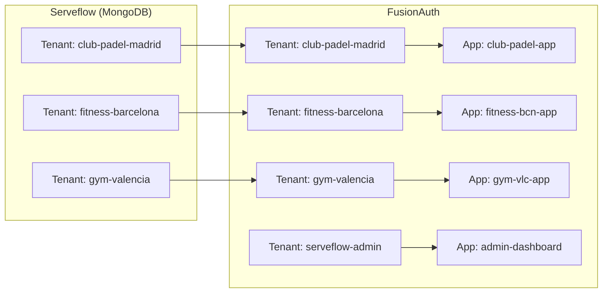

### Configuración en Tenant (MongoDB)

```typescript
// En db_serveflow_sys.tenants
interface Tenant {
  slug: string;                    // "club-padel-madrid"
  name: string;                    // "Club Pádel Madrid"

  // Configuración de FusionAuth
  fusionauthTenantId: string;      // UUID del Tenant en FusionAuth
  fusionauthConfig?: {
    baseUrl?: string;              // URL custom si tiene instancia dedicada
    applicationId?: string;        // UUID de la Application
  };

  database: {
    name: string;                  // "db_tenant_club_padel_madrid"
  };

  // ... resto de campos
}
```

### Aislamiento de Usuarios

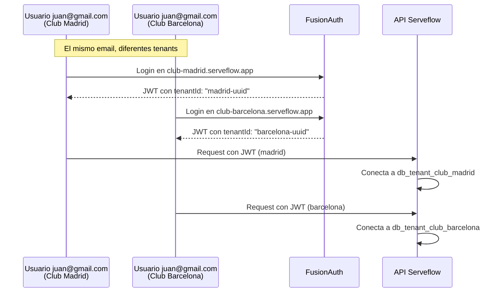

---

## 4. Modelo de Datos

### User (MongoDB - por tenant)

**Ubicación:** `db_tenant_{slug}.users`

```typescript
// packages/db/src/schemas/user.schema.ts
interface User {
  _id: ObjectId;

  // ═══════════════════════════════════════════════════════════════
  // Vínculo con FusionAuth
  // ═══════════════════════════════════════════════════════════════
  fusionauthUserId: string;     // UUID del user en FusionAuth

  // ═══════════════════════════════════════════════════════════════
  // Datos sincronizados desde FusionAuth
  // ═══════════════════════════════════════════════════════════════
  email: string;                // Único por tenant
  firstName: string;
  lastName: string;
  imageUrl?: string;
  isVerified: boolean;          // Email verificado

  // ═══════════════════════════════════════════════════════════════
  // Datos SOLO en MongoDB (FusionAuth no los tiene)
  // ═══════════════════════════════════════════════════════════════
  phoneNumber?: string;         // E.164 format
  idNumber?: string;            // DNI/Pasaporte
  idType?: 'dni' | 'passport' | 'nie' | 'other';
  birthDate?: Date;
  address?: {
    street?: string;
    city?: string;
    state?: string;
    postalCode?: string;
    country?: string;
  };

  // Multi-organización (sedes)
  organizationIds: string[];
  primaryOrganizationId?: string;

  // Estado
  status: 'active' | 'inactive' | 'suspended' | 'pending' | 'archived';

  // Preferencias
  preferences?: {
    language: string;           // 'es', 'en'
    timezone: string;           // 'Europe/Madrid'
    notifications: {
      email: boolean;
      sms: boolean;
      push: boolean;
      whatsapp: boolean;
    };
  };

  // Legal
  legal?: {
    acceptedTerms: boolean;
    acceptedPrivacy: boolean;
    acceptedMarketing: boolean;
    consentDate?: Date;
  };

  // Provider (monitores, entrenadores)
  providerProfile?: {
    bio?: string;
    specializations: string[];
    certifications?: string[];
  };

  // Timestamps
  lastLoginAt?: Date;
  createdBy?: string;
  createdAt: Date;
  updatedAt: Date;
}
```

### GlobalUser (MongoDB - sistema)

**Ubicación:** `db_serveflow_sys.global_users`

```typescript
// packages/db/src/schemas/global-user.schema.ts
interface GlobalUser {
  _id: ObjectId;

  // Vínculo con FusionAuth (Tenant: serveflow-admin)
  fusionauthUserId: string;

  // Datos básicos
  email: string;
  firstName: string;
  lastName: string;
  imageUrl?: string;

  // Estado
  status: 'active' | 'inactive' | 'suspended';

  // Acceso a tenants (para soporte)
  // NOTA: El rol (superadmin/support/billing) viene del JWT
  accessibleTenants?: Array<{
    tenantId: string;
    tenantSlug: string;
    role: 'viewer' | 'support';
    grantedAt: Date;
    grantedBy: string;
    expiresAt?: Date;           // Acceso temporal
  }>;

  // Timestamps
  lastLoginAt?: Date;
  createdAt: Date;
  updatedAt: Date;
}
```

### Relación FusionAuth ↔ MongoDB

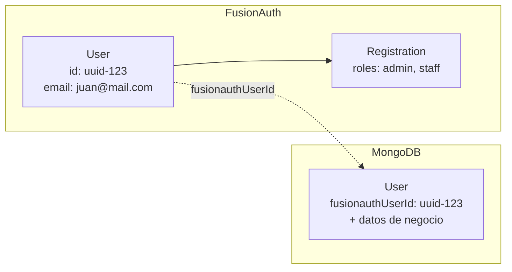

**Principio:** FusionAuth es source of truth para autenticación, MongoDB para datos de negocio.

---

## 5. Flujos de Autenticación

### 5.1 Flujo de Login

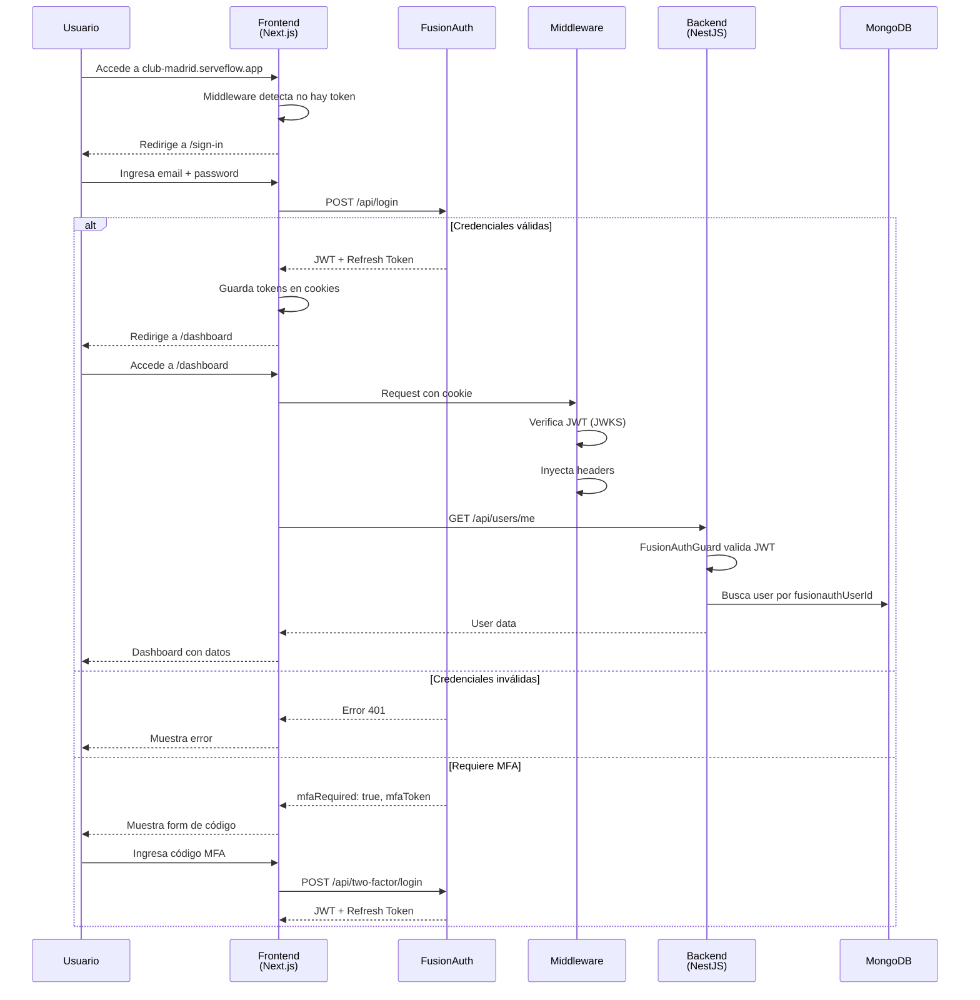

### 5.2 Flujo de Registro

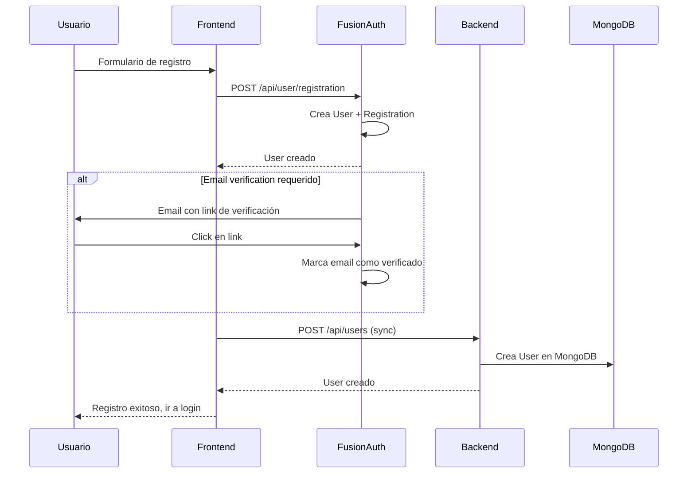

### 5.3 Flujo de Verificación de Token

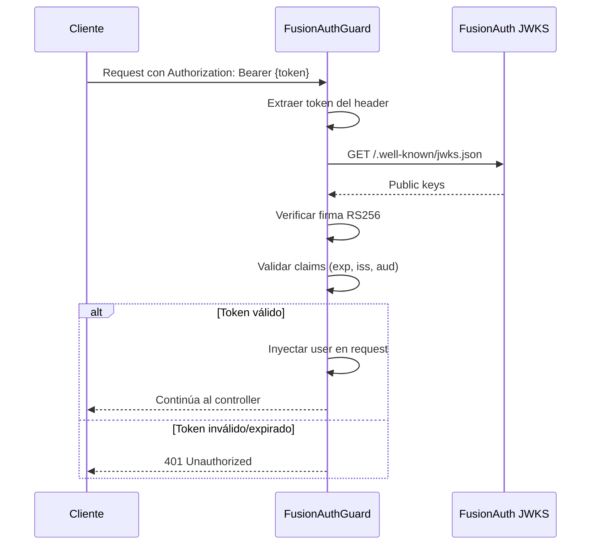

---

## 6. Implementación por App

### 6.1 Tenant Dashboard (Next.js)

**Estructura de archivos:**

```
apps/tenant/dashboard/src/
├── middleware.ts                    # Validación de auth + tenant
├── app/
│   ├── layout.tsx                   # Setup FusionAuth + TenantProvider
│   ├── (auth)/
│   │   ├── layout.tsx               # AuthSplitLayout
│   │   ├── sign-in/page.tsx         # <SignInView />
│   │   ├── sign-up/page.tsx         # <SignUpView />
│   │   ├── verify/page.tsx          # <VerifyEmailView />
│   │   └── sso-callback/page.tsx    # OAuth callback
│   └── (dashboard)/
│       └── layout.tsx               # getCurrentUser + CurrentUserProvider
├── lib/
│   ├── get-tenant.ts                # Resuelve tenant desde host
│   └── get-current-user.ts          # Obtiene user autenticado
├── context/
│   └── CurrentUserContext.tsx       # Context de usuario
└── hooks/
    └── useCurrentUser.ts            # Hook para acceder a user
```

#### middleware.ts

```typescript
// Rutas públicas (sin auth)
const publicRoutes = ['/sign-in', '/sign-up', '/sso-callback', '/verify'];

export async function middleware(req: NextRequest) {
  const host = req.headers.get('host') || '';
  const tenantSlug = extractTenantSlug(host); // demo.localhost → demo

  // Permitir rutas públicas
  if (publicRoutes.some(route => pathname.startsWith(route))) {
    return NextResponse.next();
  }

  // Buscar token en cookie (nombre único: fa_access_token)
  const accessToken = req.cookies.get('fa_access_token')?.value;

  if (!accessToken) {
    return NextResponse.redirect(new URL('/sign-in', req.url));
  }

  // Verificar token (decodificar + validar expiry)
  const { valid, userId, tenantId, applicationId } = await verifyFusionAuthToken(accessToken);

  if (!valid) {
    return NextResponse.redirect(new URL('/sign-in', req.url));
  }

  // Inyectar headers para Server Components
  const response = NextResponse.next();
  response.headers.set('x-tenant-slug', tenantSlug);
  response.headers.set('x-fusionauth-user-id', userId);
  response.headers.set('x-fusionauth-tenant-id', tenantId);
  response.headers.set('x-fusionauth-application-id', applicationId);

  return response;
}
```

#### Cookies de Autenticación

El hook `useFusionAuth` maneja las cookies:

```typescript
// packages/ui/src/hooks/use-fusionauth.ts

// Después de login exitoso:
setCookie('fa_access_token', data.token, data.tokenExpirationInstant);
setCookie('fa_refresh_token', data.refreshToken, Date.now() + 30 * 24 * 60 * 60 * 1000);

// En logout:
deleteCookie('fa_access_token');
deleteCookie('fa_refresh_token');
clearLegacyAuthCookies(); // Limpia cookies de Clerk/Frontegg
```

**Nota:** Para subdominios en desarrollo (`tenant.localhost`), las cookies se configuran correctamente sin atributo `domain` para evitar problemas de seguridad del navegador.

#### Root Layout

```typescript
// app/layout.tsx
export default async function RootLayout({ children }) {
  const { tenant } = await getTenantFromHeaders();

  // Config de FusionAuth del tenant
  const fusionauthBaseUrl = tenant?.fusionauthConfig?.baseUrl ||
    process.env.FUSIONAUTH_BASE_URL;
  const fusionauthApplicationId = tenant?.fusionauthConfig?.applicationId ||
    process.env.FUSIONAUTH_APPLICATION_ID;

  return (
    <html>
      <body>
        <FusionAuthProvider
          baseUrl={fusionauthBaseUrl}
          applicationId={fusionauthApplicationId}
        >
          <TenantProvider tenant={tenant}>
            <ThemeProvider>
              {children}
            </ThemeProvider>
          </TenantProvider>
        </FusionAuthProvider>
      </body>
    </html>
  );
}
```

#### getCurrentUser

```typescript
// lib/get-current-user.ts
export async function getCurrentUser(tenant: Tenant): Promise<GetCurrentUserResult> {
  const cookieStore = await cookies();
  const accessToken =
    cookieStore.get(`fa_access_token_${tenant.slug}`)?.value ||
    cookieStore.get('fa_access_token')?.value;

  if (!accessToken) {
    return { user: null, error: { type: 'UNAUTHORIZED' } };
  }

  // Decodificar JWT
  const payload = decodeJwtPayload(accessToken);
  const userId = payload.sub;
  const tenantId = payload.tenantId;

  // VERIFICACIÓN CRÍTICA: membership
  if (tenantId !== tenant.fusionauthTenantId) {
    return {
      user: null,
      error: {
        type: 'FORBIDDEN',
        message: 'No eres miembro de esta organización'
      }
    };
  }

  // Obtener user de MongoDB via API
  const response = await fetch(`${TENANT_API_URL}/api/users/me`, {
    headers: {
      'Authorization': `Bearer ${accessToken}`,
      'x-tenant-slug': tenant.slug,
    },
  });

  if (!response.ok) {
    if (response.status === 404) {
      return { user: null, error: { type: 'USER_NOT_FOUND' } };
    }
    return { user: null, error: { type: 'INTERNAL' } };
  }

  const data = await response.json();
  return { user: data.data, error: null };
}
```

### 6.2 Tenant Webapp (Next.js)

Estructura similar a Dashboard pero con vistas para clientes (socios):
- Página de reservas
- Perfil personal
- Historial

Reutiliza los mismos componentes de auth (`SignInView`, etc.).

### 6.3 Admin Dashboard (Next.js)

```
apps/admin/dashboard/src/
├── middleware.ts                    # Auth para global users
├── app/
│   ├── layout.tsx                   # FusionAuth (Tenant: serveflow-admin)
│   └── (dashboard)/
│       ├── tenants/                 # Gestión de tenants
│       ├── users/                   # Gestión de global users
│       └── billing/                 # Facturación
```

El admin usa un FusionAuth Tenant separado (`serveflow-admin`) con su propia Application.

### 6.4 Tenant Server (NestJS)

```
apps/tenant/server/src/
├── main.ts                          # Bootstrap NestJS
├── app.module.ts                    # FusionAuthGuard global
└── users/
    ├── users.controller.ts          # Endpoints de usuarios
    └── users.service.ts             # Lógica de negocio
```

#### Configuración del Guard

```typescript
// app.module.ts
import { FusionAuthGuard } from '@serveflow/auth/server';

@Module({
  providers: [
    {
      provide: APP_GUARD,
      useClass: FusionAuthGuard, // Guard global
    },
  ],
})
export class AppModule {}
```

#### Ejemplo de Controller

```typescript
// users/users.controller.ts
import {
  CurrentUser,
  CurrentTenantId,
  Roles,
  Public
} from '@serveflow/auth/server';

@Controller('users')
@RequireTenant()
export class UsersController {
  @Public()
  @Get('health')
  health() {
    return { status: 'ok' };
  }

  @Get('me')
  async getMe(
    @CurrentUser() user: AuthenticatedUser,
    @CurrentTenantId() tenantId: string
  ) {
    return this.usersService.findByFusionauthId(user.fusionauthUserId);
  }

  @Roles('admin', 'owner')
  @Get()
  async list(@CurrentTenantId() tenantId: string) {
    return this.usersService.list(tenantId);
  }

  @Roles('admin', 'owner')
  @Post()
  async create(
    @Body() dto: CreateUserDto,
    @CurrentUser() user: AuthenticatedUser
  ) {
    return this.usersService.create(dto, user.fusionauthUserId);
  }
}
```

### 6.5 AI Assistant (LangGraph)

El AI Assistant es un orquestador multi-agente que maneja conversaciones con usuarios a través de WhatsApp y otros canales.

**¿Qué es LangGraph?**

LangGraph es un framework para construir aplicaciones con LLMs como grafos de estados. Permite:
- Flujos multi-agente con supervisor
- Estado persistente entre turnos de conversación
- Human-in-the-loop cuando se necesita confirmación

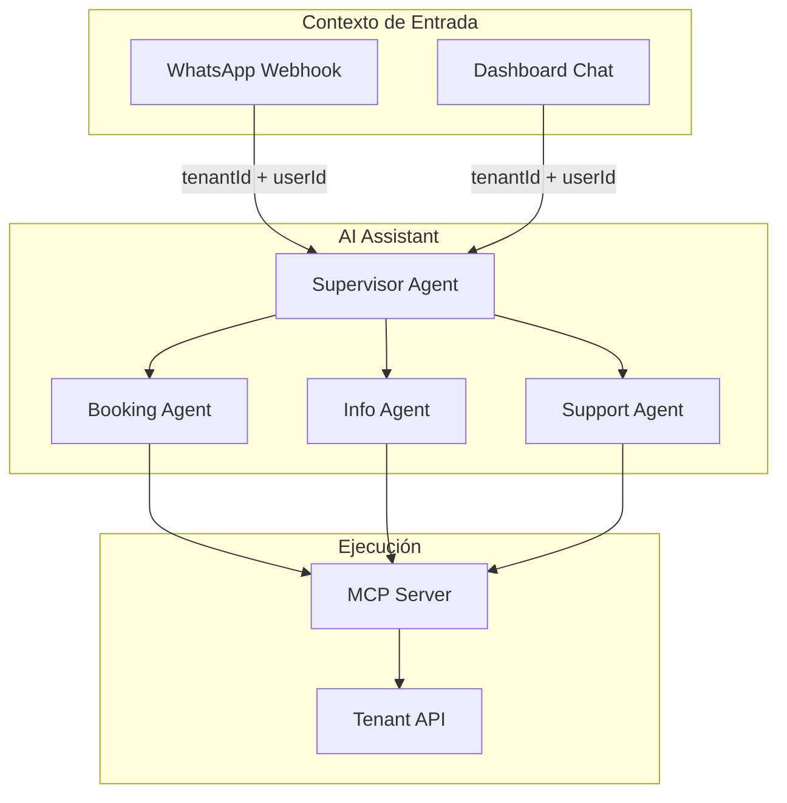

**Estructura de archivos:**

```
apps/tenant/ai-assistant/src/
├── index.ts                         # Entry point
├── graph/
│   ├── supervisor.ts                # Supervisor que enruta a agentes
│   ├── agents/
│   │   ├── booking.ts               # Agente de reservas
│   │   ├── info.ts                  # Agente de información
│   │   └── support.ts               # Agente de soporte
│   └── state.ts                     # Estado del grafo
├── config/
│   └── loader.ts                    # Carga ai_config del tenant
└── tools/
    └── mcp-client.ts                # Cliente MCP para ejecutar tools
```

**Contexto de Autenticación:**

El AI Assistant **NO autentica usuarios directamente**. Recibe el contexto de autenticación del caller:

```typescript
// Estado del grafo LangGraph
interface AssistantState {
  // Contexto de tenant (obligatorio)
  tenantId: string;
  tenantSlug: string;

  // Contexto de usuario (viene del caller)
  userId?: string;              // FusionAuth userId (si autenticado)
  userPhone?: string;           // WhatsApp phone (si no autenticado)
  userRoles?: string[];         // Roles del JWT

  // Configuración del tenant
  aiConfig: AIConfig;           // Cargado de db_tenant_{slug}.ai_config

  // Estado de conversación
  messages: Message[];
  currentAgent: string;
}
```

**Flujo de entrada desde WhatsApp:**

```typescript
// Webhook en tenant/api (controller)
@Post('whatsapp/webhook')
async handleWhatsappWebhook(
  @CurrentTenantId() tenantId: string,
  @Body() payload: WhatsAppPayload
) {
  // El tenant ya está resuelto por el subdomain
  const { from, message } = payload;

  // Buscar usuario por teléfono (puede no existir)
  const user = await this.usersService.findByPhone(from);

  // Invocar AI Assistant con contexto
  const response = await this.aiAssistant.invoke({
    tenantId,
    tenantSlug: this.tenant.slug,
    userId: user?.fusionauthUserId,     // undefined si no existe
    userPhone: from,
    userRoles: user?.roles || ['guest'], // guest si no registrado
    message: message.text,
  });

  return response;
}
```

**Carga de ai_config:**

```typescript
// config/loader.ts
export async function loadAIConfig(tenantSlug: string): Promise<AIConfig> {
  const db = await getTenantDatabase(tenantSlug);
  const config = await db.collection('ai_config').findOne({});

  return config || DEFAULT_AI_CONFIG;
}

// El supervisor usa la config para personalizar comportamiento
const supervisor = new SupervisorAgent({
  aiConfig,
  systemPrompt: aiConfig.identity.systemPrompt,
  personality: aiConfig.identity.personality,
  enabledAgents: Object.entries(aiConfig.agents)
    .filter(([_, config]) => config.enabled)
    .map(([name]) => name),
});
```

**Autorización en Tools:**

Cuando un agente necesita ejecutar una acción (ej: crear reserva), usa el MCP Server que a su vez llama al Tenant API con el contexto de autorización:

```typescript
// tools/mcp-client.ts
export class MCPClient {
  async callTool(
    toolName: string,
    params: Record<string, unknown>,
    context: AssistantState
  ) {
    // El MCP Server recibe el contexto y lo propaga al API
    return await this.mcp.callTool(toolName, {
      ...params,
      __context: {
        tenantId: context.tenantId,
        userId: context.userId,
        userRoles: context.userRoles,
      },
    });
  }
}
```

### 6.6 MCP Server

El MCP Server expone tools para que el AI Assistant (u otros clientes MCP como Claude Desktop) puedan ejecutar acciones en el sistema.

**¿Qué es MCP?**

Model Context Protocol (MCP) es un protocolo abierto de Anthropic que estandariza cómo las aplicaciones de IA acceden a datos y herramientas externas. Es como un "USB-C para AI" - una interfaz universal.

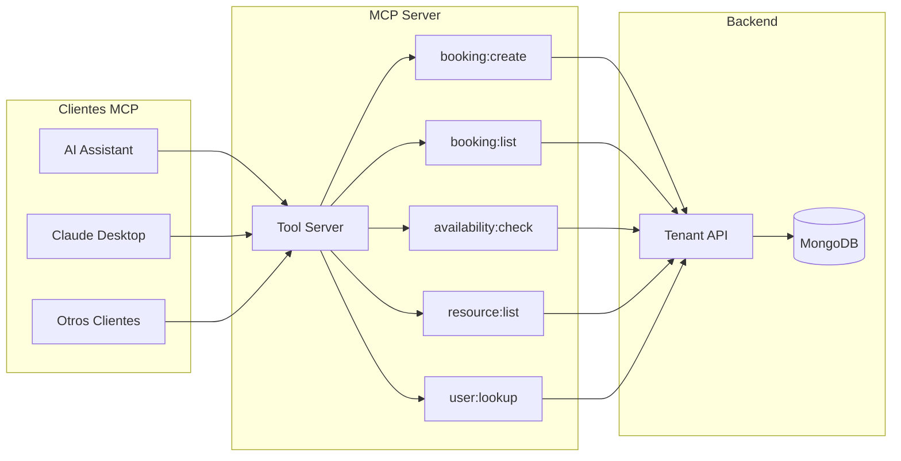

**Estructura de archivos:**

```
apps/tenant/mcp-server/src/
├── index.ts                         # Entry point MCP Server
├── server.ts                        # McpServer instance
├── tools/
│   ├── booking.ts                   # Tools de reservas
│   ├── availability.ts              # Tools de disponibilidad
│   ├── resource.ts                  # Tools de recursos
│   └── user.ts                      # Tools de usuarios
├── context/
│   └── tenant-context.ts            # Resolución de tenant
└── api/
    └── client.ts                    # Cliente HTTP para Tenant API
```

**Definición de Tools:**

```typescript
// server.ts
import { McpServer } from "@modelcontextprotocol/sdk/server/mcp.js";
import { z } from "zod";

const server = new McpServer({
  name: "serveflow-tenant",
  version: "1.0.0",
  capabilities: {
    tools: {},
  },
});

// Tool: Verificar disponibilidad
server.tool(
  "availability:check",
  "Verifica la disponibilidad de un recurso en una fecha y hora específica",
  {
    resourceId: z.string().describe("ID del recurso (pista, sala, etc.)"),
    date: z.string().describe("Fecha en formato YYYY-MM-DD"),
    startTime: z.string().describe("Hora inicio en formato HH:mm"),
    duration: z.number().describe("Duración en minutos"),
  },
  async ({ resourceId, date, startTime, duration }, extra) => {
    // Extraer contexto del caller
    const context = extra.context as TenantContext;

    const result = await tenantApi.checkAvailability({
      tenantSlug: context.tenantSlug,
      resourceId,
      date,
      startTime,
      duration,
    });

    return {
      content: [{ type: "text", text: JSON.stringify(result) }],
    };
  }
);

// Tool: Crear reserva
server.tool(
  "booking:create",
  "Crea una nueva reserva para un usuario",
  {
    resourceId: z.string(),
    date: z.string(),
    startTime: z.string(),
    duration: z.number(),
    userId: z.string().optional().describe("ID del usuario (si autenticado)"),
    guestName: z.string().optional().describe("Nombre del invitado (si no autenticado)"),
    guestPhone: z.string().optional().describe("Teléfono del invitado"),
  },
  async (params, extra) => {
    const context = extra.context as TenantContext;

    // Llamar al API con autenticación service-to-service
    const result = await tenantApi.createBooking({
      ...params,
      tenantSlug: context.tenantSlug,
      createdBy: context.userId || 'ai-assistant',
    }, {
      headers: {
        'x-service-auth': process.env.SERVICE_TOKEN,
        'x-tenant-slug': context.tenantSlug,
        'x-acting-user-id': context.userId,
      },
    });

    return {
      content: [{ type: "text", text: JSON.stringify(result) }],
    };
  }
);
```

**Contexto de Tenant:**

El MCP Server recibe el contexto del tenant en cada llamada:

```typescript
// context/tenant-context.ts
export interface TenantContext {
  tenantId: string;
  tenantSlug: string;
  userId?: string;           // Usuario que inició la acción
  userRoles?: string[];      // Roles del usuario
  source: 'ai-assistant' | 'claude-desktop' | 'api';
}

// El contexto se pasa en cada tool call
server.setRequestHandler(CallToolRequestSchema, async (request) => {
  const context: TenantContext = {
    tenantSlug: request.params.__context?.tenantSlug,
    tenantId: request.params.__context?.tenantId,
    userId: request.params.__context?.userId,
    userRoles: request.params.__context?.userRoles,
    source: request.params.__context?.source || 'api',
  };

  // Validar que tenemos tenant
  if (!context.tenantSlug) {
    throw new Error('Tenant context required');
  }

  return await executeToolWithContext(request.params.name, request.params.arguments, context);
});
```

**Autenticación Service-to-Service:**

El MCP Server usa autenticación de servicio para llamar al Tenant API:

```typescript
// api/client.ts
export class TenantApiClient {
  private serviceToken: string;

  constructor() {
    // Token de servicio compartido entre MCP Server y Tenant API
    this.serviceToken = process.env.SERVICE_AUTH_TOKEN!;
  }

  async request(
    endpoint: string,
    method: string,
    data?: unknown,
    context?: TenantContext
  ) {
    const response = await fetch(`${TENANT_API_URL}${endpoint}`, {
      method,
      headers: {
        'Content-Type': 'application/json',
        // Autenticación de servicio
        'x-service-auth': this.serviceToken,
        // Contexto de tenant
        'x-tenant-slug': context?.tenantSlug || '',
        // Usuario que actúa (para auditoría)
        'x-acting-user-id': context?.userId || 'system',
        'x-acting-user-roles': context?.userRoles?.join(',') || '',
      },
      body: data ? JSON.stringify(data) : undefined,
    });

    return response.json();
  }
}
```

**Autorización con Cerbos:**

El Tenant API valida los permisos usando Cerbos antes de ejecutar la acción:

```typescript
// En tenant/api - booking.service.ts
async createBooking(dto: CreateBookingDto, actingUser: ActingUser) {
  // Verificar permisos con Cerbos
  const allowed = await this.cerbos.isAllowed({
    principal: {
      id: actingUser.userId || 'ai-assistant',
      roles: actingUser.roles || ['service'],
      attributes: {
        isService: !actingUser.userId,
      },
    },
    resource: {
      kind: 'booking',
      id: 'new',
      attributes: {
        resourceId: dto.resourceId,
      },
    },
    action: 'create',
  });

  if (!allowed) {
    throw new ForbiddenException('No permission to create booking');
  }

  // Crear la reserva...
}
```

**Diagrama de Flujo Completo:**

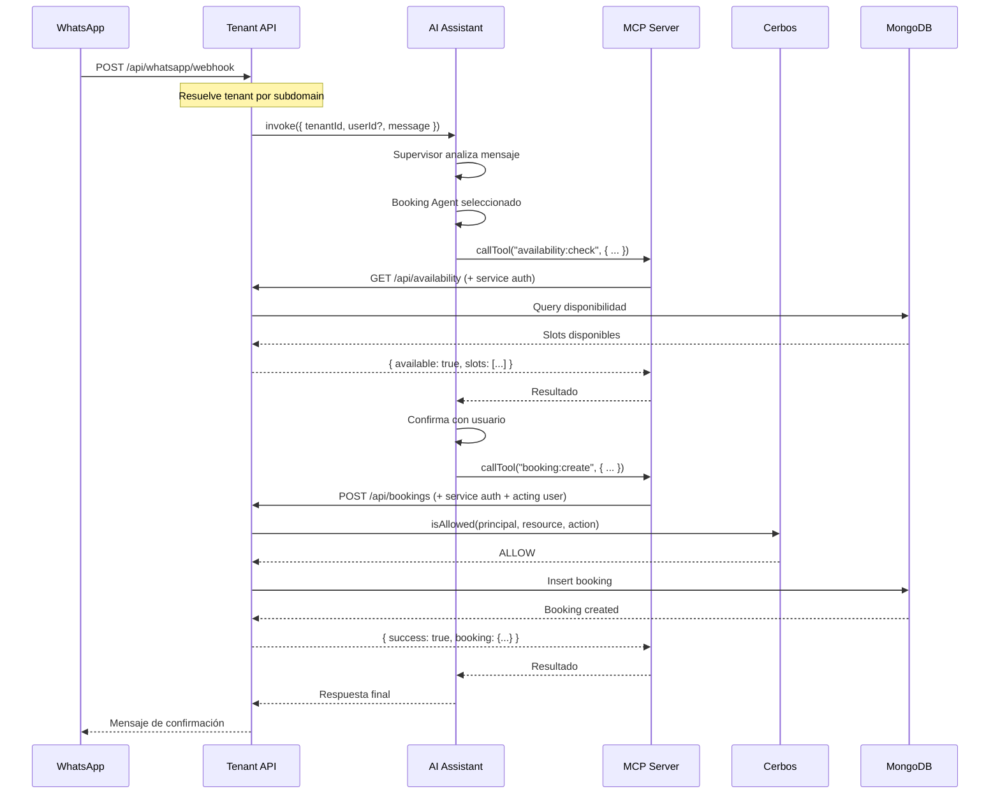

---

## 7. Package @serveflow/auth

### Estructura

```
packages/auth/src/
├── index.ts                         # Exports client-safe
├── server.ts                        # Exports NestJS
├── types.ts                         # Tipos compartidos
├── guards/
│   └── fusionauth-auth.guard.ts     # Guard NestJS
├── decorators/
│   └── auth.decorator.ts            # @Public, @Roles, etc.
├── fusionauth/
│   ├── client.ts                    # Cliente FusionAuth
│   ├── users.ts                     # CRUD usuarios
│   └── tenants.ts                   # CRUD tenants
└── lib/
    └── jwt.ts                       # Utilidades JWT
```

### Tipos Principales

```typescript
// types.ts
export interface FusionAuthUser {
  id: string;
  sub: string;
  email: string;
  name?: string;
  tenantId: string;
  roles: string[];
  permissions: string[];
}

export interface AuthenticatedUser {
  fusionauthUserId: string;
  email: string;
  firstName?: string;
  lastName?: string;
  imageUrl?: string;
  tenantId: string;
  roles: string[];
  permissions: string[];
}

export interface AuthRequest extends Request {
  user: AuthenticatedUser;
  auth: {
    userId: string;
    tenantId: string;
    roles: string[];
    permissions: string[];
  };
}
```

### Guard

```typescript
// guards/fusionauth-auth.guard.ts
@Injectable()
export class FusionAuthGuard implements CanActivate {
  private jwksClient: JwksClient;

  constructor(private reflector: Reflector) {
    this.jwksClient = jwksClient({
      jwksUri: `${process.env.FUSIONAUTH_BASE_URL}/.well-known/jwks.json`,
      cache: true,
      cacheMaxAge: 86400000, // 24h
    });
  }

  async canActivate(context: ExecutionContext): Promise<boolean> {
    // 1. Check @Public()
    if (this.isPublic(context)) return true;

    // 2. Extract token
    const token = this.extractToken(context);
    if (!token) throw new UnauthorizedException();

    // 3. Verify JWT with JWKS
    const payload = await this.verifyToken(token);

    // 4. Inject user into request
    this.injectUser(context, payload);

    // 5. Check @Roles()
    this.checkRoles(context, payload);

    // 6. Check @Permissions()
    this.checkPermissions(context, payload);

    return true;
  }

  private async verifyToken(token: string): Promise<FusionAuthJwtPayload> {
    return new Promise((resolve, reject) => {
      jwt.verify(token, this.getKey, { algorithms: ['RS256'] }, (err, decoded) => {
        if (err) reject(err);
        resolve(decoded as FusionAuthJwtPayload);
      });
    });
  }
}
```

### Decoradores

```typescript
// decorators/auth.decorator.ts

// Marcar endpoint como público
export const Public = () => SetMetadata(IS_PUBLIC_KEY, true);

// Requerir roles (OR)
export const Roles = (...roles: string[]) => SetMetadata(ROLES_KEY, roles);

// Requerir permisos (OR)
export const Permissions = (...perms: string[]) => SetMetadata(PERMISSIONS_KEY, perms);

// Requerir tenant context
export const RequireTenant = () => SetMetadata(REQUIRE_TENANT_KEY, true);

// Inyectar user en parámetro
export const CurrentUser = createParamDecorator(
  (_: unknown, ctx: ExecutionContext): AuthenticatedUser => {
    const request = ctx.switchToHttp().getRequest<AuthRequest>();
    return request.user;
  }
);

// Inyectar tenant ID
export const CurrentTenantId = createParamDecorator(
  (_: unknown, ctx: ExecutionContext): string => {
    const request = ctx.switchToHttp().getRequest<AuthRequest>();
    return request.auth.tenantId;
  }
);
```

### Cliente FusionAuth (Backend-to-Backend)

```typescript
// fusionauth/client.ts
export async function getApiKey(): Promise<string> {
  return process.env.FUSIONAUTH_API_KEY!;
}

export async function fusionauthFetch<T>(
  endpoint: string,
  options: RequestInit = {}
): Promise<T> {
  const apiKey = await getApiKey();
  const baseUrl = process.env.FUSIONAUTH_BASE_URL;

  const response = await fetch(`${baseUrl}${endpoint}`, {
    ...options,
    headers: {
      'Content-Type': 'application/json',
      'Authorization': apiKey,
      ...options.headers,
    },
  });

  if (!response.ok) {
    throw new Error(`FusionAuth API error: ${response.status}`);
  }

  return response.json();
}
```

### CRUD de Usuarios

```typescript
// fusionauth/users.ts
export async function createFusionAuthUser(input: CreateUserInput) {
  return fusionauthFetch('/api/user/registration', {
    method: 'POST',
    body: JSON.stringify({
      user: {
        email: input.email,
        firstName: input.firstName,
        lastName: input.lastName,
        password: input.password,
      },
      registration: {
        applicationId: input.applicationId,
        roles: input.roles || ['client'],
      },
    }),
  });
}

export async function getFusionAuthUser(userId: string) {
  return fusionauthFetch(`/api/user/${userId}`);
}

export async function updateFusionAuthUser(userId: string, input: UpdateUserInput) {
  return fusionauthFetch(`/api/user/${userId}`, {
    method: 'PATCH',
    body: JSON.stringify({ user: input }),
  });
}

export async function deleteFusionAuthUser(userId: string) {
  return fusionauthFetch(`/api/user/${userId}`, {
    method: 'DELETE',
  });
}
```

---

## 8. Integración con Cerbos

### ¿Qué es Cerbos?

Cerbos es un **Policy Decision Point (PDP)** - evalúa si un usuario puede realizar una acción sobre un recurso.

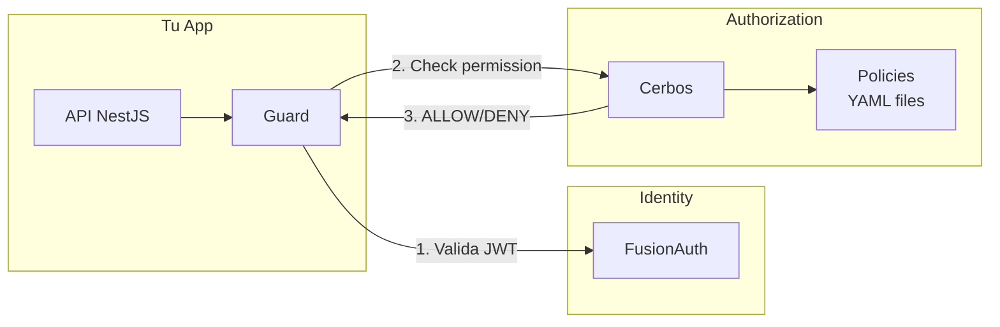

### Flujo de Autorización

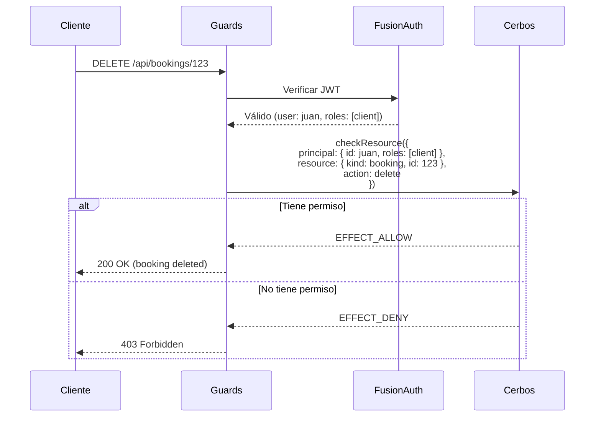

### Principal (de FusionAuth a Cerbos)

```typescript
// El JWT de FusionAuth se mapea a Cerbos Principal
function jwtToCerbosPrincipal(jwt: FusionAuthJWT): CerbosPrincipal {
  return {
    id: jwt.sub,              // User ID
    roles: jwt.roles,         // ['admin', 'staff']
    attr: {
      tenantId: jwt.tenantId,
      organizationIds: jwt.organizationIds,
      email: jwt.email,
    },
  };
}
```

### Guard con Cerbos

```typescript
// Combinar FusionAuth + Cerbos
@Injectable()
export class CerbosGuard implements CanActivate {
  constructor(
    private cerbosService: CerbosService,
    private reflector: Reflector
  ) {}

  async canActivate(context: ExecutionContext): Promise<boolean> {
    const request = context.switchToHttp().getRequest<AuthRequest>();
    const user = request.user; // Ya inyectado por FusionAuthGuard

    const permissionCheck = this.reflector.get<PermissionCheck>(
      PERMISSION_KEY,
      context.getHandler()
    );

    if (!permissionCheck) return true;

    const allowed = await this.cerbosService.isAllowed(
      {
        principal: {
          id: user.fusionauthUserId,
          roles: user.roles,
          attr: {
            tenantId: user.tenantId,
            organizationIds: user.organizationIds,
          },
        },
      },
      {
        kind: permissionCheck.resource,
        id: request.params[permissionCheck.resourceIdParam] || 'new',
      },
      permissionCheck.action
    );

    if (!allowed) {
      throw new ForbiddenException('Permission denied');
    }

    return true;
  }
}
```

Ver **03-PERMISOS.md** para documentación completa de Cerbos.

---

## 9. Configuración y Variables de Entorno

### Variables Requeridas

```bash
# ═══════════════════════════════════════════════════════════════
# FusionAuth
# ═══════════════════════════════════════════════════════════════
FUSIONAUTH_BASE_URL=https://auth.serveflow.app
FUSIONAUTH_API_KEY=your-api-key
FUSIONAUTH_APPLICATION_ID=default-app-uuid
FUSIONAUTH_TENANT_ID=default-tenant-uuid

# Para frontend (públicas)
NEXT_PUBLIC_FUSIONAUTH_BASE_URL=https://auth.serveflow.app
NEXT_PUBLIC_FUSIONAUTH_APPLICATION_ID=default-app-uuid

# ═══════════════════════════════════════════════════════════════
# Cerbos
# ═══════════════════════════════════════════════════════════════
CERBOS_URL=localhost:3593

# ═══════════════════════════════════════════════════════════════
# MongoDB
# ═══════════════════════════════════════════════════════════════
MONGODB_URI=mongodb+srv://...
MONGODB_SYSTEM_DB=db_serveflow_sys

# ═══════════════════════════════════════════════════════════════
# URLs de servicios
# ═══════════════════════════════════════════════════════════════
TENANT_API_URL=http://localhost:3001
ADMIN_API_URL=http://localhost:4001

# ═══════════════════════════════════════════════════════════════
# Dominio base
# ═══════════════════════════════════════════════════════════════
NEXT_PUBLIC_BASE_DOMAIN=serveflow.app
```

### Configuración por Tenant

Cada tenant puede tener configuración custom de FusionAuth en MongoDB:

```typescript
// En db_serveflow_sys.tenants
{
  slug: "enterprise-client",
  fusionauthTenantId: "uuid-of-dedicated-tenant",
  fusionauthConfig: {
    baseUrl: "https://enterprise.fusionauth.io",  // Instancia dedicada
    applicationId: "uuid-of-their-app"
  }
}
```

---

## 10. Decisiones Tomadas

| Decisión | Opción Elegida | Alternativas | Justificación |
|----------|----------------|--------------|---------------|
| **Proveedor de identidad** | FusionAuth | Auth0, Cognito, Clerk | Multi-tenant nativo, self-hosted option, Login API para UI custom |
| **Modo de auth** | Login API | OAuth2 hosted | Necesitamos UI 100% custom (white-label) |
| **Verificación JWT** | JWKS (RS256) | Secret key (HS256) | Más seguro, no requiere compartir secret |
| **Storage de tokens** | Cookies httpOnly | localStorage | Más seguro contra XSS |
| **Roles** | En FusionAuth Registration | Custom en MongoDB | FusionAuth ya tiene RBAC integrado |
| **Autorización** | Cerbos (separado) | En código, OPA | Policies como código, derived roles |
| **Datos de usuario** | FusionAuth + MongoDB | Solo FusionAuth | MongoDB para datos de negocio extensibles |

---

## Completado ✅

- [x] Migrar implementación de Frontegg a FusionAuth
- [x] Hook `useFusionAuth` con todas las operaciones de auth
- [x] Guard `FusionAuthGuard` con verificación JWKS
- [x] Creación automática de Tenants y Applications en FusionAuth
- [x] Configuración correcta de issuer (usa FUSIONAUTH_URL)
- [x] `requireAuthentication: false` para login desde browser
- [x] Middleware de Next.js para validación de tokens
- [x] Flujo de login end-to-end funcionando

## 11. Social Login (Google OAuth Multi-Tenant)

### Arquitectura

Cada tenant puede tener su propio Google OAuth Client ID:
- Cada tenant autoriza solo su propio subdominio en Google Cloud Console
- Aislamiento completo entre tenants
- Login social 100% white-label

```
┌─────────────────────────────────────────────────────────────────┐
│  Google Cloud Console                                            │
├─────────────────────────────────────────────────────────────────┤
│  Proyecto "Club Demo"                                            │
│    OAuth Client ID: demo-xxx.apps.googleusercontent.com         │
│    Authorized Origins: https://demo.serveflow.com               │
├─────────────────────────────────────────────────────────────────┤
│  Proyecto "Club Padel Madrid"                                    │
│    OAuth Client ID: padel-xxx.apps.googleusercontent.com        │
│    Authorized Origins: https://clubpadel.serveflow.com          │
└─────────────────────────────────────────────────────────────────┘
                              │
                              ▼
┌─────────────────────────────────────────────────────────────────┐
│  FusionAuth - Google Identity Provider                           │
│                                                                  │
│  applicationConfiguration:                                       │
│    [demo-app-id]:                                                │
│      client_id: "demo-xxx.apps.googleusercontent.com"           │
│      client_secret: "xxx"                                        │
│      enabled: true                                               │
│                                                                  │
│    [clubpadel-app-id]:                                          │
│      client_id: "padel-xxx.apps.googleusercontent.com"          │
│      client_secret: "xxx"                                        │
│      enabled: true                                               │
└─────────────────────────────────────────────────────────────────┘
                              │
                              ▼
┌─────────────────────────────────────────────────────────────────┐
│  MongoDB - Tenant Collection                                     │
│                                                                  │
│  {                                                               │
│    slug: "demo",                                                 │
│    authProviders: {                                              │
│      google: {                                                   │
│        clientId: "demo-xxx.apps.googleusercontent.com",         │
│        enabled: true                                             │
│      }                                                           │
│    }                                                             │
│  }                                                               │
└─────────────────────────────────────────────────────────────────┘
```

### Configuración por Tenant

#### 1. Google Cloud Console

1. Crear proyecto en [Google Cloud Console](https://console.cloud.google.com)
2. APIs & Services → Credentials → Create OAuth Client ID
3. Tipo: **Web application**
4. **Authorized JavaScript origins**:
   - Desarrollo: `http://[tenant-slug].localhost:3000`
   - Producción: `https://[tenant-slug].serveflow.com`

#### 2. FusionAuth - applicationConfiguration

```bash
# PATCH /api/identity-provider/[google-idp-id]
curl -X PATCH \
  "http://localhost:9011/api/identity-provider/[google-idp-id]" \
  -H "Authorization: [API-KEY]" \
  -H "Content-Type: application/json" \
  -d '{
    "identityProvider": {
      "applicationConfiguration": {
        "[app-id]": {
          "client_id": "[google-client-id]",
          "client_secret": "[google-secret]",
          "enabled": true,
          "createRegistration": true
        }
      }
    }
  }'
```

#### 3. MongoDB - authProviders

```javascript
db.tenants.updateOne(
  { slug: "demo" },
  {
    $set: {
      authProviders: {
        google: {
          clientId: "xxx.apps.googleusercontent.com",
          enabled: true
        }
      }
    }
  }
)
```

### Variables de Entorno

El **Identity Provider ID** de FusionAuth es global (no por tenant):

```bash
NEXT_PUBLIC_FUSIONAUTH_GOOGLE_IDP_ID=xxxxxxxx-xxxx-xxxx-xxxx-xxxxxxxxxxxx
```

### Flujo de Login con Google SDK

```
1. Usuario clickea "Login con Google"
           │
           ▼
2. GoogleSignInButton carga SDK con clientId del tenant
   (obtenido de tenant.authProviders.google.clientId)
           │
           ▼
3. Google muestra popup de selección de cuenta
           │
           ▼
4. Google devuelve ID Token al frontend
           │
           ▼
5. Frontend llama a FusionAuth:
   POST /api/identity-provider/login
   {
     applicationId: "[tenant-fusionauth-app-id]",
     identityProviderId: "[google-idp-id]",
     data: { token: "[google-id-token]" }
   }
           │
           ▼
6. FusionAuth valida token y devuelve JWT
```

### Checklist por Tenant

- [ ] Crear OAuth Client ID en Google Cloud Console
- [ ] Agregar Authorized Origins para el subdominio
- [ ] FusionAuth: agregar applicationConfiguration
- [ ] MongoDB: agregar authProviders.google al tenant

---

## Próximos Pasos

- [ ] Configurar JWT Populate Lambda para claims custom (organizationIds, permissions)
- [ ] Implementar flujo de refresh token automático
- [x] ~~Agregar Social Login (Google) via OAuth~~ ✅ Implementado
- [ ] Configurar email templates en FusionAuth
- [ ] Testing e2e automatizados de flujos de auth
