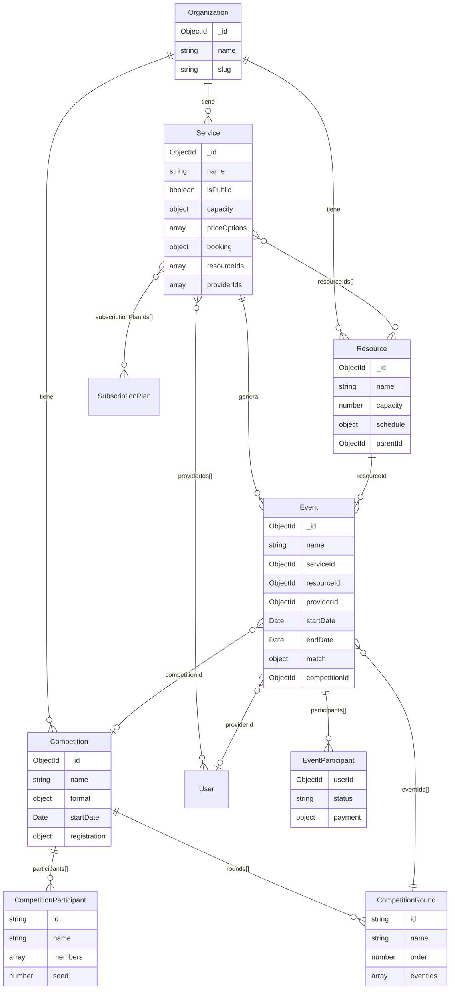
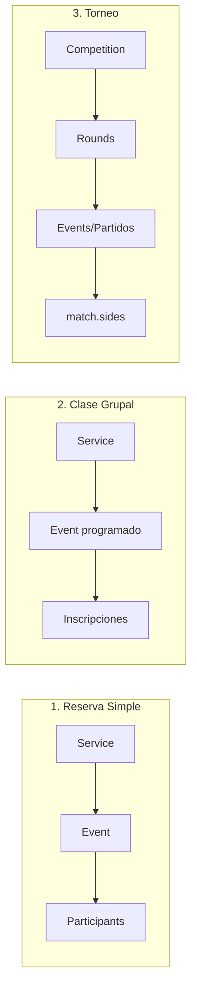

# Bloque 4: Dominio de Negocio

**Estado:** En desarrollo
**Dependencias:** Bloque 3 (Permisos)

---

## Índice

1. [Modelo de Datos](#1-modelo-de-datos)
   - 1.1 [Filosofía Core](#11-filosofía-core)
   - 1.2 [Service](#12-service)
   - 1.3 [Resource](#13-resource)
   - 1.4 [Event](#14-event)
   - 1.5 [Competition](#15-competition)
   - 1.6 [Diagrama de Relaciones](#16-diagrama-de-relaciones)
   - 1.7 [Ejemplos por Caso de Uso](#17-ejemplos-por-caso-de-uso)
2. [Sistema de Vistas (UI)](#2-sistema-de-vistas-ui)
3. [Validación y Conflictos](#3-validación-y-conflictos)

---

## 1. Modelo de Datos

### 1.1 Filosofía Core

```
ORGANIZATION → SERVICE → RESOURCE → EVENT → COMPETITION
```

- **Organization**: Sede/sucursal del tenant (ya definido en Bloque 1)
- **Service**: Qué se ofrece (clase, reserva, tratamiento...)
- **Resource**: Dónde/con qué se realiza (pista, sala, camilla...)
- **Event**: Instancia concreta en el tiempo
- **Competition**: Torneos, ligas, campeonatos (agrupa eventos)

**Principio fundamental:** Los modelos son **genéricos** y **flexibles**. No hay tipos hardcodeados. El comportamiento se define mediante configuración, no mediante enums.

---

### 1.2 Service

El Service define **qué se ofrece** y **cómo funciona la inscripción/reserva**.

```typescript
// ═══════════════════════════════════════════════════════════════════════════
// Collection: db_tenant_{slug}.services
// ═══════════════════════════════════════════════════════════════════════════

interface Service {
  _id: ObjectId;

  // ─────────────────────────────────────────────────────────────────────────
  // Identificación
  // ─────────────────────────────────────────────────────────────────────────
  name: string;                    // "Clase de Spinning", "Reserva Pista Pádel"
  description?: string;
  categoryId?: ObjectId;           // Referencia a ServiceCategory (dinámico por tenant)

  // ─────────────────────────────────────────────────────────────────────────
  // Visual
  // ─────────────────────────────────────────────────────────────────────────
  color: string;                   // Color principal para calendario
  image?: string;                  // URL de imagen

  // ─────────────────────────────────────────────────────────────────────────
  // Visibilidad
  // ─────────────────────────────────────────────────────────────────────────
  isPublic: boolean;               // ¿Visible en webapp para clientes?

  // ─────────────────────────────────────────────────────────────────────────
  // Capacidad
  // ─────────────────────────────────────────────────────────────────────────
  capacity?: {
    min?: number;                  // Mínimo de participantes
    max?: number;                  // Máximo de participantes
  };

  // ─────────────────────────────────────────────────────────────────────────
  // Precios
  // ─────────────────────────────────────────────────────────────────────────
  priceOptions: PriceOption[];

  // ─────────────────────────────────────────────────────────────────────────
  // Horario por defecto
  // ─────────────────────────────────────────────────────────────────────────
  defaultSchedule?: Schedule;

  // ─────────────────────────────────────────────────────────────────────────
  // Configuración de inscripción/reserva
  // ─────────────────────────────────────────────────────────────────────────
  booking: {
    // Ventana de reserva
    minAdvance?: number;           // Mínimo horas antes para reservar
    maxAdvance?: number;           // Máximo horas antes para reservar

    // Cancelación
    cancellation?: {
      allowed: boolean;
      deadline?: number;           // Horas antes del evento
      penalty?: number;            // Porcentaje o cantidad fija
    };

    // Lista de espera
    waitlist?: boolean;

    // Confirmación manual
    requiresConfirmation?: boolean;

    // Pago
    payment: {
      required: 'immediate' | 'on-site' | 'optional';

      // Pagos divididos
      splitPayment?: {
        enabled: boolean;
        mode: 'equal' | 'per-person';    // Partes iguales o por persona
        minPaidToConfirm?: number;       // % mínimo pagado para confirmar
        deadline?: number;               // Horas límite para completar pago
      };
    };
  };

  // ─────────────────────────────────────────────────────────────────────────
  // Relaciones - Definen qué recursos/providers puede usar este servicio
  // ─────────────────────────────────────────────────────────────────────────
  resourceIds?: ObjectId[];        // Recursos válidos para este servicio
  providerIds?: ObjectId[];        // Providers válidos para este servicio

  // ─────────────────────────────────────────────────────────────────────────
  // Membresías aplicables
  // ─────────────────────────────────────────────────────────────────────────
  subscriptionPlanIds?: ObjectId[];

  // ─────────────────────────────────────────────────────────────────────────
  // Estado y metadata
  // ─────────────────────────────────────────────────────────────────────────
  status: 'active' | 'inactive';
  organizationId: ObjectId;

  createdAt: Date;
  updatedAt: Date;
}

// ═══════════════════════════════════════════════════════════════════════════
// Tipos auxiliares
// ═══════════════════════════════════════════════════════════════════════════

interface PriceOption {
  id: string;
  label: string;                   // "1 hora", "Clase suelta", "Bono 10"
  duration: number;                // Duración en minutos
  price: number;
  currency?: string;               // Default: EUR

  // Para precios por participantes
  participants?: number;           // Aplica a X participantes
  unlimitedParticipants?: boolean;
  pricePerPerson: boolean;         // ¿Precio por persona o total?

  // Precios especiales para miembros
  hasMemberPrice?: boolean;
  membershipPrices?: Array<{
    subscriptionPlanId: string;
    price: number;
  }>;
}

interface ServiceCategory {
  _id: ObjectId;
  name: string;                    // "Clases grupales", "Pistas", "Tratamientos"
  description?: string;
  image?: string;
  status: 'active' | 'inactive';
  organizationId: ObjectId;
  createdAt: Date;
  updatedAt: Date;
}

interface Schedule {
  weeklySchedule: WeeklySchedule;
  specialDays?: SpecialDay[];
  timezone?: string;               // "Europe/Madrid"
}

interface WeeklySchedule {
  monday: DaySchedule;
  tuesday: DaySchedule;
  wednesday: DaySchedule;
  thursday: DaySchedule;
  friday: DaySchedule;
  saturday: DaySchedule;
  sunday: DaySchedule;
}

interface DaySchedule {
  isOpen: boolean;
  intervals: Array<{
    startTime: string;             // "09:00"
    endTime: string;               // "14:00"
  }>;
}

interface SpecialDay {
  date: Date;
  isOpen: boolean;
  intervals?: Array<{ startTime: string; endTime: string }>;
  description?: string;            // "Festivo", "Horario especial"
}
```

---

### 1.3 Resource

El Resource define **dónde o con qué** se realiza el servicio.

```typescript
// ═══════════════════════════════════════════════════════════════════════════
// Collection: db_tenant_{slug}.resources
// ═══════════════════════════════════════════════════════════════════════════

interface Resource {
  _id: ObjectId;

  // ─────────────────────────────────────────────────────────────────────────
  // Identificación
  // ─────────────────────────────────────────────────────────────────────────
  name: string;                    // "Pista 1", "Sala Spinning", "Camilla 3"
  description?: string;
  categoryId?: ObjectId;           // Referencia a ResourceCategory

  // ─────────────────────────────────────────────────────────────────────────
  // Capacidad
  // ─────────────────────────────────────────────────────────────────────────
  capacity?: number;               // Capacidad máxima del recurso

  // ─────────────────────────────────────────────────────────────────────────
  // Disponibilidad
  // ─────────────────────────────────────────────────────────────────────────
  schedule?: Schedule;             // Horario de disponibilidad

  // ─────────────────────────────────────────────────────────────────────────
  // Jerarquía (opcional)
  // ─────────────────────────────────────────────────────────────────────────
  parentId?: ObjectId;             // Para recursos anidados (ej: Zona → Pistas)

  // ─────────────────────────────────────────────────────────────────────────
  // Estado y metadata
  // ─────────────────────────────────────────────────────────────────────────
  status: 'active' | 'inactive';
  organizationId: ObjectId;

  createdAt: Date;
  updatedAt: Date;
}

interface ResourceCategory {
  _id: ObjectId;
  name: string;                    // "Pistas de pádel", "Salas", "Camillas"
  description?: string;
  image?: string;
  status: 'active' | 'inactive';
  organizationId: ObjectId;
  createdAt: Date;
  updatedAt: Date;
}
```

---

### 1.4 Event

El Event es **la instancia concreta** de un servicio en el tiempo.

```typescript
// ═══════════════════════════════════════════════════════════════════════════
// Collection: db_tenant_{slug}.events
// ═══════════════════════════════════════════════════════════════════════════

interface Event {
  _id: ObjectId;

  // ─────────────────────────────────────────────────────────────────────────
  // Identificación
  // ─────────────────────────────────────────────────────────────────────────
  name: string;                    // Puede heredar del servicio o ser custom
  description?: string;

  // ─────────────────────────────────────────────────────────────────────────
  // Relaciones principales
  // ─────────────────────────────────────────────────────────────────────────
  serviceId: ObjectId;             // Servicio al que pertenece
  resourceId?: ObjectId;           // Recurso donde se realiza (opcional)
  providerId?: ObjectId;           // Provider asignado (opcional)

  // ─────────────────────────────────────────────────────────────────────────
  // Tiempo
  // ─────────────────────────────────────────────────────────────────────────
  startDate: Date;
  endDate: Date;
  timezone?: string;

  // ─────────────────────────────────────────────────────────────────────────
  // Recurrencia (si aplica)
  // ─────────────────────────────────────────────────────────────────────────
  recurrence?: {
    parentEventId: ObjectId;       // Evento padre (patrón de recurrencia)
    instanceDate: Date;            // Fecha específica de esta instancia
  };

  // ─────────────────────────────────────────────────────────────────────────
  // Capacidad y participantes
  // ─────────────────────────────────────────────────────────────────────────
  capacity?: number;               // Hereda de Service si no se especifica
  participants: EventParticipant[];

  // ─────────────────────────────────────────────────────────────────────────
  // Precios (hereda de Service, puede override)
  // ─────────────────────────────────────────────────────────────────────────
  priceOptions?: PriceOption[];

  // ─────────────────────────────────────────────────────────────────────────
  // Para partidos/competiciones
  // ─────────────────────────────────────────────────────────────────────────
  competitionId?: ObjectId;        // Si pertenece a un torneo/liga
  roundId?: string;                // Ronda dentro de la competición

  match?: {
    sides: [
      { participantId: string; score?: number },
      { participantId: string; score?: number }
    ];
    winnerId?: string;
    status: 'scheduled' | 'in-progress' | 'finished' | 'walkover' | 'cancelled';
  };

  // ─────────────────────────────────────────────────────────────────────────
  // Estado
  // ─────────────────────────────────────────────────────────────────────────
  status: 'draft' | 'scheduled' | 'confirmed' | 'in-progress' | 'completed' | 'cancelled';

  // ─────────────────────────────────────────────────────────────────────────
  // Metadata
  // ─────────────────────────────────────────────────────────────────────────
  organizationId: ObjectId;
  createdBy: ObjectId;             // Usuario que creó el evento

  createdAt: Date;
  updatedAt: Date;
}

// ═══════════════════════════════════════════════════════════════════════════
// Participante de un evento
// ═══════════════════════════════════════════════════════════════════════════

interface EventParticipant {
  userId: ObjectId;

  // Estado de la inscripción
  status: 'pending' | 'confirmed' | 'waitlist' | 'cancelled' | 'attended' | 'no-show';

  // Pago
  payment: {
    priceOptionId: string;
    amount: number;
    status: 'pending' | 'partial' | 'paid' | 'refunded';
    paidAt?: Date;
  };

  // Metadata
  registeredAt: Date;
  registeredBy?: ObjectId;         // Si lo registró otro usuario (admin)
  notes?: string;
}
```

---

### 1.5 Competition

Competition agrupa eventos para **torneos, ligas y campeonatos**.

```typescript
// ═══════════════════════════════════════════════════════════════════════════
// Collection: db_tenant_{slug}.competitions
// ═══════════════════════════════════════════════════════════════════════════

interface Competition {
  _id: ObjectId;

  // ─────────────────────────────────────────────────────────────────────────
  // Identificación
  // ─────────────────────────────────────────────────────────────────────────
  name: string;                    // "Torneo Verano 2024", "Liga Otoño"
  description?: string;

  // ─────────────────────────────────────────────────────────────────────────
  // Visual
  // ─────────────────────────────────────────────────────────────────────────
  color: string;
  image?: string;
  isPublic: boolean;

  // ─────────────────────────────────────────────────────────────────────────
  // Formato
  // ─────────────────────────────────────────────────────────────────────────
  format: {
    type: 'tournament' | 'league' | 'championship';
    structure: 'single-elimination' | 'double-elimination' | 'round-robin' | 'groups-knockout';
    teamSize: number;              // 1 = individual, 2 = parejas, 4+ = equipos
    maxParticipants?: number;
  };

  // ─────────────────────────────────────────────────────────────────────────
  // Fechas
  // ─────────────────────────────────────────────────────────────────────────
  registrationStart: Date;
  registrationEnd: Date;
  startDate: Date;
  endDate?: Date;

  // ─────────────────────────────────────────────────────────────────────────
  // Inscripción
  // ─────────────────────────────────────────────────────────────────────────
  registration: {
    price: number;
    pricePerPerson: boolean;
    requiresPayment: boolean;
    cancellation?: {
      allowed: boolean;
      deadline?: number;
    };
  };

  // ─────────────────────────────────────────────────────────────────────────
  // Participantes
  // ─────────────────────────────────────────────────────────────────────────
  participants: CompetitionParticipant[];

  // ─────────────────────────────────────────────────────────────────────────
  // Estructura de la competición
  // ─────────────────────────────────────────────────────────────────────────
  rounds?: CompetitionRound[];

  // ─────────────────────────────────────────────────────────────────────────
  // Relaciones
  // ─────────────────────────────────────────────────────────────────────────
  serviceId?: ObjectId;            // Servicio asociado (ej: "Pádel")
  resourceIds?: ObjectId[];        // Recursos donde se juega

  // ─────────────────────────────────────────────────────────────────────────
  // Estado
  // ─────────────────────────────────────────────────────────────────────────
  status: 'draft' | 'registration' | 'in-progress' | 'finished' | 'cancelled';

  // ─────────────────────────────────────────────────────────────────────────
  // Metadata
  // ─────────────────────────────────────────────────────────────────────────
  organizationId: ObjectId;

  createdAt: Date;
  updatedAt: Date;
}

// ═══════════════════════════════════════════════════════════════════════════
// Participante de competición (individual, pareja o equipo)
// ═══════════════════════════════════════════════════════════════════════════

interface CompetitionParticipant {
  id: string;
  name: string;                    // Nombre del equipo/pareja
  members: ObjectId[];             // UserIds de los miembros

  seed?: number;                   // Cabeza de serie
  status: 'registered' | 'confirmed' | 'eliminated' | 'winner';

  payment: {
    amount: number;
    status: 'pending' | 'paid' | 'refunded';
    paidAt?: Date;
  };

  registeredAt: Date;
}

// ═══════════════════════════════════════════════════════════════════════════
// Ronda de competición
// ═══════════════════════════════════════════════════════════════════════════

interface CompetitionRound {
  id: string;
  name: string;                    // "Octavos", "Cuartos", "Semifinal", "Final"
  order: number;
  eventIds: ObjectId[];            // Los eventos (partidos) de esta ronda
  status: 'pending' | 'in-progress' | 'finished';
}
```

---

### 1.6 Diagrama de Relaciones



#### Flujos principales



---

### 1.7 Ejemplos por Caso de Uso

#### 🏋️ Gimnasio - Clase de Spinning

```typescript
// SERVICE
{
  name: "Clase de Spinning",
  categoryId: "cat-clases-grupales",
  color: "#FF5722",
  isPublic: true,
  capacity: { min: 5, max: 20 },
  priceOptions: [
    { label: "Clase suelta", duration: 45, price: 12, pricePerPerson: true },
    { label: "Bono 10 clases", duration: 45, price: 100, pricePerPerson: true,
      membershipPrices: [{ subscriptionPlanId: "socio-premium", price: 80 }]
    }
  ],
  booking: {
    minAdvance: 1,
    maxAdvance: 168,
    cancellation: { allowed: true, deadline: 2 },
    waitlist: true,
    requiresConfirmation: false,
    payment: { required: 'immediate', splitPayment: { enabled: false } }
  },
  resourceIds: ["sala-spinning"],
  providerIds: ["instructor-1", "instructor-2", "instructor-3"],
  status: "active"
}

// EVENT (instancia)
{
  name: "Spinning - Lunes 10:00",
  serviceId: "service-spinning",
  resourceId: "sala-spinning",
  providerId: "instructor-1",
  startDate: "2024-01-15T10:00:00",
  endDate: "2024-01-15T10:45:00",
  capacity: 20,
  participants: [
    { userId: "user-1", status: "confirmed", payment: { amount: 12, status: "paid" } },
    { userId: "user-2", status: "confirmed", payment: { amount: 0, status: "paid" } }, // Bono
    // ... más participantes
  ],
  status: "scheduled"
}
```

#### 🎾 Club Deportivo - Reserva Pista Pádel

```typescript
// SERVICE
{
  name: "Reserva Pista Pádel",
  categoryId: "cat-pistas",
  color: "#2196F3",
  isPublic: true,
  capacity: { min: 2, max: 4 },
  priceOptions: [
    { label: "1 hora", duration: 60, price: 24, pricePerPerson: false },
    { label: "1.5 horas", duration: 90, price: 32, pricePerPerson: false }
  ],
  booking: {
    minAdvance: 0,
    maxAdvance: 168,
    cancellation: { allowed: true, deadline: 4 },
    payment: {
      required: 'immediate',
      splitPayment: { enabled: true, mode: 'equal', minPaidToConfirm: 25, deadline: 2 }
    }
  },
  resourceIds: ["pista-1", "pista-2", "pista-3", "pista-4"],
  providerIds: [],
  status: "active"
}

// EVENT (reserva)
{
  name: "Reserva Pista 2",
  serviceId: "service-padel",
  resourceId: "pista-2",
  startDate: "2024-01-15T18:00:00",
  endDate: "2024-01-15T19:30:00",
  capacity: 4,
  participants: [
    { userId: "user-1", status: "confirmed", payment: { amount: 8, status: "paid" } },
    { userId: "user-2", status: "confirmed", payment: { amount: 8, status: "paid" } },
    { userId: "user-3", status: "confirmed", payment: { amount: 8, status: "pending" } },
    { userId: "user-4", status: "pending", payment: { amount: 8, status: "pending" } }
  ],
  status: "confirmed"
}
```

#### 🏆 Club Deportivo - Torneo

```typescript
// COMPETITION
{
  name: "Torneo Verano 2024",
  color: "#9C27B0",
  isPublic: true,
  format: {
    type: "tournament",
    structure: "single-elimination",
    teamSize: 2,
    maxParticipants: 16
  },
  registrationStart: "2024-06-01",
  registrationEnd: "2024-06-15",
  startDate: "2024-06-20",
  registration: {
    price: 30,
    pricePerPerson: true,
    requiresPayment: true
  },
  participants: [
    { id: "p1", name: "Juan & Pedro", members: ["user-1", "user-2"], seed: 1, status: "confirmed" },
    { id: "p2", name: "María & Ana", members: ["user-3", "user-4"], seed: 2, status: "confirmed" },
    // ... más parejas
  ],
  rounds: [
    { id: "r1", name: "Octavos", order: 1, eventIds: ["match-1", "match-2", ...], status: "finished" },
    { id: "r2", name: "Cuartos", order: 2, eventIds: ["match-9", "match-10", ...], status: "in-progress" },
    { id: "r3", name: "Semifinal", order: 3, eventIds: [], status: "pending" },
    { id: "r4", name: "Final", order: 4, eventIds: [], status: "pending" }
  ],
  resourceIds: ["pista-1", "pista-2", "pista-3"],
  status: "in-progress"
}

// EVENT (partido del torneo)
{
  name: "Cuartos - Partido 1",
  serviceId: "service-padel",
  resourceId: "pista-1",
  startDate: "2024-06-22T10:00:00",
  endDate: "2024-06-22T11:30:00",
  competitionId: "torneo-verano-2024",
  roundId: "r2",
  match: {
    sides: [
      { participantId: "p1", score: 6 },
      { participantId: "p5", score: 3 }
    ],
    winnerId: "p1",
    status: "finished"
  },
  participants: [], // En partidos, los participantes están en match.sides
  status: "completed"
}
```

#### 💆 Fisioterapia - Sesión

```typescript
// SERVICE
{
  name: "Sesión Fisioterapia",
  categoryId: "cat-tratamientos",
  color: "#00BCD4",
  isPublic: true,
  capacity: { min: 1, max: 1 },
  priceOptions: [
    { label: "30 minutos", duration: 30, price: 35, pricePerPerson: true },
    { label: "45 minutos", duration: 45, price: 45, pricePerPerson: true },
    { label: "60 minutos", duration: 60, price: 55, pricePerPerson: true }
  ],
  booking: {
    minAdvance: 2,
    maxAdvance: 672,
    cancellation: { allowed: true, deadline: 24 },
    requiresConfirmation: false,
    payment: { required: 'on-site', splitPayment: { enabled: false } }
  },
  resourceIds: ["camilla-1", "camilla-2", "camilla-3"],
  providerIds: ["fisio-ana", "fisio-carlos"],
  status: "active"
}

// EVENT (cita)
{
  name: "Sesión con Ana",
  serviceId: "service-fisio",
  resourceId: "camilla-1",
  providerId: "fisio-ana",
  startDate: "2024-01-15T11:00:00",
  endDate: "2024-01-15T11:45:00",
  capacity: 1,
  participants: [
    { userId: "user-1", status: "confirmed", payment: { amount: 45, status: "pending" } }
  ],
  status: "scheduled"
}
```

---

## 2. Sistema de Vistas (UI)

> **Nota:** El modelo base `AppRoute` se define en `03-PERMISOS.md` (sección 9.4.1).
> Esta sección extiende ese modelo con el sistema completo de vistas.

### 1.1 Concepto de Vista

Una **Vista** es una configuración de UI que combina:
- **Recurso**: Qué entidad muestra (events, users, bookings)
- **Views**: Cómo se puede visualizar (calendar, list, crm, kanban)
- **Filtros**: Filtros predefinidos (solo mis reservas, solo clases)
- **Roles**: Quién puede ver esta vista

```
┌─────────────────────────────────────────────────────────────────────────────┐
│                           CONCEPTO DE VISTA                                  │
├─────────────────────────────────────────────────────────────────────────────┤
│                                                                              │
│   EJEMPLO: Tenant "Gimnasio FitMax" quiere estas vistas en su Dashboard:   │
│                                                                              │
│   ┌─────────────────────────────────────────────────────────────────┐       │
│   │  Vista: "Eventos"                                                │       │
│   │  ─────────────────                                               │       │
│   │  resource: events                                                │       │
│   │  views: [calendar, list]                                         │       │
│   │  roles: [admin, employee]                                        │       │
│   │  filters: {}  (todos los eventos)                                │       │
│   └─────────────────────────────────────────────────────────────────┘       │
│                                                                              │
│   ┌─────────────────────────────────────────────────────────────────┐       │
│   │  Vista: "Clases Grupales"                                        │       │
│   │  ─────────────────────────                                       │       │
│   │  resource: events                     ← Mismo recurso            │       │
│   │  views: [calendar, list]                                         │       │
│   │  roles: [admin, employee, provider]   ← Más roles               │       │
│   │  filters: { serviceType: "class" }    ← Filtro predefinido       │       │
│   └─────────────────────────────────────────────────────────────────┘       │
│                                                                              │
│   ┌─────────────────────────────────────────────────────────────────┐       │
│   │  Vista: "Clientes"                                               │       │
│   │  ─────────────────                                               │       │
│   │  resource: users                                                 │       │
│   │  views: [crm, list]                   ← Vista CRM disponible    │       │
│   │  roles: [admin]                                                  │       │
│   │  filters: { roles: ["client"] }       ← Solo clientes           │       │
│   └─────────────────────────────────────────────────────────────────┘       │
│                                                                              │
│   ┌─────────────────────────────────────────────────────────────────┐       │
│   │  Vista: "Mi Equipo"                                              │       │
│   │  ──────────────────                                              │       │
│   │  resource: users                                                 │       │
│   │  views: [list]                                                   │       │
│   │  roles: [admin]                                                  │       │
│   │  filters: { roles: ["employee", "provider"] }                    │       │
│   └─────────────────────────────────────────────────────────────────┘       │
│                                                                              │
│   Dos vistas pueden usar el MISMO recurso con diferentes filtros            │
│                                                                              │
└─────────────────────────────────────────────────────────────────────────────┘
```

### 1.2 Modelo Completo: ViewConfig

```typescript
// ═══════════════════════════════════════════════════════════════════════════
// ViewConfig: Extensión completa de AppRoute para el sistema de vistas
// Implementar cuando se desarrolle el Bloque 4
// ═══════════════════════════════════════════════════════════════════════════

// Tipos de vista por app
type DashboardViewType = 'list' | 'calendar' | 'kanban' | 'crm' | 'grid' | 'form' | 'timeline';
type WebAppViewType = 'cards' | 'list' | 'calendar' | 'profile' | 'detail' | 'booking-form';
type ViewType = DashboardViewType | WebAppViewType;

// Filtros especiales resueltos en runtime
type SpecialFilter = 'ME' | 'MY_ORGS' | 'TODAY' | 'THIS_WEEK' | 'THIS_MONTH';

// ═══════════════════════════════════════════════════════════════════════════
// ViewConfig: Modelo completo de Vista
// ═══════════════════════════════════════════════════════════════════════════

interface ViewConfig {
  // ─────────────────────────────────────────────────────────────────────────
  // Identificación (heredado de AppRoute)
  // ─────────────────────────────────────────────────────────────────────────
  id: string;                      // "classes", "clients", "my-bookings"
  path: string;                    // "/classes", "/clients"
  label: string;                   // "Clases Grupales"
  icon?: string;                   // "dumbbell"
  allowedRoles: string[];          // ["admin", "employee", "provider"]
  isEnabled: boolean;
  order: number;

  // ─────────────────────────────────────────────────────────────────────────
  // Recurso asociado (OBLIGATORIO en Bloque 4)
  // ─────────────────────────────────────────────────────────────────────────
  resource: ResourceId;            // Usa ResourceId de @serveflow/core

  // ─────────────────────────────────────────────────────────────────────────
  // Configuración de visualización
  // ─────────────────────────────────────────────────────────────────────────
  availableViews: ViewType[];      // ["calendar", "list", "kanban"]
  defaultView: ViewType;           // "calendar"

  // ─────────────────────────────────────────────────────────────────────────
  // Filtros predefinidos
  // ─────────────────────────────────────────────────────────────────────────
  defaultFilters?: {
    [field: string]: unknown | SpecialFilter;
  };
  // Ejemplos:
  // { serviceType: "class" }           → Solo eventos de tipo clase
  // { roles: ["client"] }              → Solo usuarios con rol client
  // { userId: "ME" }                   → Solo mis recursos
  // { organizationId: "MY_ORGS" }      → Solo de mis organizaciones
  // { date: "TODAY" }                  → Solo de hoy

  // ─────────────────────────────────────────────────────────────────────────
  // Configuración de campos visibles
  // ─────────────────────────────────────────────────────────────────────────
  visibleFields?: string[];        // ["name", "email", "phone", "createdAt"]
  sortableFields?: string[];       // ["name", "createdAt"]
  searchableFields?: string[];     // ["name", "email"]
  defaultSort?: {
    field: string;
    direction: 'asc' | 'desc';
  };

  // ─────────────────────────────────────────────────────────────────────────
  // Acciones disponibles
  // ─────────────────────────────────────────────────────────────────────────
  actions?: {
    create?: boolean;              // Mostrar botón "Crear"
    export?: boolean;              // Mostrar botón "Exportar"
    import?: boolean;              // Mostrar botón "Importar"
    bulkActions?: string[];        // ["delete", "archive", "assign"]
  };

  // ─────────────────────────────────────────────────────────────────────────
  // Sub-vistas (para navegación anidada)
  // ─────────────────────────────────────────────────────────────────────────
  children?: ViewConfig[];
}

// ResourceId viene de @serveflow/core (ver sección 9.5 de 03-PERMISOS.md)
// Recursos disponibles: event, service, resource, user, organization, role, settings
import type { ResourceId } from '@serveflow/core';
```

### 1.3 Ejemplos de Vistas por Caso de Uso

```typescript
// ═══════════════════════════════════════════════════════════════════════════
// EJEMPLO: Gimnasio con múltiples vistas sobre el mismo recurso
// ═══════════════════════════════════════════════════════════════════════════

const gimnasioViews: ViewConfig[] = [
  // Vista general de eventos (admin ve todo)
  {
    id: 'events',
    path: '/events',
    label: 'Todos los Eventos',
    icon: 'calendar',
    allowedRoles: ['admin'],
    isEnabled: true,
    order: 1,
    resource: 'event',
    availableViews: ['calendar', 'list', 'timeline'],
    defaultView: 'calendar',
  },

  // Vista de clases grupales (empleados y providers)
  {
    id: 'classes',
    path: '/classes',
    label: 'Clases Grupales',
    icon: 'users',
    allowedRoles: ['admin', 'employee', 'provider'],
    isEnabled: true,
    order: 2,
    resource: 'event',
    availableViews: ['calendar', 'list'],
    defaultView: 'calendar',
    defaultFilters: {
      serviceType: 'class',
    },
  },

  // Vista de mis clases (solo provider, sus asignadas)
  {
    id: 'my-classes',
    path: '/my-classes',
    label: 'Mis Clases',
    icon: 'dumbbell',
    allowedRoles: ['provider'],
    isEnabled: true,
    order: 3,
    resource: 'event',
    availableViews: ['calendar', 'list'],
    defaultView: 'calendar',
    defaultFilters: {
      serviceType: 'class',
      instructorId: 'ME',  // Filtro especial
    },
  },

  // Vista de reservas de pista
  {
    id: 'court-bookings',
    path: '/court-bookings',
    label: 'Reservas de Pista',
    icon: 'layout-grid',
    allowedRoles: ['admin', 'employee'],
    isEnabled: true,
    order: 4,
    resource: 'event',
    availableViews: ['calendar', 'list'],
    defaultView: 'calendar',
    defaultFilters: {
      serviceType: 'court-rental',
    },
  },

  // Vista CRM de clientes
  {
    id: 'clients',
    path: '/clients',
    label: 'Clientes',
    icon: 'users',
    allowedRoles: ['admin'],
    isEnabled: true,
    order: 5,
    resource: 'user',
    availableViews: ['crm', 'list'],
    defaultView: 'crm',
    defaultFilters: {
      roles: ['client'],
    },
    visibleFields: ['name', 'email', 'phone', 'membershipStatus', 'lastVisit'],
    actions: {
      create: true,
      export: true,
    },
  },

  // Vista de equipo (empleados y providers)
  {
    id: 'team',
    path: '/team',
    label: 'Mi Equipo',
    icon: 'users-cog',
    allowedRoles: ['admin'],
    isEnabled: true,
    order: 6,
    resource: 'user',
    availableViews: ['list', 'grid'],
    defaultView: 'list',
    defaultFilters: {
      roles: ['employee', 'provider'],
    },
  },
];
```

### 1.4 Cómo se Resuelven los Filtros Especiales

```typescript
// ═══════════════════════════════════════════════════════════════════════════
// Resolución de filtros especiales en runtime
// ═══════════════════════════════════════════════════════════════════════════

function resolveFilters(
  defaultFilters: Record<string, unknown>,
  ctx: AuthContext
): Record<string, unknown> {
  const resolved: Record<string, unknown> = {};

  for (const [field, value] of Object.entries(defaultFilters)) {
    if (value === 'ME') {
      resolved[field] = ctx.userId;
    } else if (value === 'MY_ORGS') {
      // Array vacío significa todas las orgs
      resolved[field] = ctx.organizationIds.length > 0
        ? { $in: ctx.organizationIds }
        : undefined;  // No filtrar
    } else if (value === 'TODAY') {
      resolved[field] = {
        $gte: startOfDay(new Date()),
        $lt: endOfDay(new Date()),
      };
    } else if (value === 'THIS_WEEK') {
      resolved[field] = {
        $gte: startOfWeek(new Date()),
        $lt: endOfWeek(new Date()),
      };
    } else {
      resolved[field] = value;
    }
  }

  return resolved;
}

// Uso en el backend
async function listEvents(view: ViewConfig, ctx: AuthContext) {
  const filters = resolveFilters(view.defaultFilters || {}, ctx);

  // Además, Cerbos valida que el usuario puede leer estos eventos
  const events = await EventModel.find(filters);

  return events;
}
```

### 1.5 Almacenamiento por Tenant

```typescript
// ═══════════════════════════════════════════════════════════════════════════
// Collection: db_tenant_{slug}.app_configs
// Un documento por app (dashboard, webapp)
// ═══════════════════════════════════════════════════════════════════════════

interface TenantAppConfig {
  _id: ObjectId;
  app: 'dashboard' | 'webapp';

  // Vistas configuradas (extienden o reemplazan defaults)
  views: ViewConfig[];

  // Rutas públicas (solo webapp)
  publicRoutes?: string[];

  // Configuración de home
  homeConfig?: {
    widgets: Record<string, WidgetConfig[]>;  // Por rol
  };

  // Override de tema
  theme?: ThemeConfig;

  updatedAt: Date;
}

// ═══════════════════════════════════════════════════════════════════════════
// Merge de configuración: Defaults + Tenant Config
// ═══════════════════════════════════════════════════════════════════════════

function getAppViews(
  app: AppType,
  tenantConfig?: TenantAppConfig
): ViewConfig[] {
  const defaults = app === 'dashboard'
    ? DEFAULT_DASHBOARD_VIEWS
    : DEFAULT_WEBAPP_VIEWS;

  if (!tenantConfig?.views) {
    return defaults;
  }

  // Tenant puede:
  // 1. Añadir vistas nuevas
  // 2. Modificar vistas existentes (por id)
  // 3. Deshabilitar vistas (isEnabled: false)

  const merged = [...defaults];

  for (const tenantView of tenantConfig.views) {
    const existingIndex = merged.findIndex(v => v.id === tenantView.id);

    if (existingIndex >= 0) {
      // Override de vista existente
      merged[existingIndex] = { ...merged[existingIndex], ...tenantView };
    } else {
      // Nueva vista del tenant
      merged.push(tenantView);
    }
  }

  return merged.filter(v => v.isEnabled).sort((a, b) => a.order - b.order);
}
```

### 1.6 UI para Configurar Vistas (Admin del Tenant)

```
┌─────────────────────────────────────────────────────────────────────────────┐
│                    CONFIGURACIÓN > VISTAS DEL DASHBOARD                      │
├─────────────────────────────────────────────────────────────────────────────┤
│                                                                              │
│   Personaliza las vistas que aparecen en el menú de tu Dashboard.           │
│                                                                              │
│   ┌─────────────────────────────────────────────────────────────────────┐   │
│   │  ≡  Eventos               calendar  │  ☑ Activa  │  [Editar]       │   │
│   │      Roles: admin, employee                                         │   │
│   ├─────────────────────────────────────────────────────────────────────┤   │
│   │  ≡  Clases Grupales       calendar  │  ☑ Activa  │  [Editar]       │   │
│   │      Roles: admin, employee, provider                               │   │
│   │      Filtro: serviceType = class                                    │   │
│   ├─────────────────────────────────────────────────────────────────────┤   │
│   │  ≡  Clientes              crm       │  ☑ Activa  │  [Editar]       │   │
│   │      Roles: admin                                                   │   │
│   │      Filtro: roles = client                                         │   │
│   ├─────────────────────────────────────────────────────────────────────┤   │
│   │  ≡  Mi Equipo             list      │  ☐ Inactiva│  [Editar]       │   │
│   │      Roles: admin                                                   │   │
│   └─────────────────────────────────────────────────────────────────────┘   │
│                                                                              │
│   [+ Añadir Vista]                                                          │
│                                                                              │
│   ─────────────────────────────────────────────────────────────────────     │
│                                                                              │
│   Al hacer clic en [Editar]:                                                │
│                                                                              │
│   ┌─────────────────────────────────────────────────────────────────────┐   │
│   │  Editar Vista: Clases Grupales                                      │   │
│   │                                                                      │   │
│   │  Nombre: [Clases Grupales        ]                                  │   │
│   │  Icono:  [users ▼]                                                  │   │
│   │  Recurso: [events ▼]  (no editable si viene de template)           │   │
│   │                                                                      │   │
│   │  Vistas disponibles:                                                │   │
│   │  ☑ Calendario   ☑ Lista   ☐ Kanban   ☐ Timeline                    │   │
│   │  Vista por defecto: [Calendario ▼]                                  │   │
│   │                                                                      │   │
│   │  Roles que pueden acceder:                                          │   │
│   │  ☑ Admin   ☑ Empleado   ☑ Proveedor   ☐ Cliente                    │   │
│   │                                                                      │   │
│   │  Filtros predefinidos:                                              │   │
│   │  ┌──────────────────────────────────────────────────────────────┐   │   │
│   │  │  Campo: [serviceType ▼]  Valor: [class         ]            │   │   │
│   │  │  [+ Añadir filtro]                                           │   │   │
│   │  └──────────────────────────────────────────────────────────────┘   │   │
│   │                                                                      │   │
│   │  [Cancelar]                                      [Guardar Cambios]  │   │
│   └─────────────────────────────────────────────────────────────────────┘   │
│                                                                              │
└─────────────────────────────────────────────────────────────────────────────┘
```

---

## 3. Validación y Conflictos

### 3.1 Validación de Disponibilidad

Al crear o modificar un Event, el sistema debe validar:

```typescript
interface AvailabilityValidation {
  // Verificar disponibilidad del recurso
  resourceAvailable: boolean;

  // Verificar disponibilidad del provider
  providerAvailable: boolean;

  // Verificar que está dentro del horario del servicio
  withinSchedule: boolean;

  // Verificar capacidad no excedida
  capacityOk: boolean;

  // Conflictos encontrados
  conflicts: Conflict[];
}

interface Conflict {
  type: 'resource' | 'provider' | 'schedule' | 'capacity';
  message: string;
  conflictingEventId?: ObjectId;
}
```

### 3.2 Reglas de Negocio

```typescript
// ═══════════════════════════════════════════════════════════════════════════
// Validaciones al crear/modificar Event
// ═══════════════════════════════════════════════════════════════════════════

const eventValidations = {
  // 1. Resource no puede estar ocupado en el mismo horario
  resourceConflict: async (event: Event) => {
    if (!event.resourceId) return true;

    const conflicting = await EventModel.findOne({
      resourceId: event.resourceId,
      _id: { $ne: event._id },
      status: { $nin: ['cancelled', 'draft'] },
      $or: [
        { startDate: { $lt: event.endDate, $gte: event.startDate } },
        { endDate: { $gt: event.startDate, $lte: event.endDate } },
        { startDate: { $lte: event.startDate }, endDate: { $gte: event.endDate } },
      ],
    });

    return !conflicting;
  },

  // 2. Provider no puede estar en dos eventos simultáneos
  providerConflict: async (event: Event) => {
    if (!event.providerId) return true;
    // Similar lógica
  },

  // 3. Respetar ventana de reserva (minAdvance, maxAdvance)
  bookingWindow: (event: Event, service: Service) => {
    const now = new Date();
    const hoursUntil = (event.startDate.getTime() - now.getTime()) / (1000 * 60 * 60);

    if (service.booking.minAdvance && hoursUntil < service.booking.minAdvance) {
      return false; // Muy poco tiempo de antelación
    }
    if (service.booking.maxAdvance && hoursUntil > service.booking.maxAdvance) {
      return false; // Demasiado tiempo de antelación
    }

    return true;
  },

  // 4. No exceder capacidad
  capacityCheck: (event: Event, service: Service) => {
    const maxCapacity = event.capacity || service.capacity?.max;
    if (!maxCapacity) return true;

    const confirmedCount = event.participants.filter(
      p => p.status === 'confirmed' || p.status === 'attended'
    ).length;

    return confirmedCount <= maxCapacity;
  },
};
```

### 3.3 Flujo de Cancelación

```typescript
interface CancellationResult {
  allowed: boolean;
  penalty?: number;
  refundAmount?: number;
  message?: string;
}

function validateCancellation(
  event: Event,
  service: Service,
  participant: EventParticipant
): CancellationResult {
  const cancellation = service.booking.cancellation;

  if (!cancellation?.allowed) {
    return { allowed: false, message: 'Cancelación no permitida' };
  }

  const hoursUntil = (event.startDate.getTime() - Date.now()) / (1000 * 60 * 60);

  if (cancellation.deadline && hoursUntil < cancellation.deadline) {
    // Fuera del plazo
    if (cancellation.penalty) {
      const penaltyAmount = (participant.payment.amount * cancellation.penalty) / 100;
      return {
        allowed: true,
        penalty: cancellation.penalty,
        refundAmount: participant.payment.amount - penaltyAmount,
        message: `Cancelación con ${cancellation.penalty}% de penalización`,
      };
    }
    return { allowed: false, message: 'Plazo de cancelación excedido' };
  }

  return {
    allowed: true,
    refundAmount: participant.payment.amount,
    message: 'Cancelación sin penalización',
  };
}

---

## Decisiones Tomadas

- [x] **Event con participants embebidos** - Array de `EventParticipant` dentro del documento Event
- [x] **Recurrencia con instancias explícitas** - Cada evento recurrente se genera como documento independiente con `recurrence.parentEventId`
- [x] **Modelo genérico sin tipos hardcodeados** - El comportamiento se define por configuración del Service, no por enums
- [x] **Competition como entidad separada** - Los torneos/ligas agrupan Events mediante `competitionId`

## Decisiones Pendientes

- [ ] ¿Histórico de cambios en Event? (audit log)
- [ ] ¿Integración con calendarios externos (Google, Outlook)?
- [ ] ¿Notificaciones automáticas? (emails, push)
- [ ] ¿Sistema de bonos/paquetes de sesiones?
- [ ] ¿Lista de espera automática? (promoción cuando hay cancelación)
