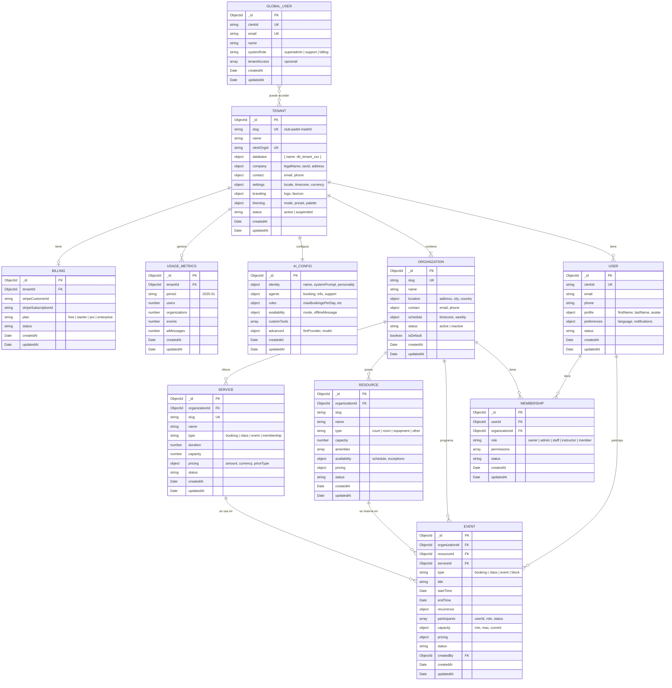

# Serveflow V2 - Modelo de Datos

> **Última actualización**: Bloque 1 - Fundación
> **Versión**: 1.0.0

## Diagrama Entidad-Relación



## Arquitectura de Bases de Datos

Serveflow utiliza un patrón **database-per-tenant** con MongoDB:

```
┌─────────────────────────────────────────────────────────────────┐
│                        MongoDB Cluster                          │
├─────────────────────────────────────────────────────────────────┤
│  db_serveflow_sys          │  Base de datos del sistema        │
│    ├── tenants             │  Registro de todos los tenants    │
│    ├── global_users        │  Admins de Serveflow              │
│    ├── billing             │  Facturación Serveflow→Tenant     │
│    └── usage_metrics       │  Métricas de uso por tenant       │
├─────────────────────────────────────────────────────────────────┤
│  db_tenant_{slug}          │  Base de datos por tenant         │
│    ├── organizations       │  Sedes/localizaciones             │
│    ├── users               │  Usuarios del tenant              │
│    ├── memberships         │  Relación user↔organization       │
│    ├── services            │  Servicios ofrecidos              │
│    ├── resources           │  Recursos (pistas, salas, etc.)   │
│    ├── events              │  Reservas y eventos               │
│    └── ai_config           │  Configuración del asistente IA   │
└─────────────────────────────────────────────────────────────────┘
```

---

## Base de Datos del Sistema (`db_serveflow_sys`)

### Collection: `tenants`

Registro de todos los tenants de la plataforma.

```typescript
interface TenantMVP {
  _id: ObjectId;

  // Identificación
  slug: string;              // "club-padel-madrid" (único, usado en subdominios)
  name: string;              // "Club Pádel Madrid"
  clerkOrgId: string;        // ID de Clerk Organization

  // Base de datos
  database: {
    name: string;            // "db_tenant_club_padel_madrid"
  };

  // Datos de empresa (para facturación Serveflow → Tenant)
  company: {
    legalName: string;       // "Club Pádel Madrid S.L."
    taxId: string;           // CIF/NIF/VAT
    address: {
      street: string;
      city: string;
      postalCode: string;
      country: string;       // ISO 3166-1 alpha-2 ("ES")
      state?: string;
    };
  };

  // Contacto
  contact: {
    email: string;
    phone?: string;
    supportEmail?: string;
    billingEmail?: string;
  };

  // Configuración regional
  settings: {
    locale: string;          // "es-ES"
    timezone: string;        // "Europe/Madrid"
    currency: string;        // "EUR"
  };

  // Identidad visual
  branding: {
    logo: {
      url: string;
      darkUrl?: string;
    };
    favicon?: string;
    appName?: string;
  };

  // Tema visual
  theming: {
    mode: 'light' | 'dark' | 'system';
    preset?: 'default' | 'preset1' | 'preset2' | 'preset3' | 'preset4' | 'preset5';
    palette?: {
      primary?: ColorScale;
      secondary?: ColorScale;
    };
    typography?: {
      primaryFont?: string;
      secondaryFont?: string;
    };
    direction?: 'ltr' | 'rtl';
  };

  // Estado
  status: 'active' | 'suspended';

  // Timestamps
  createdAt: Date;
  updatedAt: Date;
}
```

**Índices:**
| Campo | Tipo | Descripción |
|-------|------|-------------|
| `slug` | unique | Identificador URL del tenant |
| `clerkOrgId` | unique | ID de organización en Clerk |
| `company.taxId` | unique | CIF/NIF para facturación |
| `contact.email` | index | Búsqueda por email |
| `status` | index | Filtrado por estado |
| `advancedSettings.customDomain` | sparse | Dominio personalizado |

---

### Collection: `global_users`

Administradores y personal de Serveflow (no confundir con usuarios de tenants).

```typescript
interface GlobalUser {
  _id: ObjectId;

  clerkId: string;           // ID de Clerk
  email: string;
  name: string;

  // Rol en el sistema Serveflow
  systemRole: 'superadmin' | 'support' | 'billing';

  // Acceso opcional a tenants específicos (para soporte)
  tenantAccess?: Array<{
    tenantId: ObjectId;
    role: 'viewer' | 'support';
    grantedAt: Date;
    grantedBy: ObjectId;
  }>;

  createdAt: Date;
  updatedAt: Date;
}
```

**Índices:**
| Campo | Tipo | Descripción |
|-------|------|-------------|
| `clerkId` | unique | ID de Clerk |
| `email` | unique | Email único |

---

### Collection: `billing` (Fase 2)

Información de facturación y suscripción de cada tenant.

```typescript
interface TenantBilling {
  _id: ObjectId;
  tenantId: ObjectId;

  stripeCustomerId: string;
  stripeSubscriptionId?: string;

  plan: 'free' | 'starter' | 'pro' | 'enterprise';
  status: 'active' | 'past_due' | 'cancelled';

  currentPeriodStart: Date;
  currentPeriodEnd: Date;

  createdAt: Date;
  updatedAt: Date;
}
```

---

### Collection: `usage_metrics` (Fase 2)

Métricas de uso para facturación y límites.

```typescript
interface UsageMetrics {
  _id: ObjectId;
  tenantId: ObjectId;
  period: string;            // "2025-01"

  users: number;
  organizations: number;
  events: number;
  aiMessages: number;
  storageBytes: number;

  createdAt: Date;
  updatedAt: Date;
}
```

---

## Base de Datos del Tenant (`db_tenant_{slug}`)

### Collection: `organizations`

Sedes o localizaciones dentro del tenant (ej: "Sede Norte", "Sede Sur").

```typescript
interface OrganizationMVP {
  _id: ObjectId;

  slug: string;              // "sede-norte"
  name: string;              // "Sede Norte"

  // Ubicación
  location: {
    address: string;
    city: string;
    country: string;
    postalCode?: string;
  };

  // Contacto
  contact: {
    email: string;
    phone?: string;
  };

  // Horario
  schedule: {
    timezone: string;        // "Europe/Madrid"
    weekly: {
      monday?: DaySchedule;
      tuesday?: DaySchedule;
      wednesday?: DaySchedule;
      thursday?: DaySchedule;
      friday?: DaySchedule;
      saturday?: DaySchedule;
      sunday?: DaySchedule;
    };
  };

  status: 'active' | 'inactive';
  isDefault: boolean;        // true = organización principal

  createdAt: Date;
  updatedAt: Date;
}

interface DaySchedule {
  isOpen: boolean;
  openTime?: string;         // "09:00"
  closeTime?: string;        // "21:00"
  breaks?: Array<{
    start: string;
    end: string;
  }>;
}
```

**Índices:**
| Campo | Tipo | Descripción |
|-------|------|-------------|
| `slug` | unique | Identificador URL |
| `status` | index | Filtrado por estado |
| `isDefault` | index | Organización principal |

---

### Collection: `users` (Fase 2)

Usuarios del tenant (clientes, profesores, staff).

```typescript
interface TenantUser {
  _id: ObjectId;

  clerkId: string;
  email: string;
  phone?: string;

  profile: {
    firstName: string;
    lastName: string;
    avatar?: string;
    birthDate?: Date;
  };

  preferences: {
    language: string;
    notifications: {
      email: boolean;
      sms: boolean;
      push: boolean;
      whatsapp: boolean;
    };
  };

  status: 'active' | 'suspended';

  createdAt: Date;
  updatedAt: Date;
}
```

**Índices:**
| Campo | Tipo | Descripción |
|-------|------|-------------|
| `clerkId` | unique | ID de Clerk |
| `email` | index | Búsqueda por email |
| `phone` | sparse | Búsqueda por teléfono |

---

### Collection: `memberships` (Fase 2)

Relación entre usuarios y organizaciones con roles.

```typescript
interface Membership {
  _id: ObjectId;

  userId: ObjectId;
  organizationId: ObjectId;

  role: 'owner' | 'admin' | 'staff' | 'instructor' | 'member';

  permissions: string[];     // ["bookings.create", "users.view"]

  status: 'active' | 'suspended';

  createdAt: Date;
  updatedAt: Date;
}
```

**Índices:**
| Campo | Tipo | Descripción |
|-------|------|-------------|
| `userId` | index | Por usuario |
| `organizationId` | index | Por organización |
| `userId + organizationId` | unique | Una membresía por par |

---

### Collection: `services` (Fase 2)

Servicios ofrecidos (clases, alquiler de pistas, etc.).

```typescript
interface Service {
  _id: ObjectId;

  organizationId: ObjectId;

  slug: string;
  name: string;
  description?: string;

  type: 'booking' | 'class' | 'event' | 'membership';

  duration: number;          // Minutos
  capacity?: number;         // Plazas disponibles

  pricing: {
    amount: number;
    currency: string;
    priceType: 'fixed' | 'hourly' | 'per_person';
  };

  requirements?: {
    membershipRequired: boolean;
    minAdvanceHours: number;
    maxAdvanceDays: number;
  };

  status: 'active' | 'inactive';

  createdAt: Date;
  updatedAt: Date;
}
```

**Índices:**
| Campo | Tipo | Descripción |
|-------|------|-------------|
| `slug` | unique | Identificador URL |
| `organizationId + status` | compound | Servicios activos por org |

---

### Collection: `resources` (Fase 2)

Recursos físicos (pistas, salas, equipamiento).

```typescript
interface Resource {
  _id: ObjectId;

  organizationId: ObjectId;

  slug: string;
  name: string;              // "Pista 1", "Sala Yoga"
  type: 'court' | 'room' | 'equipment' | 'other';

  description?: string;
  capacity?: number;

  amenities?: string[];      // ["iluminación", "vestuarios"]

  availability: {
    schedule?: WeeklySchedule;
    exceptions?: Array<{
      date: string;
      available: boolean;
      reason?: string;
    }>;
  };

  pricing?: {
    basePrice: number;
    currency: string;
    peakHourMultiplier?: number;
  };

  status: 'active' | 'maintenance' | 'inactive';

  createdAt: Date;
  updatedAt: Date;
}
```

**Índices:**
| Campo | Tipo | Descripción |
|-------|------|-------------|
| `organizationId + slug` | unique | Slug único por org |
| `organizationId + status` | compound | Recursos activos por org |

---

### Collection: `events` (Fase 2)

Reservas, clases y eventos.

```typescript
interface Event {
  _id: ObjectId;

  organizationId: ObjectId;
  resourceId?: ObjectId;
  serviceId?: ObjectId;

  type: 'booking' | 'class' | 'event' | 'block';

  title: string;
  description?: string;

  startTime: Date;
  endTime: Date;

  recurrence?: {
    pattern: 'daily' | 'weekly' | 'monthly';
    endDate?: Date;
    exceptions?: Date[];
  };

  participants: Array<{
    userId: ObjectId;
    role: 'organizer' | 'instructor' | 'attendee';
    status: 'confirmed' | 'pending' | 'cancelled';
  }>;

  capacity?: {
    min?: number;
    max: number;
    current: number;
  };

  pricing?: {
    amount: number;
    currency: string;
    paymentStatus: 'pending' | 'paid' | 'refunded';
  };

  status: 'scheduled' | 'in_progress' | 'completed' | 'cancelled';

  metadata?: Record<string, unknown>;

  createdAt: Date;
  updatedAt: Date;
  createdBy: ObjectId;
}
```

**Índices:**
| Campo | Tipo | Descripción |
|-------|------|-------------|
| `organizationId + startTime` | compound | Eventos por org y fecha |
| `resourceId + startTime + endTime` | compound | Disponibilidad de recurso |
| `participants.userId + startTime` | compound | Eventos de un usuario |

---

### Collection: `ai_config`

Configuración del asistente IA del tenant (un documento por tenant).

```typescript
interface AIConfig {
  _id: ObjectId;

  // Identidad del asistente
  identity: {
    name: string;            // "PadelBot"
    systemPrompt: string;    // Prompt del sistema
    personality: 'formal' | 'amigable' | 'profesional' | 'motivador';
    language: 'es' | 'en' | 'ca' | 'pt';
    welcomeMessage: string;
  };

  // Agentes habilitados
  agents: {
    booking: {
      enabled: boolean;
      config?: {
        maxAdvanceDays: number;
        requiresConfirmation: boolean;
      };
    };
    info: {
      enabled: boolean;
    };
    support: {
      enabled: boolean;
      config?: {
        escalateToHuman: boolean;
        humanEmail?: string;
      };
    };
    tournaments?: { enabled: boolean };
    classes?: { enabled: boolean };
    nutrition?: { enabled: boolean };
  };

  // Reglas de negocio
  rules: {
    maxBookingsPerDay: number;
    requiresMembership: boolean;
    canBookForOthers: boolean;
    cancellationHours: number;
  };

  // Disponibilidad
  availability: {
    mode: '24h' | 'business_hours' | 'custom';
    customHours?: {
      start: string;
      end: string;
    };
    offlineMessage: string;
  };

  // Herramientas personalizadas
  customTools?: Array<{
    name: string;
    description: string;
    endpoint: string;
    parameters: Record<string, unknown>;
  }>;

  // Configuración avanzada
  advanced?: {
    llmProvider?: 'anthropic' | 'openai';
    model?: string;
    temperature?: number;
    maxTokens?: number;
  };

  createdAt: Date;
  updatedAt: Date;
}
```

---

## Tipos Comunes

### ColorScale
```typescript
interface ColorScale {
  lighter: string;
  light: string;
  main: string;
  dark: string;
  darker: string;
  contrastText: string;
}
```

### WeeklySchedule
```typescript
interface WeeklySchedule {
  monday?: DaySchedule;
  tuesday?: DaySchedule;
  wednesday?: DaySchedule;
  thursday?: DaySchedule;
  friday?: DaySchedule;
  saturday?: DaySchedule;
  sunday?: DaySchedule;
}
```

---

## Historial de Cambios

| Bloque | Fecha | Cambios |
|--------|-------|---------|
| Bloque 1 | 2025-01 | Modelo inicial: Tenant, Organization, GlobalUser, AIConfig |

---

## Próximos Cambios (Planificados)

### Bloque 2 - Tenant Dashboard
- Añadir `users` collection completa
- Añadir `memberships` collection
- Añadir `services` collection

### Bloque 3 - Reservas
- Añadir `resources` collection
- Añadir `events` collection
- Añadir índices de disponibilidad

### Bloque 4 - AI Assistant
- Expandir `ai_config` con tools MCP
- Añadir `conversations` collection para historial

### Bloque 5 - Pagos
- Añadir `payments` collection
- Añadir `invoices` collection
- Expandir `events` con información de pago
