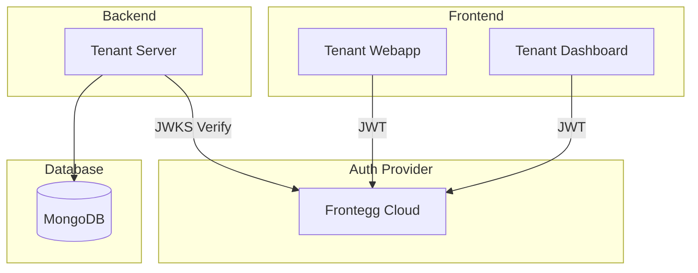
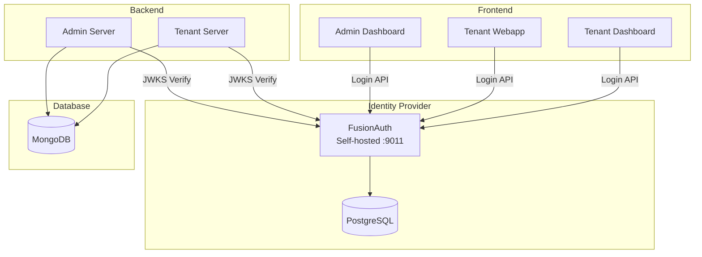
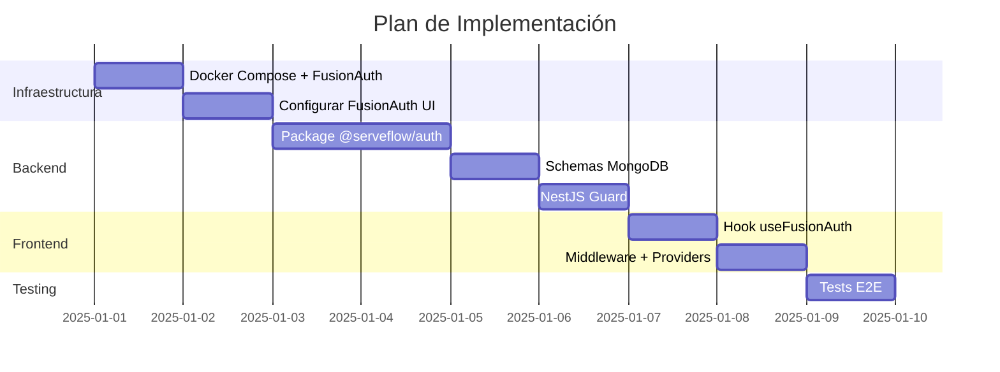

# Plan de Implementación: Identidad (Frontegg → FusionAuth)

**Estado:** Pendiente
**Última actualización:** 2025-12-13
**Relacionado:** [02-IDENTIDAD.md](./02-IDENTIDAD.md)

---

## Índice

1. [Resumen](#1-resumen)
2. [Estado Actual (Frontegg)](#2-estado-actual-frontegg)
3. [Estado Objetivo (FusionAuth)](#3-estado-objetivo-fusionauth)
4. [Fases de Implementación](#4-fases-de-implementación)
5. [Fase 1: Infraestructura](#5-fase-1-infraestructura)
6. [Fase 2: Package @serveflow/auth](#6-fase-2-package-serveflowauth)
7. [Fase 3: Schemas y Base de Datos](#7-fase-3-schemas-y-base-de-datos)
8. [Fase 4: Backend (NestJS)](#8-fase-4-backend-nestjs)
9. [Fase 5: Frontend (Next.js)](#9-fase-5-frontend-nextjs)
10. [Fase 6: Testing](#10-fase-6-testing)
11. [Configuración de FusionAuth](#11-configuración-de-fusionauth)

---

## 1. Resumen

### Objetivo

Migrar el sistema de autenticación de **Frontegg** (cloud) a **FusionAuth** (self-hosted), manteniendo la arquitectura multi-tenant existente.

### Archivos a Modificar

```
┌─────────────────────────────────────────────────────────────────────────┐
│  packages/auth/src/                                                      │
│  ├── types.ts                    → Renombrar Frontegg* → FusionAuth*    │
│  ├── guards/frontegg-auth.guard  → guards/fusionauth-auth.guard         │
│  ├── decorators/auth.decorator   → Sin cambios (agnóstico)              │
│  ├── frontegg/                   → fusionauth/ (reescribir)             │
│  └── index.ts, server.ts         → Actualizar exports                   │
│                                                                          │
│  packages/db/src/schemas/                                                │
│  ├── user.schema.ts              → fronteggUserId → fusionauthUserId    │
│  ├── global-user.schema.ts       → fronteggUserId → fusionauthUserId    │
│  └── tenant.schema.ts            → fronteggTenantId → fusionauthTenantId│
│                                                                          │
│  packages/core/src/types/                                                │
│  ├── user.ts                     → Actualizar interfaces                │
│  ├── global-user.ts              → Actualizar interfaces                │
│  └── tenant.ts                   → Actualizar interfaces                │
│                                                                          │
│  packages/ui/src/                                                        │
│  └── hooks/use-frontegg-auth.ts  → hooks/use-fusionauth.ts              │
│                                                                          │
│  apps/tenant/dashboard/src/                                              │
│  ├── middleware.ts               → Actualizar nombres cookies           │
│  ├── lib/get-current-user.ts     → Actualizar verificación              │
│  └── app/layout.tsx              → FusionAuthProvider                   │
│                                                                          │
│  apps/tenant/server/src/                                                 │
│  ├── app.module.ts               → FusionAuthGuard                      │
│  └── users/users.service.ts      → Usar FusionAuth API                  │
│                                                                          │
│  NUEVOS ARCHIVOS                                                         │
│  └── docker-compose.yml          → FusionAuth + PostgreSQL              │
└─────────────────────────────────────────────────────────────────────────┘
```

---

## 2. Estado Actual (Frontegg)

### Arquitectura



### Componentes Actuales

| Archivo | Función |
|---------|---------|
| `frontegg/client.ts` | Cliente HTTP, vendor token, configuración |
| `frontegg/users.ts` | CRUD usuarios en Frontegg |
| `frontegg/tenants.ts` | CRUD tenants en Frontegg |
| `guards/frontegg-auth.guard.ts` | Verificación JWT via JWKS |
| `decorators/auth.decorator.ts` | @Public, @Roles, @CurrentUser, etc. |

### Schemas MongoDB Actuales

```typescript
// User (db_tenant_{slug}.users)
{
  fronteggUserId: string;  // ← A migrar
  email: string;
  firstName: string;
  lastName: string;
}

// GlobalUser (db_serveflow_sys.global_users)
{
  fronteggUserId: string;  // ← A migrar
  email: string;
}

// Tenant (db_serveflow_sys.tenants)
{
  fronteggTenantId: string;  // ← A migrar
  fronteggConfig: {
    baseUrl: string;
    clientId: string;
  };
}
```

### Variables de Entorno Actuales

```bash
FRONTEGG_BASE_URL=https://app-xxx.frontegg.com
FRONTEGG_CLIENT_ID=xxx
FRONTEGG_API_KEY=xxx
FRONTEGG_DEFAULT_ROLE_ID=xxx
```

---

## 3. Estado Objetivo (FusionAuth)

### Arquitectura



### Variables de Entorno Objetivo

```bash
# FusionAuth
FUSIONAUTH_URL=http://localhost:9011
FUSIONAUTH_API_KEY=xxx
FUSIONAUTH_TENANT_ID=xxx  # Tenant por defecto
NEXT_PUBLIC_FUSIONAUTH_URL=http://localhost:9011
```

---

## 4. Fases de Implementación



---

## 5. Fase 1: Infraestructura

### Docker Compose

Crear `docker-compose.yml` en la raíz:

```yaml
version: '3.8'

services:
  fusionauth-db:
    image: postgres:16
    environment:
      POSTGRES_USER: fusionauth
      POSTGRES_PASSWORD: ${FUSIONAUTH_DB_PASSWORD:-fusionauth}
      POSTGRES_DB: fusionauth
    volumes:
      - fusionauth-db-data:/var/lib/postgresql/data
    networks:
      - serveflow-network
    healthcheck:
      test: ["CMD-SHELL", "pg_isready -U fusionauth"]
      interval: 5s
      timeout: 5s
      retries: 5

  fusionauth:
    image: fusionauth/fusionauth-app:latest
    depends_on:
      fusionauth-db:
        condition: service_healthy
    environment:
      DATABASE_URL: jdbc:postgresql://fusionauth-db:5432/fusionauth
      DATABASE_ROOT_USERNAME: fusionauth
      DATABASE_ROOT_PASSWORD: ${FUSIONAUTH_DB_PASSWORD:-fusionauth}
      DATABASE_USERNAME: fusionauth
      DATABASE_PASSWORD: ${FUSIONAUTH_DB_PASSWORD:-fusionauth}
      FUSIONAUTH_APP_MEMORY: ${FUSIONAUTH_APP_MEMORY:-512M}
      FUSIONAUTH_APP_RUNTIME_MODE: development
      FUSIONAUTH_APP_URL: http://fusionauth:9011
      SEARCH_TYPE: database
    ports:
      - "9011:9011"
    volumes:
      - fusionauth-config:/usr/local/fusionauth/config
    networks:
      - serveflow-network

volumes:
  fusionauth-db-data:
  fusionauth-config:

networks:
  serveflow-network:
    driver: bridge
```

### Levantar Servicios

```bash
# Crear .env
echo "FUSIONAUTH_DB_PASSWORD=fusionauth_secure_password" > .env

# Levantar
docker-compose up -d

# Verificar
docker-compose ps
curl http://localhost:9011/api/status
```

---

## 6. Fase 2: Package @serveflow/auth

### Nueva Estructura

```
packages/auth/src/
├── index.ts                     # Exports cliente
├── server.ts                    # Exports servidor
├── types.ts                     # Tipos actualizados
├── guards/
│   └── fusionauth-auth.guard.ts # Guard renombrado
├── decorators/
│   └── auth.decorator.ts        # Sin cambios
└── fusionauth/                  # NUEVO (reemplaza frontegg/)
    ├── index.ts
    ├── client.ts                # Cliente FusionAuth
    ├── users.ts                 # CRUD usuarios
    └── tenants.ts               # CRUD tenants
```

### Cambios en types.ts

```typescript
// ANTES
export interface AuthenticatedUser {
  fronteggUserId: string;
  email: string;
  tenantId: string;
  roles: string[];
  permissions: string[];
}

// DESPUÉS
export interface AuthenticatedUser {
  fusionauthUserId: string;  // Renombrado
  email: string;
  firstName?: string;
  lastName?: string;
  tenantId: string;
  roles: string[];
  // permissions eliminado - se manejará en Cerbos (Bloque 3)
}
```

### Guard FusionAuth

```typescript
// guards/fusionauth-auth.guard.ts
import { Injectable, CanActivate, ExecutionContext, UnauthorizedException } from '@nestjs/common';
import { Reflector } from '@nestjs/core';
import * as jwksClient from 'jwks-rsa';
import * as jwt from 'jsonwebtoken';
import { IS_PUBLIC_KEY, ROLES_KEY, REQUIRE_TENANT_KEY } from '../decorators/auth.decorator';
import { AuthenticatedUser } from '../types';

@Injectable()
export class FusionAuthGuard implements CanActivate {
  private jwksClient: jwksClient.JwksClient;
  private baseUrl: string;

  constructor(private reflector: Reflector) {
    this.baseUrl = process.env['FUSIONAUTH_URL'] || 'http://localhost:9011';

    this.jwksClient = jwksClient({
      jwksUri: `${this.baseUrl}/.well-known/jwks.json`,
      cache: true,
      cacheMaxAge: 86400000, // 24 horas
      rateLimit: true,
    });
  }

  async canActivate(context: ExecutionContext): Promise<boolean> {
    // Verificar si es ruta pública
    const isPublic = this.reflector.getAllAndOverride<boolean>(
      IS_PUBLIC_KEY,
      [context.getHandler(), context.getClass()]
    );
    if (isPublic) return true;

    const request = context.switchToHttp().getRequest();
    const authHeader = request.headers.authorization;

    if (!authHeader?.startsWith('Bearer ')) {
      throw new UnauthorizedException('Missing authorization header');
    }

    const token = authHeader.substring(7);
    const decoded = await this.verifyToken(token);

    // Construir AuthenticatedUser
    const authenticatedUser: AuthenticatedUser = {
      fusionauthUserId: decoded.sub,
      email: decoded.email,
      firstName: decoded.given_name,
      lastName: decoded.family_name,
      tenantId: decoded.tid || decoded.applicationId,
      roles: decoded.roles || [],
    };

    request.user = authenticatedUser;
    request.auth = {
      userId: decoded.sub,
      tenantId: authenticatedUser.tenantId,
      roles: authenticatedUser.roles,
    };

    // Validar tenant requerido
    const requireTenant = this.reflector.getAllAndOverride<boolean>(
      REQUIRE_TENANT_KEY,
      [context.getHandler(), context.getClass()]
    );
    if (requireTenant && !authenticatedUser.tenantId) {
      throw new UnauthorizedException('Tenant context required');
    }

    // Validar roles
    const requiredRoles = this.reflector.getAllAndOverride<string[]>(
      ROLES_KEY,
      [context.getHandler(), context.getClass()]
    );
    if (requiredRoles?.length) {
      const hasRole = requiredRoles.some(role => decoded.roles?.includes(role));
      if (!hasRole) {
        throw new UnauthorizedException(`Required role: ${requiredRoles.join(' or ')}`);
      }
    }

    return true;
  }

  private async verifyToken(token: string): Promise<FusionAuthJwtPayload> {
    const decoded = jwt.decode(token, { complete: true });
    if (!decoded) throw new UnauthorizedException('Invalid token');

    const key = await this.jwksClient.getSigningKey(decoded.header.kid);
    const publicKey = key.getPublicKey();

    return jwt.verify(token, publicKey, {
      algorithms: ['RS256'],
      issuer: this.baseUrl,
    }) as FusionAuthJwtPayload;
  }
}

interface FusionAuthJwtPayload {
  sub: string;
  email: string;
  given_name?: string;
  family_name?: string;
  tid?: string;
  applicationId: string;
  roles: string[];
  iat: number;
  exp: number;
  iss: string;
}
```

### Cliente FusionAuth

```typescript
// fusionauth/client.ts
import FusionAuthClient from '@fusionauth/typescript-client';

let client: FusionAuthClient | null = null;

export function getFusionAuthClient(): FusionAuthClient {
  if (!client) {
    client = new FusionAuthClient(
      process.env.FUSIONAUTH_API_KEY!,
      process.env.FUSIONAUTH_URL || 'http://localhost:9011'
    );
  }
  return client;
}
```

### CRUD Usuarios

```typescript
// fusionauth/users.ts
import { getFusionAuthClient } from './client';

export interface CreateFusionAuthUserInput {
  email: string;
  password?: string;
  firstName?: string;
  lastName?: string;
  tenantId: string;
  applicationId: string;
  roles?: string[];
  sendSetPasswordEmail?: boolean;
}

export async function createFusionAuthUser(input: CreateFusionAuthUserInput) {
  const client = getFusionAuthClient();

  const response = await client.register(undefined, {
    user: {
      email: input.email,
      password: input.password,
      firstName: input.firstName,
      lastName: input.lastName,
      tenantId: input.tenantId,
    },
    registration: {
      applicationId: input.applicationId,
      roles: input.roles,
    },
    sendSetPasswordEmail: input.sendSetPasswordEmail,
  });

  if (!response.wasSuccessful()) {
    throw new Error(response.exception?.message || 'Failed to create user');
  }

  return response.response.user!;
}

export async function getFusionAuthUser(userId: string) {
  const client = getFusionAuthClient();
  const response = await client.retrieveUser(userId);

  if (!response.wasSuccessful()) {
    if (response.statusCode === 404) return null;
    throw new Error('Failed to retrieve user');
  }

  return response.response.user!;
}

export async function deleteFusionAuthUser(userId: string) {
  const client = getFusionAuthClient();
  await client.deleteUser(userId);
}
```

---

## 7. Fase 3: Schemas y Base de Datos

### Cambios en Schemas

```typescript
// packages/db/src/schemas/user.schema.ts
// ANTES
@Prop({ required: true, unique: true, index: true })
fronteggUserId!: string;

// DESPUÉS
@Prop({ required: true, unique: true, index: true })
fusionauthUserId!: string;
```

```typescript
// packages/db/src/schemas/tenant.schema.ts
// ANTES
@Prop()
fronteggTenantId?: string;

@Prop({ type: Object })
fronteggConfig?: { baseUrl: string; clientId: string };

// DESPUÉS
@Prop({ required: true })
fusionauthTenantId!: string;

@Prop({ required: true })
fusionauthApplicationId!: string;
```

### Script de Migración

```typescript
// scripts/migrate-to-fusionauth.ts
import { MongoClient } from 'mongodb';

async function migrate() {
  const client = new MongoClient(process.env.MONGO_URI!);

  try {
    await client.connect();
    const sysDb = client.db('db_serveflow_sys');

    // 1. Migrar tenants
    await sysDb.collection('tenants').updateMany(
      { fronteggTenantId: { $exists: true } },
      [{
        $set: {
          fusionauthTenantId: '$fronteggTenantId',
          fusionauthApplicationId: '$fronteggConfig.clientId',
        },
        $unset: ['fronteggTenantId', 'fronteggConfig'],
      }]
    );

    // 2. Migrar global_users
    await sysDb.collection('global_users').updateMany(
      { fronteggUserId: { $exists: true } },
      [{
        $set: { fusionauthUserId: '$fronteggUserId' },
        $unset: 'fronteggUserId',
      }]
    );

    // 3. Migrar users en cada tenant
    const tenants = await sysDb.collection('tenants').find().toArray();
    for (const tenant of tenants) {
      const tenantDb = client.db(tenant.database.name);
      await tenantDb.collection('users').updateMany(
        { fronteggUserId: { $exists: true } },
        [{
          $set: { fusionauthUserId: '$fronteggUserId' },
          $unset: 'fronteggUserId',
        }]
      );
      console.log(`Migrated ${tenant.database.name}`);
    }

    console.log('Migration completed');
  } finally {
    await client.close();
  }
}

migrate().catch(console.error);
```

---

## 8. Fase 4: Backend (NestJS)

### App Module

```typescript
// apps/tenant/server/src/app/app.module.ts
import { FusionAuthGuard } from '@serveflow/auth/server';

@Module({
  imports: [ServeflowMongooseModule, UsersModule],
  providers: [
    {
      provide: APP_GUARD,
      useClass: FusionAuthGuard,  // Renombrado
    },
  ],
})
export class AppModule {}
```

### Users Service

```typescript
// apps/tenant/server/src/users/users.service.ts
import { createFusionAuthUser } from '@serveflow/auth';

@Injectable()
export class UsersService {
  async create(userModel: Model<User>, tenant: Tenant, dto: CreateUserDto) {
    // 1. Crear en FusionAuth
    const faUser = await createFusionAuthUser({
      email: dto.email,
      firstName: dto.firstName,
      lastName: dto.lastName,
      tenantId: tenant.fusionauthTenantId,
      applicationId: tenant.fusionauthApplicationId,
      roles: ['member'],
      sendSetPasswordEmail: true,
    });

    // 2. Crear en MongoDB
    return userModel.create({
      fusionauthUserId: faUser.id,
      email: dto.email.toLowerCase(),
      firstName: dto.firstName,
      lastName: dto.lastName,
      status: 'pending',
    });
  }

  async findByFusionauthId(userModel: Model<User>, fusionauthUserId: string) {
    return userModel.findOne({ fusionauthUserId });
  }
}
```

---

## 9. Fase 5: Frontend (Next.js)

### Hook useFusionAuth

```typescript
// packages/ui/src/hooks/use-fusionauth.ts
import { useState, useCallback } from 'react';
import { useTenant } from '@serveflow/tenants/react';

export function useFusionAuth() {
  const { tenant } = useTenant();
  const [isLoading, setIsLoading] = useState(false);
  const [error, setError] = useState<string | null>(null);

  const baseUrl = process.env.NEXT_PUBLIC_FUSIONAUTH_URL || 'http://localhost:9011';

  const login = useCallback(async (credentials: { email: string; password: string }) => {
    setIsLoading(true);
    setError(null);

    try {
      const response = await fetch(`${baseUrl}/api/login`, {
        method: 'POST',
        headers: {
          'Content-Type': 'application/json',
          'X-FusionAuth-TenantId': tenant?.fusionauthTenantId || '',
        },
        body: JSON.stringify({
          loginId: credentials.email,
          password: credentials.password,
          applicationId: tenant?.fusionauthApplicationId,
        }),
      });

      if (!response.ok) {
        const data = await response.json();
        throw new Error(data.fieldErrors?.password?.[0]?.message || 'Login failed');
      }

      const data = await response.json();

      // Guardar tokens en cookies
      document.cookie = `fa_access_token=${data.token}; path=/; max-age=3600; SameSite=Lax`;
      if (data.refreshToken) {
        document.cookie = `fa_refresh_token=${data.refreshToken}; path=/; max-age=2592000; SameSite=Lax`;
      }

      return data;
    } catch (err) {
      const message = err instanceof Error ? err.message : 'Login failed';
      setError(message);
      throw err;
    } finally {
      setIsLoading(false);
    }
  }, [baseUrl, tenant]);

  const logout = useCallback(async () => {
    document.cookie = 'fa_access_token=; path=/; expires=Thu, 01 Jan 1970 00:00:00 GMT';
    document.cookie = 'fa_refresh_token=; path=/; expires=Thu, 01 Jan 1970 00:00:00 GMT';
    window.location.href = '/sign-in';
  }, []);

  const signUp = useCallback(async (data: {
    email: string;
    password: string;
    firstName?: string;
    lastName?: string;
  }) => {
    setIsLoading(true);
    setError(null);

    try {
      const response = await fetch(`${baseUrl}/api/user/registration`, {
        method: 'POST',
        headers: {
          'Content-Type': 'application/json',
          'X-FusionAuth-TenantId': tenant?.fusionauthTenantId || '',
        },
        body: JSON.stringify({
          user: {
            email: data.email,
            password: data.password,
            firstName: data.firstName,
            lastName: data.lastName,
          },
          registration: {
            applicationId: tenant?.fusionauthApplicationId,
          },
        }),
      });

      if (!response.ok) {
        const errorData = await response.json();
        throw new Error(errorData.fieldErrors?.email?.[0]?.message || 'Registration failed');
      }

      const result = await response.json();

      if (result.token) {
        document.cookie = `fa_access_token=${result.token}; path=/; max-age=3600; SameSite=Lax`;
      }

      return result;
    } catch (err) {
      const message = err instanceof Error ? err.message : 'Registration failed';
      setError(message);
      throw err;
    } finally {
      setIsLoading(false);
    }
  }, [baseUrl, tenant]);

  return { login, logout, signUp, isLoading, error, clearError: () => setError(null) };
}
```

### Middleware Actualizado

```typescript
// apps/tenant/dashboard/src/middleware.ts
import { NextResponse } from 'next/server';
import type { NextRequest } from 'next/server';

const publicRoutes = ['/sign-in', '/sign-up', '/sso-callback', '/verify'];

export async function middleware(req: NextRequest) {
  const pathname = req.nextUrl.pathname;

  if (publicRoutes.some(route => pathname.startsWith(route))) {
    return NextResponse.next();
  }

  // Nombres de cookies actualizados
  const token = req.cookies.get('fa_access_token')?.value;

  if (!token) {
    return NextResponse.redirect(new URL('/sign-in', req.url));
  }

  try {
    const [, payload] = token.split('.');
    const decoded = JSON.parse(Buffer.from(payload, 'base64').toString());

    if (decoded.exp * 1000 < Date.now()) {
      return NextResponse.redirect(new URL('/sign-in', req.url));
    }

    const response = NextResponse.next();
    response.headers.set('x-fusionauth-user-id', decoded.sub);
    response.headers.set('x-fusionauth-tenant-id', decoded.tid || decoded.applicationId);

    return response;
  } catch {
    return NextResponse.redirect(new URL('/sign-in', req.url));
  }
}
```

### getCurrentUser Actualizado

```typescript
// apps/tenant/dashboard/src/lib/get-current-user.ts
import { cookies } from 'next/headers';

export async function getCurrentUser(tenant: Tenant): Promise<GetCurrentUserResult> {
  const cookieStore = await cookies();
  const accessToken = cookieStore.get('fa_access_token')?.value;

  if (!accessToken) {
    return { user: null, error: { type: 'UNAUTHORIZED' } };
  }

  const [, payload] = accessToken.split('.');
  const decoded = JSON.parse(Buffer.from(payload, 'base64').toString());

  // Verificar membresía
  if (decoded.applicationId !== tenant.fusionauthApplicationId) {
    return {
      user: null,
      error: { type: 'FORBIDDEN', message: 'No eres miembro de esta organización' }
    };
  }

  // Obtener de MongoDB
  const response = await fetch(`${TENANT_API_URL}/api/users/me`, {
    headers: {
      'Authorization': `Bearer ${accessToken}`,
      'x-tenant-slug': tenant.slug,
    },
    cache: 'no-store',
  });

  if (!response.ok) {
    if (response.status === 404) return { user: null, error: { type: 'USER_NOT_FOUND' } };
    return { user: null, error: { type: 'INTERNAL' } };
  }

  const data = await response.json();
  return { user: data.data, error: null };
}
```

---

## 10. Fase 6: Testing

### Tests del Guard

```typescript
// packages/auth/src/__tests__/fusionauth-guard.spec.ts
describe('FusionAuthGuard', () => {
  it('should allow public routes', async () => {});
  it('should reject requests without token', async () => {});
  it('should verify JWT signature via JWKS', async () => {});
  it('should inject authenticated user into request', async () => {});
  it('should validate required roles', async () => {});
  it('should require tenant when decorated', async () => {});
});
```

### Test E2E de Login

```bash
# 1. Levantar FusionAuth
docker-compose up -d

# 2. Crear usuario de prueba en FusionAuth UI

# 3. Probar login
curl -X POST http://localhost:9011/api/login \
  -H "Content-Type: application/json" \
  -d '{"loginId":"test@example.com","password":"test123","applicationId":"xxx"}'
```

---

## 11. Configuración de FusionAuth

### Paso 1: Levantar Infraestructura

```bash
docker-compose up -d
```

### Paso 2: Setup Inicial (http://localhost:9011)

1. Crear usuario admin
2. Completar Setup Wizard
   - Nombre: Serveflow
   - License: Community

### Paso 3: Crear Tenant para cada Cliente

Para Serveflow usamos **1 FusionAuth Tenant = 1 Serveflow Tenant**:

1. **Tenants → Add**
2. Name: `{tenant-slug}` (ej: "demo", "club-padel-madrid")
3. Guardar el **Tenant ID**

### Paso 4: Crear Application por Tenant

1. **Applications → Add**
2. Name: `{tenant-slug}-app`
3. Tenant: Seleccionar el tenant creado
4. **Roles** (pestaña Roles):
   - `owner`
   - `admin`
   - `staff`
   - `member`
5. **JWT** (pestaña JWT):
   - Enable JWT: Yes
   - Access token TTL: 3600 (1 hora)
   - Refresh token TTL: 2592000 (30 días)
6. Guardar el **Application ID**

### Paso 5: Crear API Key

1. **Settings → API Keys → Add**
2. Endpoints habilitados:
   - `/api/user`
   - `/api/user/registration`
   - `/api/login`
   - `/api/jwt/refresh`
3. Guardar la **API Key**

### Paso 6: Variables de Entorno

```bash
# .env.development
FUSIONAUTH_URL=http://localhost:9011
FUSIONAUTH_API_KEY=<api-key-generada>
NEXT_PUBLIC_FUSIONAUTH_URL=http://localhost:9011

# En MongoDB (tenant document)
{
  "fusionauthTenantId": "<tenant-id>",
  "fusionauthApplicationId": "<application-id>"
}
```

### Paso 7: Migrar Base de Datos

```bash
npx ts-node scripts/migrate-to-fusionauth.ts
```

### Paso 8: Verificar

```bash
# FusionAuth status
curl http://localhost:9011/api/status

# JWKS endpoint
curl http://localhost:9011/.well-known/jwks.json

# Levantar apps
pnpm dev

# Probar en http://demo.localhost:4200/sign-in
```

---

## Checklist

- [ ] Docker Compose levanta FusionAuth
- [ ] FusionAuth accesible en http://localhost:9011
- [ ] Tenant creado en FusionAuth
- [ ] Application creada con roles
- [ ] API Key generada
- [ ] Variables de entorno configuradas
- [ ] Package @serveflow/auth actualizado
- [ ] Schemas MongoDB migrados
- [ ] Guard FusionAuth funcionando
- [ ] Hook useFusionAuth funcionando
- [ ] Login funciona en tenant dashboard
